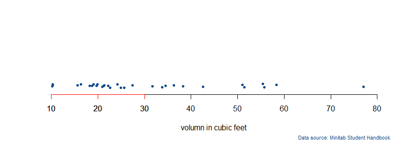
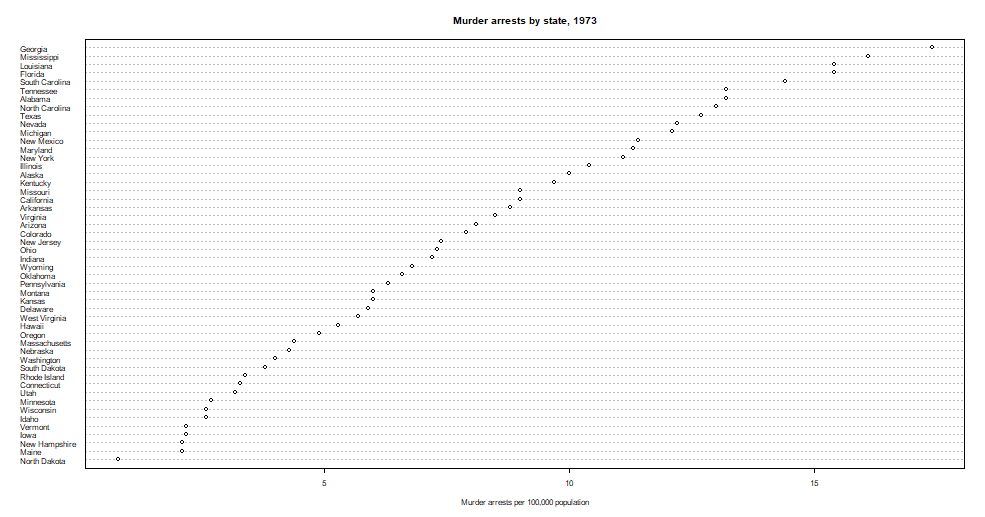

# Strip Charts
## A Simple Graph
```r
attach(trees)
stripchart(Volume)
```

```r
stripchart(Volume, method = "jitter")
```


> The help file shows that the default value of jitter is 0.1. Experiment with the jitter argument and the stack argument to see how they work. Another way to improve the graph is to change the character representing each point with the pch (think “plot character”) parameter. This time, add a label to the x-axis by using the xlab argument:
> xlab 参数 设置的是轴的名称
> pch 设置的是图形的类型， jitter 默认为 0.1
> When you use method = "jitter", the points are placed at random above or below the horizon.
> 使用了 jitter 参数，那么相同数值的点随机的在上或者在下
```r
stripchart(Volume, method = "jitter", pch = 20, xlab = "Volume in cubic feet")
```


> A few of them must be used only with a par() command, usually given before calling another graphic function. The argument controlling the box around a graph is bty
> 图形使用边框可以使用 par() 命令，可以设置 bty 参数来进行设定
> The options available with the bty argument of the par() function are "o" (the default), "l", "7", "c", "u", or "]".
> bty参数有 o,l,7,c,u,]
```R
> par(bty = "n")
> stripchart(Volume, method = "jitter", pch = 20, xlab = "Volume in cubic feet")
```


> You can fix that by using the xlim argument to extend the x-axis
> 大于70的点，在上图上看着特别的突兀，可以使用xlim参数去扩展x轴

```r
> par(bty = "n")
> stripchart(Volume, method = "jitter", jitter = .3, pch = 20, xlab = "volumn in cubic feet", col = "dodgerblue4", ylim = c(0,8), xlim = c(10,80))
```


> stripchart 函数中的 col 设置的是数据点的颜色
> 可以使用 axis() 函数中的 col 来设置轴的颜色， at设置了起作用的范围，axis()对已经存在的图形起作用 1 = bottom, 2 = left, 3 = top, and 4 = right
```r
> axis(1, col = "red", at = c(10,20,30))
```


> The mtext() command adds a note outside of the plotting area of the graph.
> mtext() 函数给图形外围添加一个备注
> Text to be displayed: in our example, "Data source: MinitabStudent Handbook".
> 第一个参数需要输出的内容
> Where it should be: side = 1 specifies the bottom.
> side = 1 代表输出的位置为图片底部
> How many lines below (or above, left of, or right of) the graph
> adj = 1 specifies far right, adj = 0 means far left, and a number between 0 and 1 can be provided to indicate how far to the left/right.
> adj = 1 定义了距离右边有多远， adj = 0 定义了距离左边有多远
> Color: col = "dodgerblue4"
> col = "dodgerblue4" 定义了颜色
> Type size: cex = .7.
> cex = .7 定义了线的类型
```R
> mtext("Data source: Minitab Student Handbook",side = 1, line = 4, adj = 1, col = "dodgerblue4", cex = .7)
```


# Dot Charts
```r
> attach(USArrests)
> dotchart(Murder)
```


> 添加列标签
> The labels argument placed the state names on the plot; the cex argument changed the character size. The default value of cex is 1, so any smaller value makes the characters smaller.
> labels 参数设置列标签
> cex 默认大小为 1

```r
> par(bty = "o")
> dotchart(Murder, labels = row.names(USArrests), cex = .5)
```


```R
> data2 = USArrests[order(USArrests$Murder),]
> dotchart(data2$Murder, labels = row.names(data2), cex = .5, main = "Murder arrests by state, 1973", xlab = "Murder arrests per 100,000 population")
```

