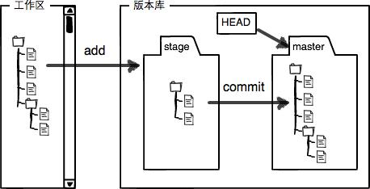

```bash
$ git config --global user.name "Your Name"
$ git config --global user.email "email@example.com"
```
因为Git是分布式版本控制系统，所以，每个机器都必须自报家门：你的名字和Email地址。你也许会担心，
如果有人故意冒充别人怎么办？这个不必担心，首先我们相信大家都是善良无知的群众，其次，真的有冒充
的也是有办法可查的。

注意git config命令的--global参数，用了这个参数，表示你这台机器上所有的Git仓库都会使用这个配置，
当然也可以对某个仓库指定不同的用户名和Email地址。

什么是版本库呢？版本库又名仓库，英文名repository，你可以简单理解成一个目录，这个目录里面的所有文件都可以被Git管理起来，每个文件的修改、删除，Git都能跟踪，以便任何时刻都可以追踪历史，或者在将来某个时刻可以“还原”

```bash
[root@localhost Desktop]# mkdir learngit
[root@localhost Desktop]# cd learngit/
[root@localhost learngit]# pwd
/root/Desktop/learngit

[root@localhost learngit]# git init
Initialized empty Git repository in /root/Desktop/learngit/.git/

```

第一步，用命令git add告诉Git，把文件添加到仓库：
```bash
$ git add readme.txt
```

第二步，用命令git commit告诉Git，把文件提交到仓库
简单解释一下git commit命令，-m后面输入的是本次提交的说明，可以输入任意内容，当然最好是有意义的
为什么Git添加文件需要add，commit一共两步呢？因为commit可以一次提交很多文件，所以你可以多次add不同的文件
```bash
[master (root-commit) 4b538d5] wrote a readme file
 1 file changed, 2 insertions(+)
 create mode 100644 readme.txt


[root@localhost learngit]# git status
 # On branch master
 # Changes not staged for commit:
 #   (use "git add <file>..." to update what will be committed)
 #   (use "git checkout -- <file>..." to discard changes in working directory)
 #
 #       modified:   readme.txt
 #
 no changes added to commit (use "git add" and/or "git commit -a")

 [root@localhost learngit]# git diff
 diff --git a/readme.txt b/readme.txt
 index a57a274..856172e 100644
 --- a/readme.txt
 +++ b/readme.txt
 @@ -1,2 +1,2 @@
 -Git is a version control system
 +Git is a distributed version control system
  Git is a free software

  [root@localhost learngit]# git commit -m "add distributed"
  [master ebb242b] add distributed
   1 file changed, 1 insertion(+), 1 deletion(-)
  [root@localhost learngit]# git status
  # On branch master
  nothing to commit, working directory clean


  [root@localhost learngit]# git status
  # On branch master
  nothing to commit, working directory clean
  [root@localhost learngit]# git log
  commit ebb242be6f5599798d0638ea53633d7415a1f609
  Author: RayLee <349278769@qq.com>
  Date:   Thu May 10 08:45:56 2018 +0800

      add distributed

  commit 4b538d5df0559eaac1faa3f9e4a7b7586985f0ce
  Author: RayLee <349278769@qq.com>
  Date:   Thu May 10 08:41:01 2018 +0800

      wrote a readme file
```

```bash
[root@localhost learngit]# git log --pretty=oneline
ebb242be6f5599798d0638ea53633d7415a1f609 add distributed
4b538d5df0559eaac1faa3f9e4a7b7586985f0ce wrote a readme file
```

首先，Git必须知道当前版本是哪个版本，在Git中，用HEAD表示当前版本
上一个版本就是HEAD^ ，上上一个版本就是HEAD^^，当然往上100个版本写100个^比较容易数不过来，所以写成HEAD~100。

```bash
[root@localhost learngit]# git reset --hard HEAD^
HEAD is now at ebb242b add distributed
[root@localhost learngit]# cat readme.txt
Git is a distributed version control system
Git is a free software
```

在Git中，总是有后悔药可以吃的。当你用$ git reset --hard HEAD^回退到add distributed版本时，再想恢复到append GPL，就必须找到append GPL的commit id。Git提供了一个命令git reflog用来记录你的每一次命令

版本库（Repository）

工作区有一个隐藏目录.git，这个不算工作区，而是Git的版本库。

Git的版本库里存了很多东西，其中最重要的就是称为stage（或者叫index）的暂存区，还有Git为我们自动创建的第一个分支master，以及指向master的一个指针叫HEAD。



第一步是用git add把文件添加进去，实际上就是把文件修改添加到暂存区；

第二步是用git commit提交更改，实际上就是把暂存区的所有内容提交到当前分支。

因为我们创建Git版本库时，Git自动为我们创建了唯一一个master分支，所以，现在，git commit就是往master分支上提交更改

```bash
[root@localhost learngit]# git diff HEAD -- LICENSE
diff --git a/LICENSE b/LICENSE
index c064e36..5fe6fb0 100644
--- a/LICENSE
+++ b/LICENSE
@@ -1,2 +1,3 @@
 addd BY RAYLEE
 addd BY RAYLEE
+addd BY RAYLEE
```

命令git checkout -- readme.txt意思就是，把readme.txt文件在工作区的修改全部撤销，这里有两种情况：

一种是readme.txt自修改后还没有被放到暂存区，现在，撤销修改就回到和版本库一模一样的状态；

一种是readme.txt已经添加到暂存区后，又作了修改，现在，撤销修改就回到添加到暂存区后的状态
