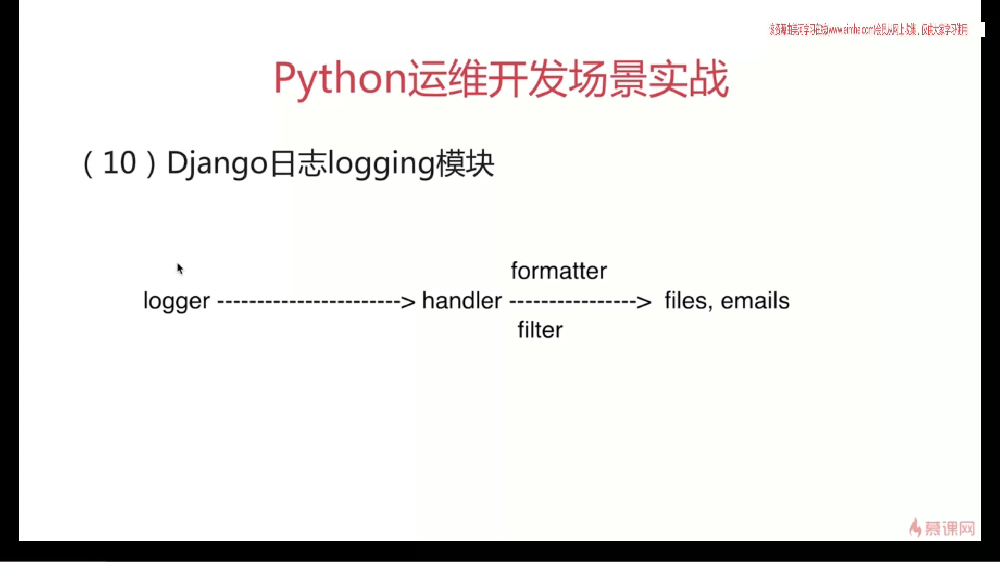

# 3-1 DevOPS工程快速入门引导

```python
>>> type(aa)
<type 'str'>
>>> aa = u'123'
>>> type(aa)
<type 'unicode'>
```

> break 会终止循环
> continue 会终止当前的循环

> 迭代器
> 集合数据类型(列表、元组、字符串、数值)
> 迭代器：可以被next()函数调用并不断返回下一个值的对象

> 生成器
> 生成器本质上海还是一个迭代器，用关键字 yield 来返回值

> 生成器作用？
> 迭代器作用？

> 列表解析
```python
[item + 2 for item in aa]
```

> 匿名函数
> 不需要标准的方式来声明，如使用 def 语句
```python
a = lambda x, y: x + y
```

> 正则表达式
```python
import re
# 在第二个参数中搜索第一个参数，返回一个对象
re.search("abc", "123abcyul")

# 从开头开始查找
re.match("[0-9]{3}a.c", "123abcyul")

# 要提取的内容
re.match("[0-9]{3}(a.c)", "123abcyul").group(0)
```

> 引入包的位置
```python
sys.path

# 从某个包中引入某个函数
from re import search

# 从某个包中引入某个函数并重命名
from re import search as sss
```

> 装饰器
> 装饰器本质上是一个python函数
> 装饰器的返回值也是一个对象
> 他可以不修改代码增加函数的功能
```python
def use_logging(func):
   def writelog(*args, **kwargs):
      logging.warn("%s is running" % func.__name__)
      return func(*args)
   return writelog

@use_logging
def far():
   print("far ...")
```

> Django
> 目录结构
```python
[root@localhost Documents]# /usr/lib/python2.7/site-packages/django/bin/django-admin.py startproject mydevops

[root@localhost Documents]# tree mydevops/
mydevops/
├── manage.py
└── mydevops
    ├── __init__.py
    ├── settings.py
    ├── urls.py
    └── wsgi.py

1 directory, 5 files

[root@localhost mydevops]# cat manage.py
#!/usr/bin/env python
import os
import sys

if __name__ == "__main__":
    os.environ.setdefault("DJANGO_SETTINGS_MODULE", "mydevops.settings")

    from django.core.management import execute_from_command_line

    execute_from_command_line(sys.argv)

```

> 建立新的应用
```python
[root@localhost mydevops]# python /usr/lib/python2.7/site-packages/django/bin/django-admin.py startapp scanhosts
[root@localhost mydevops]# ls
manage.py  mydevops  scanhosts
[root@localhost mydevops]# tree scanhosts/
scanhosts/
├── admin.py
├── __init__.py
├── migrations
│   └── __init__.py
├── models.py
├── tests.py
└── views.py

1 directory, 6 files
[root@localhost mydevops]# tree mydevops/
mydevops/
├── __init__.py
├── settings.py
├── urls.py
└── wsgi.py

0 directories, 4 files
```

1、settings 文件配置
```python
vi settings.py

14 import os
15
16 BASE_DIR = os.path.dirname(os.path.dirname(os.path.abspath(__file__)))
17 print ".......BASE_DIR", BASE_DIR

```

> 添加日志部分
```python
# LOGGING
LOGGING = {
    "version" : 1,
    "disable_existing_loggers": False,
    "formatters" : {
        "verbose": {
            "format": "[%(levelname)s %(asctime)s %(module)s:%(lineno)d] %(message)s",
            "datefmt": "%Y%m%d %H:%M:%s",
        },
    },

    "handlers":{
        "file":{
            "level": "INFO",
            "class": "logging.fileHandler",
            "formatter": "verbose",
            "filename": "/tmp/error.logs",
        },
    },
    "loggers":{
        "django":{
            "handlers": ["file"],
            "level": "INFO",
            "propagate": True,
        },
    },
}
```


> 启动 Django
```bash
[raylee@localhost mydevops]$ python manage.py runserver
.......BASE_DIR /home/raylee/Documents/mydevops
.......BASE_DIR /home/raylee/Documents/mydevops
Performing system checks...
```
> 如果应用不添加到 settings 文件中是不会被启用的

> 修改数据库配置部分
```
DATABASES = {
        'default' :{
        'ENGINE': 'django.db.backends.mysql',
        'NAME' : 'mydevops',
        'USER' : 'root',
        'PASSWORD' : '12346',
        'HOST' : '127.0.0.1',
        'PORT' : '3306',
        'OPTIONS' : {},
        'init_command' : 'SET storage_engine=INNODB,'
                         'SESSION TRANSACTION ISOLATION LEVEL READ COMMITED, autocommit=1, names "utf8"',
        }
}
```

2、models 文件配置
- CharField     字符串字段
- IntegerField  整数型字段
- DateTimeFiled 时间日期字段
- ForeignKey    定义多对一关系
```python
# 可以操作数据库表格
# -*- coding:utf-8 -*-
from django.db import models

# Create your models here.
class UserIPInfo(models.Model):
    ip = models.CharField(max_length=40, default='', verbose_name=u'ip地址', null=True)
    time = models.DateTimeField(verbose_name=u"更新时间", auto_now=True)

    class Meta:
        verbose_name = u"用户访问地址信息表"
        verbose_name_plural = verbose_name
        db_table = "useripinfo"


class BrowseInfo(models.Model):
    useragent = models.CharField(max_length=100, default='', verbose_name=u"用户浏览器agent信息", null=True)
    models.CharField(max_length=256, verbose_name=u"唯一设备ID", default="")
    userip = models.ForeignKey("UserIPInfo")

    class Meta:
        verbose_name = u'用户浏览器信息表'
        verbose_name_plural = verbose_name
        db_table = "browseinfo"
```

3、迁移

> 生成迁移文件
```bash
[raylee@localhost mydevops]$ python manage.py makemigrations
.......BASE_DIR /home/raylee/Documents/mydevops
Migrations for 'scanhosts':
  0001_initial.py:
    - Create model BrowseInfo
    - Create model UserIPInfo
    - Add field userip to browseinfo
```

```bash
[raylee@localhost mydevops]$ cd scanhosts
[raylee@localhost scanhosts]$ ls
admin.py  admin.pyc  __init__.py  __init__.pyc  migrations  models.py  models.pyc  tests.py  views.py
[raylee@localhost scanhosts]$ cd migrations/
[raylee@localhost migrations]$ ls
0001_initial.py  __init__.py  __init__.pyc
[raylee@localhost migrations]$ cat 0001_initial.py
```

> 应用成SQL文件
```bash
[raylee@localhost mydevops]$ python manage.py migrate
.......BASE_DIR /home/raylee/Documents/mydevops
Operations to perform:
  Synchronize unmigrated apps: staticfiles, messages
  Apply all migrations: admin, scanhosts, contenttypes, auth, sessions
Synchronizing apps without migrations:
  Creating tables...
    Running deferred SQL...
  Installing custom SQL...
Running migrations:
  Rendering model states... DONE
  Applying contenttypes.0001_initial... OK
  Applying auth.0001_initial... OK
  Applying admin.0001_initial... OK
  Applying contenttypes.0002_remove_content_type_name... OK
  Applying auth.0002_alter_permission_name_max_length... OK
  Applying auth.0003_alter_user_email_max_length... OK
  Applying auth.0004_alter_user_username_opts... OK
  Applying auth.0005_alter_user_last_login_null... OK
  Applying auth.0006_require_contenttypes_0002... OK
  Applying scanhosts.0001_initial... OK
  Applying sessions.0001_initial... OK
```
- python django批量导入mysql，报错django.db.utils.OperationalError: (1366,
> 因为批量导入的数据中有中文，这个错误出现的原因是mysql数据库设置的编码和要导入数据的编码不一致

> mysql数据库在建立的时候要 default character set utf8
```sql
alter {database | schema} [db_name] alter_specification [, alter_specification] ...
alter_specification:
  [default] character set charset_name
  [default] collate collation_name

上述特性存储在 db.opt 文件中。 需要具有 alter 权限
C:\ProgramData\MySQL\MySQL Server 5.7\Data\db.opt
default-character-set=utf8
default-collation=utf8_general_ci

create database test1;
alter database test1 character set 'gbk'

C:\ProgramData\MySQL\MySQL Server 5.7\Data\db.opt
default-character-set=gbk
default-collation=gbk_chinese_ci

show create database test1;
CREATE DATABASE `test1` /*!40100 DEFAULT CHARACTER SET gbk */

直接修改db.opt 重启数据库也可以
```

```sql
show create database mydevops;

CREATE DATABASE `mydevops` /*!40100 DEFAULT CHARACTER SET latin1 */

mysql> alter database mydevops character set 'utf8';
Query OK, 1 row affected (0.01 sec)

mysql> show create database mydevops;
+----------+-------------------------------------------------------------------+
| Database | Create Database                                                   |
+----------+-------------------------------------------------------------------+
| mydevops | CREATE DATABASE `mydevops` /*!40100 DEFAULT CHARACTER SET utf8 */ |
+----------+-------------------------------------------------------------------+
1 row in set (0.00 sec)

```

> 查看数据库
```sql
mysql> use mydevops
Reading table information for completion of table and column names
You can turn off this feature to get a quicker startup with -A

Database changed
mysql> desc useripinfo;
+-------+-------------+------+-----+---------+----------------+
| Field | Type        | Null | Key | Default | Extra          |
+-------+-------------+------+-----+---------+----------------+
| id    | int(11)     | NO   | PRI | NULL    | auto_increment |
| ip    | varchar(40) | YES  |     | NULL    |                |
| time  | datetime(6) | NO   |     | NULL    |                |
+-------+-------------+------+-----+---------+----------------+
3 rows in set (0.06 sec)
mysql> desc browseinfo;
+-----------+--------------+------+-----+---------+----------------+
| Field     | Type         | Null | Key | Default | Extra          |
+-----------+--------------+------+-----+---------+----------------+
| id        | int(11)      | NO   | PRI | NULL    | auto_increment |
| useragent | varchar(100) | YES  |     | NULL    |                |
| userip_id | int(11)      | NO   | MUL | NULL    |                |
+-----------+--------------+------+-----+---------+----------------+
3 rows in set (0.00 sec)
```


- 视图, 路由转发
> urls.py
```python
from django.conf.urls import include, url, patterns
from django.contrib import admin
from scanhosts.views import *

urlpatterns = [
    url(r'^admin/', include(admin.site.urls)),
    url(r"^getinfos/$", user_history),
    url(r"^sendinfo/$", user_info),
]

```
> view视图
```python
from django.shortcuts import render

# Create your views here.
from django.http  import JsonResponse, HttpResponse
from models import *
import json

# request 是客户端发出的请求
def user_info(request):
    # 取到访问的 IP
    ip_addr = request.META['REMOTE_ADDR']
    # 访问的浏览器
    user_ua = request.META['HTTP_USER_AGENT']

    # 根据 IP 查找对应的用户信息
    user_obj = UserIPInfo.objects.filter(ip = ip_addr)
    if not user_obj:
        # 插入新的数据
        res = UserIPInfo.objects.create(ip = ip_addr)
        # 使用 id 联动
        ip_add_id = res.id
    else:
        ip_add_id = user_obj[0].id

    BrowseInfo.objects.create(useragent = user_ua, userip_id = ip_add_id)

    result = {'STATUS': "success",
              "INFO" : "User Info",
              "IP": ip_addr,
              "UA":user_ua}
    return HttpResponse(json.dumps(result), content_type="application/json")
```

```python
def user_history(request):
    ip_lst = UserIPInfo.objects.all()
    infos = {}
    for item in ip_lst:
        infos[item.ip] = [ b_obj.useragent for b_obj in BrowseInfo.objects.filter(userip_id = item.id) ]

    result = {"STATUS" : "success",
              "INFO" : infos,
              }
    return HttpResponse(json.dumps(result), content_type="application/json")
```


> 启动
```python
[raylee@localhost mydevops]$ python manage.py runserver
.......BASE_DIR /home/raylee/Documents/mydevops
.......BASE_DIR /home/raylee/Documents/mydevops
Performing system checks...
```

> 查看数据库数据
```sql
mysql> select * from useripinfo;
+----+-----------+----------------------------+
| id | ip        | time                       |
+----+-----------+----------------------------+
|  1 | 127.0.0.1 | 2018-04-18 00:54:51.803994 |
+----+-----------+----------------------------+
1 row in set (0.00 sec)

mysql> select * from browseinfo;
+----+----------------------------------------------------------------------+-----------+
| id | useragent                                                            | userip_id |
+----+----------------------------------------------------------------------+-----------+
|  1 | Mozilla/5.0 (X11; Linux x86_64; rv:52.0) Gecko/20100101 Firefox/52.0 |         1 |
+----+----------------------------------------------------------------------+-----------+
1 row in set (0.00 sec)
```


> 邮件服务


服务端：开启smtp协议支持
客户端：配置settings文件

> 设置服务器的配置
```python
# Email setting smtp/pop3
EMAIL_HOST = "smtp.163.com"
EMAIL_HOST_USER = "youdashui2004@163.com"
EMAIL_HOST_PASSWORD = "wuhan2008"
EMAIL_USE_TLS = False
```

> 创建一个 tools.py
```python
#!/usr/bin/env python
# -*- coding:utf-8 -*-

from django.core.mail import send_mail
import time

class sendmail():
    def __init__(self, receive_addr, sub_info, content_info):
        sub_data = time.strftime("%Y-%m-%d_%H:%M:%S", time.localtime())
        self.receive_addr = receive_addr
        self.sub_info = sub_info
        self.content_info = content_info

    def send(self):
        try:
            send_mail(subject=self.sub_info,
                      message=self.content_info,
                      from_email='youdashui2004@163.com',
                      recipient_list=self.receive_addr,
                      fail_silently=False)
            return True
        except Exception as e :
            print e
            return False
```

> 使用代码时
```python
sendm = sendmail(receive_addr=['iaskjob.com'], sub_info="op dev", content_info="test")
sendm.send()
```


## 第5章 自动化资产扫描发现进阶
### 四、资产扫描进阶
服务器资产信息  | 硬件服务器、KVM服务器、esx虚拟机
--|--
未知设备ip列表  |  网络设备、其他设备


#### (一) snmp网络设备扫描
> 简单网络管理协议，该协议能够支持网络管理系统，并获取相关信息


```bash
[root@localhost snmp]# snmpwalk -v 2c -c public 127.0.0.1
SNMPv2-MIB::sysDescr.0 = STRING: Linux localhost.localdomain 3.10.0-693.21.1.el7.x86_64 #1 SMP Wed Mar 7 19:03:37 UTC 2018 x86_64
SNMPv2-MIB::sysObjectID.0 = OID: NET-SNMP-MIB::netSnmpAgentOIDs.10
DISMAN-EVENT-MIB::sysUpTimeInstance = Timeticks: (50810) 0:08:28.10
SNMPv2-MIB::sysContact.0 = STRING: Root <root@localhost> (configure /etc/snmp/snmp.local.conf)
SNMPv2-MIB::sysName.0 = STRING: localhost.localdomain
SNMPv2-MIB::sysLocation.0 = STRING: Unknown (edit /etc/snmp/snmpd.conf)
SNMPv2-MIB::sysORLastChange.0 = Timeticks: (6) 0:00:00.06
SNMPv2-MIB::sysORID.1 = OID: SNMP-MPD-MIB::snmpMPDCompliance
SNMPv2-MIB::sysORID.2 = OID: SNMP-USER-BASED-SM-MIB::usmMIBCompliance
SNMPv2-MIB::sysORID.3 = OID: SNMP-FRAMEWORK-MIB::snmpFrameworkMIBCompliance
SNMPv2-MIB::sysORID.4 = OID: SNMPv2-MIB::snmpMIB
SNMPv2-MIB::sysORID.5 = OID: TCP-MIB::tcpMIB
SNMPv2-MIB::sysORID.6 = OID: IP-MIB::ip
SNMPv2-MIB::sysORID.7 = OID: UDP-MIB::udpMIB
SNMPv2-MIB::sysORID.8 = OID: SNMP-VIEW-BASED-ACM-MIB::vacmBasicGroup
SNMPv2-MIB::sysORID.9 = OID: SNMP-NOTIFICATION-MIB::snmpNotifyFullCompliance
SNMPv2-MIB::sysORID.10 = OID: NOTIFICATION-LOG-MIB::notificationLogMIB
SNMPv2-MIB::sysORDescr.1 = STRING: The MIB for Message Processing and Dispatching.
SNMPv2-MIB::sysORDescr.2 = STRING: The management information definitions for the SNMP User-based Security Model.
SNMPv2-MIB::sysORDescr.3 = STRING: The SNMP Management Architecture MIB.
SNMPv2-MIB::sysORDescr.4 = STRING: The MIB module for SNMPv2 entities
SNMPv2-MIB::sysORDescr.5 = STRING: The MIB module for managing TCP implementations
SNMPv2-MIB::sysORDescr.6 = STRING: The MIB module for managing IP and ICMP implementations
SNMPv2-MIB::sysORDescr.7 = STRING: The MIB module for managing UDP implementations
SNMPv2-MIB::sysORDescr.8 = STRING: View-based Access Control Model for SNMP.
SNMPv2-MIB::sysORDescr.9 = STRING: The MIB modules for managing SNMP Notification, plus filtering.
SNMPv2-MIB::sysORDescr.10 = STRING: The MIB module for logging SNMP Notifications.
SNMPv2-MIB::sysORUpTime.1 = Timeticks: (6) 0:00:00.06
SNMPv2-MIB::sysORUpTime.2 = Timeticks: (6) 0:00:00.06
SNMPv2-MIB::sysORUpTime.3 = Timeticks: (6) 0:00:00.06
SNMPv2-MIB::sysORUpTime.4 = Timeticks: (6) 0:00:00.06
SNMPv2-MIB::sysORUpTime.5 = Timeticks: (6) 0:00:00.06
SNMPv2-MIB::sysORUpTime.6 = Timeticks: (6) 0:00:00.06
SNMPv2-MIB::sysORUpTime.7 = Timeticks: (6) 0:00:00.06
SNMPv2-MIB::sysORUpTime.8 = Timeticks: (6) 0:00:00.06
SNMPv2-MIB::sysORUpTime.9 = Timeticks: (6) 0:00:00.06
SNMPv2-MIB::sysORUpTime.10 = Timeticks: (6) 0:00:00.06
HOST-RESOURCES-MIB::hrSystemUptime.0 = Timeticks: (177740) 0:29:37.40
HOST-RESOURCES-MIB::hrSystemUptime.0 = No more variables left in this MIB View (It is past the end of the MIB tree)
```

#### (二) docker容器扫描
#### (三) KVM虚拟机扫描
#### (四) 其他扫描
