```python
pip install requests
pip install beautifulsoup4
```
[西刺免费代理](http://www.xicidaili.com/)
[request包官方网站](http://docs.python-requests.org/zh_CN/latest/user/quickstart.html)
[beautifulsoup4官方网站](http://beautifulsoup.readthedocs.io/zh_CN/latest/)

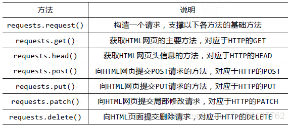

```python
# -*- coding:UTF-8 -*-
import requests
from bs4 import BeautifulSoup

if __name__ == "__main__":
    target = "http://www.biqukan.com/1_1094/5403177.html"
    req = requests.get(url=target)

    html = req.text
    bf = BeautifulSoup(html)
    texts = bf.find_all('div', class_= 'showtxt')
    print(texts)
    print(texts[0].text.replace('\xa0'*8,'\n\n'))
```

> 在解析html之前，我们需要创建一个Beautiful Soup对象。BeautifulSoup函数里的参数就是我们已经获得的html信息。然后我们使用find_all方法，获得html信息中所有class属性为showtxt的div标签。find_all方法的第一个参数是获取的标签名，第二个参数class_是标签的属性，为什么不是class，而带了一个下划线呢？因为python中class是关键字，为了防止冲突，这里使用class_表示标签的class属性，class_后面跟着的showtxt就是属性值了。

> find_all匹配的返回的结果是一个列表。提取匹配结果后，使用text属性，提取文本内容，滤除br标签。随后使用replace方法，剔除空格，替换为回车进行分段。 在html中是用来表示空格的。replace(‘\xa0’*8,’\n\n’)就是去掉下图的八个空格符号，并用回车代替


> URL就是同意资源定位符(Uniform Resource Locator)，它的一般格式如下(带方括号[]的为可选项)
```
protocol :// hostname[:port] / path / [;parameters][?query]#fragment
```
> (1)protocol：第一部分就是协议，例如百度使用的就是https协议；
> (2)hostname[:port]：第二部分就是主机名(还有端口号为可选参数)，一般网站默认的端口号为80
> (3)path：第三部分就是主机资源的具体地址，如目录和文件名等

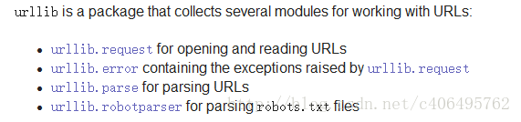

> 1.urllib.request模块是用来打开和读取URLs的；
> 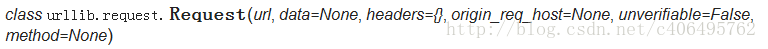
> 1.在创建Request对象的时候，填入headers参数(包含User Agent信息)，这个Headers参数要求为字典；2.在创建Request对象的时候不添加headers参数，在创建完成之后，使用add_header()的方法，添加headers。
> 2.urllib.error模块包含一些有urllib.request产生的错误，可以使用try进行捕捉处理；
> urllib.error可以接收有urllib.request产生的异常。urllib.error有两个方法，URLError和HTTPError
> URLError是OSError的一个子类，HTTPError是URLError的一个子类，服务器上HTTP的响应会返回一个状态码，根据这个HTTP状态码，我们可以知道我们的访问是否成功
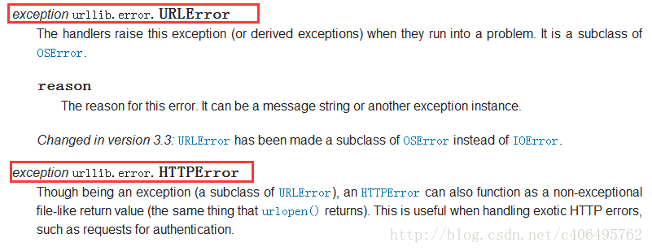
> 3.urllib.parse模块包含了一些解析URLs的方法；
> 4.urllib.robotparser模块用来解析robots.txt文本文件.它提供了一个单独的RobotFileParser类，通过该类提供的can_fetch()方法测试爬虫是否可以下载一个页面。

> 我们使用urllib.request.urlopen()这个接口函数就可以很轻松的打开一个网站，读取并打印信息。


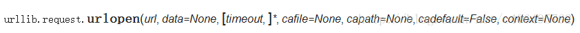

> 我们可以使用data参数，向服务器发送数据。根据HTTP规范，GET用于信息获取，POST是向服务器提交数据的一种请求，再换句话说：

> 从客户端向服务器提交数据使用POST；

> 从服务器获得数据到客户端使用GET(GET也可以提交，暂不考虑)。

> 如果没有设置urlopen()函数的data参数，HTTP请求采用GET方式，也就是我们从服务器获取信息，如果我们设置data参数，HTTP请求采用POST方式，也就是我们向服务器传递数据。

```python
data参数有自己的格式，它是一个基于application/x-www.form-urlencoded的格式，具体格式我们不用了解，
因为我们可以使用urllib.parse.urlencode()函数将字符串自动转换成上面所说的格式
```

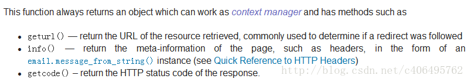
> geturl()返回的是一个url的字符串；
> info()返回的是一些meta标记的元信息，包括一些服务器的信息
> getcode()返回的是HTTP的状态码，如果返回200表示请求成功


```python
# -*- coding: UTF-8 -*-
from urllib import request

if __name__ == "__main__":
    response = request.urlopen("http://fanyi.baidu.com")
    html = response.read()
    print(html)
```
> 我们可以通过简单的decode()命令将网页的信息进行解码，并显示出来
```python
# -*- coding: UTF-8 -*-
from urllib import request

if __name__ == "__main__":
    response = request.urlopen("http://www.baidu.com/")
    html = response.read()
    print(html.decode('utf-8'))
```

```
pip install chardet
```

```python
# -*- coding: UTF-8 -*-
from urllib import request
import chardet

if __name__ == "__main__":
    response = request.urlopen("http://fanyi.baidu.com/")
    html = response.read()
    charset = chardet.detect(html)
    print(charset)
```

```python
# -*- coding: UTF-8 -*-
from urllib import request

if __name__ == "__main__":
    req = request.Request("http://fanyi.baidu.com/")
    response = request.urlopen(req)
    print("geturl打印信息：%s"%(response.geturl()))
    print('**********************************************')
    print("info打印信息：%s"%(response.info()))
    print('**********************************************')
    print("getcode打印信息：%s"%(response.getcode()))
```
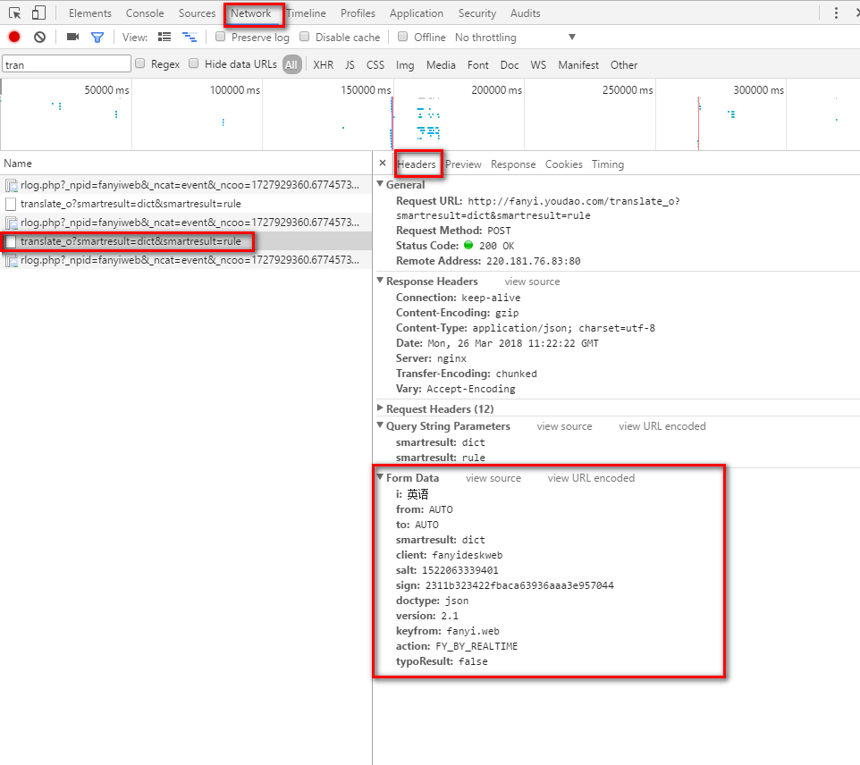

```python
# -*- coding: UTF-8 -*-
from urllib import request
from urllib import parse
import json

if __name__ == "__main__":
    #对应上图的Request URL
    Request_URL = 'http://fanyi.youdao.com/translate?smartresult=dict&smartresult=rule&smartresult=ugc&sessionFrom=https://www.baidu.com/link'
    #创建Form_Data字典，存储上图的Form Data
    Form_Data = {}
    Form_Data['type'] = 'AUTO'
    Form_Data['i'] = 'Jack'
    Form_Data['doctype'] = 'json'
    Form_Data['xmlVersion'] = '1.8'
    Form_Data['keyfrom'] = 'fanyi.web'
    Form_Data['ue'] = 'ue:UTF-8'
    Form_Data['action'] = 'FY_BY_CLICKBUTTON'
    #使用urlencode方法转换标准格式
    data = parse.urlencode(Form_Data).encode('utf-8')
    #传递Request对象和转换完格式的数据
    response = request.urlopen(Request_URL,data)
    #读取信息并解码
    html = response.read().decode('utf-8')
    #使用JSON
    translate_results = json.loads(html)
    #找到翻译结果
    translate_results = translate_results['translateResult'][0][0]['tgt']
    #打印翻译信息
    print("翻译的结果是：%s" % translate_results)
```

```python
# -*- coding: UTF-8 -*-
from urllib import request
from urllib import error

if __name__ == "__main__":
    #一个不存在的连接
    url = "http://www.iloveyou.com/"
    req = request.Request(url)
    try:
        response = request.urlopen(req)
        html = response.read().decode('utf-8')
        print(html)
    except error.URLError as e:
        print(e.reason)
```

```python
# -*- coding: UTF-8 -*-
from urllib import request
from urllib import error

if __name__ == "__main__":
    #一个不存在的连接
    url = "http://www.douyu.com/Jack_Cui.html"
    req = request.Request(url)
    try:
        responese = request.urlopen(req)
        # html = responese.read()
    except error.HTTPError as e:
        print(e.code)
```

```python
# -*- coding: UTF-8 -*-
from urllib import request
from urllib import error

if __name__ == "__main__":
    #一个不存在的连接
    url = "http://www.douyu.com/Jack_Cui.html"
    req = request.Request(url)
    try:
        responese = request.urlopen(req)
    except error.URLError as e:
        if hasattr(e, 'code')
            print("HTTPError")
            print(e.code)
        elif hasattr(e, 'reason')
            print("URLError")
            print(e.reason)
```
> User Agent存放于Headers中，服务器就是通过查看Headers中的User Agent来判断是谁在访问。在Python中，如果不设置User Agent，程序将使用默认的参数，那么这个User Agent就会有Python的字样，如果服务器检查User Agent，那么没有设置User Agent的Python程序将无法正常访问网站。
```
1.Android
Mozilla/5.0 (Linux; Android 4.1.1; Nexus 7 Build/JRO03D) AppleWebKit/535.19 (KHTML, like Gecko) Chrome/18.0.1025.166 Safari/535.19
Mozilla/5.0 (Linux; U; Android 4.0.4; en-gb; GT-I9300 Build/IMM76D) AppleWebKit/534.30 (KHTML, like Gecko) Version/4.0 Mobile Safari/534.30
Mozilla/5.0 (Linux; U; Android 2.2; en-gb; GT-P1000 Build/FROYO) AppleWebKit/533.1 (KHTML, like Gecko) Version/4.0 Mobile Safari/533.1

2.Firefox
Mozilla/5.0 (Windows NT 6.2; WOW64; rv:21.0) Gecko/20100101 Firefox/21.0
Mozilla/5.0 (Android; Mobile; rv:14.0) Gecko/14.0 Firefox/14.0

3.Google Chrome
Mozilla/5.0 (Windows NT 6.2; WOW64) AppleWebKit/537.36 (KHTML, like Gecko) Chrome/27.0.1453.94 Safari/537.36
Mozilla/5.0 (Linux; Android 4.0.4; Galaxy Nexus Build/IMM76B) AppleWebKit/535.19 (KHTML, like Gecko) Chrome/18.0.1025.133 Mobile Safari/535.19

4.iOS
Mozilla/5.0 (iPad; CPU OS 5_0 like Mac OS X) AppleWebKit/534.46 (KHTML, like Gecko) Version/5.1 Mobile/9A334 Safari/7534.48.3
Mozilla/5.0 (iPod; U; CPU like Mac OS X; en) AppleWebKit/420.1 (KHTML, like Gecko) Version/3.0 Mobile/3A101a Safari/419.3
```

```python
# -*- coding: UTF-8 -*-
from urllib import request

if __name__ == "__main__":
    #以CSDN为例，CSDN不更改User Agent是无法访问的
    url = 'http://www.csdn.net/'
    head = {}
    #写入User Agent信息
    head['User-Agent'] = 'Mozilla/5.0 (Linux; Android 4.1.1; Nexus 7 Build/JRO03D) AppleWebKit/535.19 (KHTML, like Gecko) Chrome/18.0.1025.166  Safari/535.19'
 #创建Request对象
    req = request.Request(url, headers=head)
    #传入创建好的Request对象
    response = request.urlopen(req)
    #读取响应信息并解码
    html = response.read().decode('utf-8')
    #打印信息
    print(html)
```

```python
# -*- coding: UTF-8 -*-
from urllib import request

if __name__ == "__main__":
    #以CSDN为例，CSDN不更改User Agent是无法访问的
    url = 'http://www.csdn.net/'
    #创建Request对象
    req = request.Request(url)
    #传入headers
    req.add_header('User-Agent', 'Mozilla/5.0 (Linux; Android 4.1.1; Nexus 7 Build/JRO03D) AppleWebKit/535.19 (KHTML, like Gecko) Chrome/18.0.1025.166  Safari/535.19')
    #传入创建好的Request对象
    response = request.urlopen(req)
    #读取响应信息并解码
    html = response.read().decode('utf-8')
    #打印信息
    print(html)
```

>  (1)调用urlib.request.ProxyHandler()，proxies参数为一个字典
> 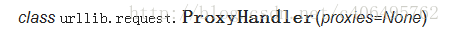
>  (2)创建Opener(类似于urlopen，这个代开方式是我们自己定制的)
> 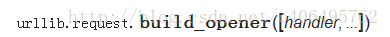
>  (3)安装Opener
> 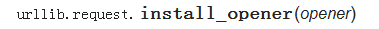

> 使用install_opener方法之后，会将程序默认的urlopen方法替换掉。也就是说，如果使用install_opener之后，在该文件中，再次调用urlopen会使用自己创建好的opener。如果不想替换掉，只是想临时使用一下，可以使用opener.open(url)，这样就不会对程序默认的urlopen有影响。

> Cookie，指某些网站为了辨别用户身份、进行session跟踪而储存在用户本地终端上的数据（通常经过加密)。 比如说有些网站需要登录后才能访问某个页面，在登录之前，你想抓取某个页面内容，登陆前与登陆后是不同的，或者不允许的。 使用Cookie和使用代理IP一样，也需要创建一个自己的opener。在HTTP包中，提供了cookiejar模块，用于提供对Cookie的支持。
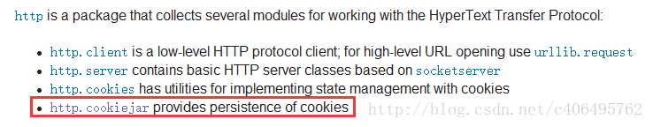

> http.cookiejar功能强大，我们可以利用本模块的CookieJar类的对象来捕获cookie并在后续连接请求时重新发送，比如可以实现模拟登录功能。该模块主要的对象有CookieJar、FileCookieJar、MozillaCookieJar、LWPCookieJar。
> 它们的关系： CookieJar–派生–>FileCookieJar–派生–>MozillaCookieJar和LWPCookieJar
> 工作原理：创建一个带有cookie的opener，在访问登录的URL时，将登录后的cookie保存下来，然后利用这个cookie来访问其他网址。查看登录之后才能看到的信息。

```python
# -*- coding: UTF-8 -*-
from urllib import request
from http import cookiejar

if __name__ == '__main__':
    #声明一个CookieJar对象实例来保存cookie
    cookie = cookiejar.CookieJar()
    #利用urllib.request库的HTTPCookieProcessor对象来创建cookie处理器,也就CookieHandler
    handler=request.HTTPCookieProcessor(cookie)
    #通过CookieHandler创建opener
    opener = request.build_opener(handler)
    #此处的open方法打开网页
    response = opener.open('http://www.baidu.com')
    #打印cookie信息
    for item in cookie:
        print('Name = %s' % item.name)
        print('Value = %s' % item.value)
```
> 在上面的方法中，我们将cookie保存到了cookie这个变量中，如果我们想将cookie保存到文件中该怎么做呢？方便以后直接读取文件使用，这时，我们就要用到FileCookieJar这个对象了，在这里我们使用它的子类MozillaCookieJar来实现Cookie的保存

```python
# -*- coding: UTF-8 -*-
from urllib import request
from http import cookiejar

if __name__ == '__main__':

    #设置保存cookie的文件，同级目录下的cookie.txt
    filename = 'cookie.txt'
    #声明一个MozillaCookieJar对象实例来保存cookie，之后写入文件
    cookie = cookiejar.MozillaCookieJar(filename)
    #利用urllib.request库的HTTPCookieProcessor对象来创建cookie处理器,也就CookieHandler
    handler=request.HTTPCookieProcessor(cookie)
    #通过CookieHandler创建opener
    opener = request.build_opener(handler)
    #此处的open方法打开网页
    response = opener.open('http://www.baidu.com')
    #保存cookie到文件
    cookie.save(ignore_discard=True, ignore_expires=True)
```
> cookie.save的参数说明：
> ignore_discard的意思是即使cookies将被丢弃也将它保存下来；
> ignore_expires的意思是如果在该文件中cookies已经存在，则覆盖原文件写入。
> 在这里，我们将这两个全部设置为True。运行之后，cookies将被保存到cookie.txt文件中。我们可以查看自己查看下cookie.txt这个文件的内容

```python
# -*- coding: UTF-8 -*-
from urllib import request
from http import cookiejar

if __name__ == '__main__':
    #设置保存cookie的文件的文件名,相对路径,也就是同级目录下
    filename = 'cookie.txt'
    #创建MozillaCookieJar实例对象
    cookie = cookiejar.MozillaCookieJar()
    #从文件中读取cookie内容到变量
    cookie.load(filename, ignore_discard=True, ignore_expires=True)
    #利用urllib.request库的HTTPCookieProcessor对象来创建cookie处理器,也就CookieHandler
    handler=request.HTTPCookieProcessor(cookie)
    #通过CookieHandler创建opener
    opener = request.build_opener(handler)
    #此用opener的open方法打开网页
    response = opener.open('http://www.baidu.com')
    #打印信息
    print(response.read().decode('utf-8'))
```

```python
# -*- coding: UTF-8 -*-
from urllib import request
from urllib import error
from urllib import parse
from http import cookiejar

if __name__ == '__main__':
    #登陆地址
    login_url = 'http://www.jobbole.com/wp-admin/admin-ajax.php'
    #User-Agent信息
    user_agent = r'Mozilla/5.0 (Windows NT 6.2; WOW64) AppleWebKit/537.36 (KHTML, like Gecko) Chrome/27.0.1453.94 Safari/537.36'
    #Headers信息
    head = {'User-Agnet': user_agent, 'Connection': 'keep-alive'}
    #登陆Form_Data信息
    Login_Data = {}
    Login_Data['action'] = 'user_login'
    Login_Data['redirect_url'] = 'http://www.jobbole.com/'
    Login_Data['remember_me'] = '0'         #是否一个月内自动登陆
    Login_Data['user_login'] = '********'       #改成你自己的用户名
    Login_Data['user_pass'] = '********'        #改成你自己的密码
    #使用urlencode方法转换标准格式
    logingpostdata = parse.urlencode(Login_Data).encode('utf-8')
    #声明一个CookieJar对象实例来保存cookie
    cookie = cookiejar.CookieJar()
    #利用urllib.request库的HTTPCookieProcessor对象来创建cookie处理器,也就CookieHandler
    cookie_support = request.HTTPCookieProcessor(cookie)
    #通过CookieHandler创建opener
    opener = request.build_opener(cookie_support)
    #创建Request对象
    req1 = request.Request(url=login_url, data=logingpostdata, headers=head)

    #面向对象地址
    date_url = 'http://date.jobbole.com/wp-admin/admin-ajax.php'
    #面向对象
    Date_Data = {}
    Date_Data['action'] = 'get_date_contact'
    Date_Data['postId'] = '4128'
    #使用urlencode方法转换标准格式
    datepostdata = parse.urlencode(Date_Data).encode('utf-8')
    req2 = request.Request(url=date_url, data=datepostdata, headers=head)
    try:
        #使用自己创建的opener的open方法
        response1 = opener.open(req1)
        response2 = opener.open(req2)
        html = response2.read().decode('utf-8')
        index = html.find('jb_contact_email')
        #打印查询结果
        print('联系邮箱:%s' % html[index+19:-2])

    except error.URLError as e:
        if hasattr(e, 'code'):
            print("HTTPError:%d" % e.code)
        elif hasattr(e, 'reason'):
            print("URLError:%s" % e.reason)
```

> Beautiful Soup自动将输入文档转换为Unicode编码，输出文档转换为utf-8编码。你不需要考虑编码方式，除非文档没有指定一个编码方式，这时，Beautiful Soup就不能自动识别编码方式了。然后，你仅仅需要说明一下原始编码方式就可以了。Beautiful Soup已成为和lxml、html6lib一样出色的python解释器，为用户灵活地提供不同的解析策略或强劲的速度。

```python
from bs4 import BeautifulSoup

#html为解析的页面获得html信息,为方便讲解，自己定义了一个html文件

html = """
<html>
<head>
<title>Jack_Cui</title>
</head>
<body>
<p class="title" name="blog"><b>My Blog</b></p>
<li><!--注释--></li>
<a href="http://blog.csdn.net/c406495762/article/details/58716886" class="sister" id="link1">Python3网络爬虫(一)：利用urllib进行简单的网页抓取</a><br/>
<a href="http://blog.csdn.net/c406495762/article/details/59095864" class="sister" id="link2">Python3网络爬虫(二)：利用urllib.urlopen发送数据</a><br/>
<a href="http://blog.csdn.net/c406495762/article/details/59488464" class="sister" id="link3">Python3网络爬虫(三)：urllib.error异常</a><br/>
</body>
</html>
"""

#创建Beautiful Soup对象
soup = BeautifulSoup(html,'lxml')
print(soup.prettify())
```
b)Beautiful Soup四大对象

Beautiful Soup将复杂HTML文档转换成一个复杂的树形结构,每个节点都是Python对象,所有对象可以归纳为4种:
Tag
Tag通俗点讲就是HTML中的一个个标签, 不过有一点是，它查找的是在所有内容中的第一个符合要求的标签
对于Tag，有两个重要的属性：name和attrs
name
soup 对象本身比较特殊，它的 name 即为 [document]，对于其他内部标签，输出的值便为标签本身的名称
```python
print(soup.name)
print(soup.title.name)
#[document]
#title
```
attrs
```python
print(soup.a.attrs)
#{'class': ['sister'], 'href': 'http://blog.csdn.net/c406495762/article/details/58716886', 'id': 'link1'}
```
> 如果我们想要单独获取某个属性，可以这样，例如我们获取a标签的class叫什么，两个等价的方法如
```python
print(soup.a['class'])
print(soup.a.get('class'))
#['sister']
#['sister']
```


```python
print(soup.title)
#<title>Jack_Cui</title>

print(soup.head)
#<head> <title>Jack_Cui</title></head>

print(soup.a)
#<a class="sister" href="http://blog.csdn.net/c406495762/article/details/58716886" id="link1">Python3网络爬虫(一)：利用urllib进行简单的网页抓取</a>

print(soup.p)
#<p class="title" name="blog"><b>My Blog</b></p>
```
NavigableString
> 既然我们已经得到了标签的内容，那么问题来了，我们要想获取标签内部的文字怎么办呢？很简单，用 .string 即可
```python
print(soup.title.string)
#Jack_Cui
```

BeautifulSoup
> BeautifulSoup 对象表示的是一个文档的全部内容.大部分时候,可以把它当作 Tag 对象，是一个特殊的 Tag，我们可以分别获取它的类型，名称，以及属性

```python
print(type(soup.name))
print(soup.name)
print(soup.attrs)
#<class 'str'>
#[document]
#{}
```

Comment
>  Comment对象是一个特殊类型的NavigableString对象，其实输出的内容仍然不包括注释符号，但是如果不好好处理它，可能会对我们的文本处理造成意想不到的麻烦
```python
print(soup.li)
print(soup.li.string)
print(type(soup.li.string))
#<li><!--注释--></li>
#注释
#<class 'bs4.element.Comment'>

from bs4 import element

if type(soup.li.string) == element.Comment:
     print(soup.li.string)
```

```python
# -*-coding:utf-8 -*-
from selenium.webdriver.support import expected_conditions as EC
from selenium.webdriver.support.ui import WebDriverWait
from selenium.webdriver.common.by import By
from selenium import webdriver
class Crack():
    def __init__(self,keyword):
        self.url = 'http://bj.gsxt.gov.cn/sydq/loginSydqAction!sydq.dhtml';
        self.browser = webdriver.Chrome('D:\\chromedriver.exe')
        self.wait = WebDriverWait(self.browser, 100)
        self.keyword = keyword
    def open(self):
        """
        打开浏览器,并输入查询内容
        """
        self.browser.get(self.url)
        keyword = self.wait.until(EC.presence_of_element_located((By.ID, 'keyword_qycx')))
        bowton = self.wait.until(EC.presence_of_element_located((By.CLASS_NAME, 'btn')))
        keyword.send_keys(self.keyword)
        bowton.click()
    def crack(self):
        # 打开浏览器
        self.open()
if __name__ == '__main__':
    print('开始验证')
    crack = Crack(u'中国移动')
    crack.crack()
```
