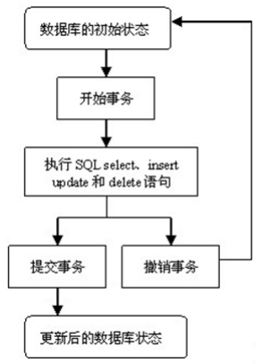
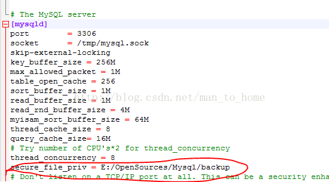
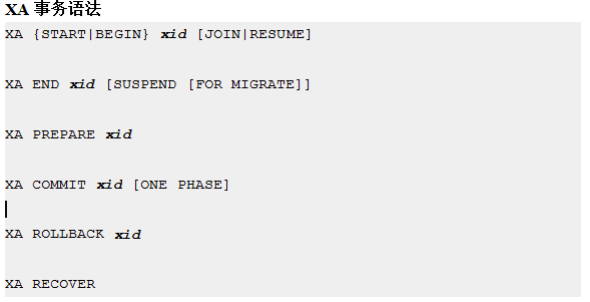

```sql
mysql> system ls -al
total 122960
drwxr-x--x.  5 mysql mysql     4096 Mar 18 00:39 .
drwxr-xr-x. 58 root  root      4096 Mar 18 00:41 ..
-rw-r-----.  1 mysql mysql       56 Mar 18 00:31 auto.cnf
-rw-------.  1 mysql mysql     1675 Mar 18 00:31 ca-key.pem
-rw-r--r--.  1 mysql mysql     1107 Mar 18 00:31 ca.pem
-rw-r--r--.  1 mysql mysql     1107 Mar 18 00:31 client-cert.pem
-rw-------.  1 mysql mysql     1679 Mar 18 00:31 client-key.pem
-rw-r-----.  1 mysql mysql      350 Mar 18 00:39 ib_buffer_pool
-rw-r-----.  1 mysql mysql 12582912 Mar 18 00:39 ibdata1
-rw-r-----.  1 mysql mysql 50331648 Mar 18 00:39 ib_logfile0
-rw-r-----.  1 mysql mysql 50331648 Mar 18 00:31 ib_logfile1
-rw-r-----.  1 mysql mysql 12582912 Mar 18 00:41 ibtmp1
drwxr-x---.  2 mysql mysql     4096 Mar 18 00:31 mysql
srwxrwxrwx.  1 mysql mysql        0 Mar 18 00:39 mysql.sock
-rw-------.  1 mysql mysql        6 Mar 18 00:39 mysql.sock.lock
drwxr-x---.  2 mysql mysql     8192 Mar 18 00:31 performance_schema
-rw-------.  1 mysql mysql     1679 Mar 18 00:31 private_key.pem
-rw-r--r--.  1 mysql mysql      451 Mar 18 00:31 public_key.pem
-rw-r--r--.  1 mysql mysql     1107 Mar 18 00:31 server-cert.pem
-rw-------.  1 mysql mysql     1675 Mar 18 00:31 server-key.pem
drwxr-x---.  2 mysql mysql     8192 Mar 18 00:31 sys
mysql> show databases;
+--------------------+
| Database           |
+--------------------+
| information_schema |
| mysql              |
| performance_schema |
| sys                |
+--------------------+
4 rows in set (0.01 sec)

mysql> create database test;
Query OK, 1 row affected (0.05 sec)

mysql> system ls -lrt
total 122952
-rw-r-----. 1 mysql mysql 50331648 Mar 18 00:31 ib_logfile1
-rw-r-----. 1 mysql mysql       56 Mar 18 00:31 auto.cnf
drwxr-x---. 2 mysql mysql     8192 Mar 18 00:31 performance_schema
drwxr-x---. 2 mysql mysql     4096 Mar 18 00:31 mysql
drwxr-x---. 2 mysql mysql     8192 Mar 18 00:31 sys
-rw-------. 1 mysql mysql     1675 Mar 18 00:31 ca-key.pem
-rw-r--r--. 1 mysql mysql     1107 Mar 18 00:31 ca.pem
-rw-------. 1 mysql mysql     1675 Mar 18 00:31 server-key.pem
-rw-r--r--. 1 mysql mysql     1107 Mar 18 00:31 server-cert.pem
-rw-------. 1 mysql mysql     1679 Mar 18 00:31 client-key.pem
-rw-r--r--. 1 mysql mysql     1107 Mar 18 00:31 client-cert.pem
-rw-------. 1 mysql mysql     1679 Mar 18 00:31 private_key.pem
-rw-r--r--. 1 mysql mysql      451 Mar 18 00:31 public_key.pem
-rw-r-----. 1 mysql mysql      350 Mar 18 00:39 ib_buffer_pool
-rw-------. 1 mysql mysql        6 Mar 18 00:39 mysql.sock.lock
srwxrwxrwx. 1 mysql mysql        0 Mar 18 00:39 mysql.sock
-rw-r-----. 1 mysql mysql 12582912 Mar 18 00:39 ibdata1
-rw-r-----. 1 mysql mysql 50331648 Mar 18 00:39 ib_logfile0
-rw-r-----. 1 mysql mysql 12582912 Mar 18 00:41 ibtmp1
drwxr-x---. 2 mysql mysql       19 Mar 19 00:22 test


[root@localhost mysql]# cd test
[root@localhost test]# ls
db.opt
[root@localhost test]# ll
total 4
-rw-r-----. 1 mysql mysql 65 Mar 19 00:22 db.opt


mysql> use test;
Database changed
mysql> select database();
+------------+
| database() |
+------------+
| test       |
+------------+
1 row in set (0.00 sec)

mysql> drop database test;
Query OK, 0 rows affected (0.07 sec)


mysql> select version();
+-----------+
| version() |
+-----------+
| 5.7.21    |
+-----------+
1 row in set (0.00 sec)

mysql> select now();
+---------------------+
| now()               |
+---------------------+
| 2018-03-19 00:27:02 |
+---------------------+
1 row in set (0.00 sec)

mysql> select user();
+--------+
| user() |
+--------+
| root@  |
+--------+
1 row in set (0.00 sec)

```
> MysqL在执行一句数据库操作命令的时候，通常都是自动提交的。常用引擎下有两种： MyIsam和InnoDB，MyIsam是不支持事务处理的，但InnoDB支持，但InnoDB在不开启事务处理的情况下执行语句也会自动提交，因为MysqL有一个机制控制，那就是自动提交机制，在默认情况下是开启的，我们在开发过程中有些场景需要关闭自动提交来保证数据的一致性。

```sql
mysql> show variables like '%autocommit%';
+---------------+-------+
| Variable_name | Value |
+---------------+-------+
| autocommit    | ON    |
+---------------+-------+
1 row in set (0.03 sec)

mysql> set autocommit = 0;
Query OK, 0 rows affected (0.00 sec)

mysql> show variables like '%autocommit%';
+---------------+-------+
| Variable_name | Value |
+---------------+-------+
| autocommit    | OFF   |
+---------------+-------+
1 row in set (0.01 sec)

```

> 通过修改配置文件my.cnf文件，通过vim编辑my.cnf文件，在[mysqld]添加: autocommit=0


> 错误日志文件记录了错误信息，以及mysqld进程的关闭和启动的信息，这部分信息并不是全部记录而只是记录mysqld进程运行过程中发生的关键性错误。错误日志默认位置数据目录DATADIR 指定的目录中，可以在启动mysqld进程时，通过log-error选项来指定错误日志文件名和存放位置，或者my.ini配置文件中配置log-error参数，如果没有指定文件名的话，会自动生成一个[hostname].err文件保存在{datadir}文件夹下。

```sql
mysql> show variables like 'log_error';
+---------------+---------------------+
| Variable_name | Value               |
+---------------+---------------------+
| log_error     | /var/log/mysqld.log |
+---------------+---------------------+
1 row in set (0.00 sec)

```

> 查询日志也称为 general log（通用日志），查询日志记录了数据库执行的所有命令，由于数据库操作命令有可能非常多而且执行比较频繁，所以当开启了查询日志以后，数据库可能需要不停的写入查询日志，这样会增大服务器的IO压力，增加很多系统开销，所以默认情况下，mysql的查询日志是没有开启的。

> 开启查询日志可以帮助分析哪些语句执行频率，以及对应语句的数据是否能够被缓存，所以，可以根据实际情况决定是否开启查询日志。 开启查询日志后，有三种方式来存放日志：

1) 存放于指定的日志文件中。
2) 存放于mysql.general_log表中。
3) 同时存放在指定的日志文件与mysql库的general_log表中。

```sql
mysql> show variables where variable_name like "%general_log%" or variable_name="log_output";
+------------------+------------------------------+
| Variable_name    | Value                        |
+------------------+------------------------------+
| general_log      | OFF                          |
| general_log_file | /var/lib/mysql/localhost.log |
| log_output       | FILE                         |
+------------------+------------------------------+
3 rows in set (0.00 sec)

```
1) “FILE”表示存放于指定的文件中，
2) “TABLE”表示存放于mysql库的general_log表中，
3) “FILE,TABLE”表示将查询日志同时存放于指定的文件与general_log表中，一般不会进行这样的设置，因为这样会徒增很多IO压力。
4) “NONE”时表示不记录查询日志，即使general_log设置为ON，如果log_output设置为NONE，也不会记录查询日志。

注：log_output不仅用于控制查询日志的输出，也控制慢查询日志的输出，当log_output设置为file时，查询日志和慢查询日志都存放到对应的文件中，设置为table，查询日志和慢查询日志都存放在对应的数据库表中。
general_log_file: 表示当log_output的值设置为”FILE”或者”FILE,TABLE”时，将查询日志存放于哪个日志文件中，即通过此参数指定查询日志的文件，默认文件名是host_name.log，而且使用了相对路径，默认位置为DATADIR变量所对应的目录位置。

2 查询日志参数修改

可以直接修改配置文件/etc/my.cnf：
general_log = {ON|OFF}
general_log_file = /data/mysql/mysql.log
log_output = {TABLE|FILE|NONE}

也可以直接在会话级别进行修改，但修改会在重启MariaDB后失效
```sql
mysql> set global general_log=on;
Query OK, 0 rows affected (0.07 sec)

mysql> set global log_output = 'file,table';
Query OK, 0 rows affected (0.00 sec)

mysql> show variables where variable_name like '%general_log%' or variable_name='log_output';
+------------------+------------------------------+
| Variable_name    | Value                        |
+------------------+------------------------------+
| general_log      | ON                           |
| general_log_file | /var/lib/mysql/localhost.log |
| log_output       | FILE,TABLE                   |
+------------------+------------------------------+
3 rows in set (0.01 sec)

mysql> create database test;
Query OK, 1 row affected (0.00 sec)

mysql> use test;
Database changed
mysql> create table test(id int);
Query OK, 0 rows affected (0.12 sec)


[root@localhost tmp]# cat /var/lib/mysql/localhost.log
/usr/sbin/mysqld, Version: 5.7.21 (MySQL Community Server (GPL)). started with:
Tcp port: 3306  Unix socket: /var/lib/mysql/mysql.sock
Time                 Id Command    Argument
2018-03-19T07:40:01.559985Z	    2 Query	set log_output = 'file,table'
2018-03-19T07:40:09.079437Z	    2 Query	set global log_output = 'file,table'
2018-03-19T07:40:40.215788Z	    2 Query	show variables where variable_name like '%general_log%' or variable_name='log_output'
2018-03-19T07:42:08.041174Z	    2 Query	create database test
2018-03-19T07:42:11.545268Z	    2 Query	SELECT DATABASE()
2018-03-19T07:42:11.545495Z	    2 Init DB	test
2018-03-19T07:42:11.583158Z	    2 Query	show databases
2018-03-19T07:42:11.634569Z	    2 Query	show tables
2018-03-19T07:42:18.681408Z	    2 Query	create table test(id int)

mysql> select * from mysql.general_log;
+----------------------------+---------------------------------------+-----------+-----------+--------------+---------------------------------------------------------------------------------------+
| event_time                 | user_host                             | thread_id | server_id | command_type | argument                                                                              |
+----------------------------+---------------------------------------+-----------+-----------+--------------+---------------------------------------------------------------------------------------+
| 2018-03-19 00:40:40.215788 | skip-grants user[root] @ localhost [] |         2 |         0 | Query        | show variables where variable_name like '%general_log%' or variable_name='log_output' |
| 2018-03-19 00:42:08.041174 | skip-grants user[root] @ localhost [] |         2 |         0 | Query        | create database test                                                                  |
| 2018-03-19 00:42:11.545268 | skip-grants user[root] @ localhost [] |         2 |         0 | Query        | SELECT DATABASE()                                                                     |
| 2018-03-19 00:42:11.545495 | skip-grants user[root] @ localhost [] |         2 |         0 | Init DB      | test                                                                                  |
| 2018-03-19 00:42:11.583158 | skip-grants user[root] @ localhost [] |         2 |         0 | Query        | show databases                                                                        |
| 2018-03-19 00:42:11.634569 | skip-grants user[root] @ localhost [] |         2 |         0 | Query        | show tables                                                                           |
| 2018-03-19 00:42:18.681408 | skip-grants user[root] @ localhost [] |         2 |         0 | Query        | create table test(id int)                                                             |
| 2018-03-19 00:44:17.275502 | skip-grants user[root] @ localhost [] |         2 |         0 | Query        | select * from mysql.general_log                                                       |
+----------------------------+---------------------------------------+-----------+-----------+--------------+---------------------------------------------------------------------------------------+
8 rows in set (0.00 sec)

```

> 1 慢查询日志概念
> MariaDB的慢查询日志用来记录数据库中响应时间超过阀值的语句，具体指运行时间超过long_query_time值的SQL，会被记录到慢查询日志中。long_query_time的默认值为10，单位是秒。默认情况下，MariaDB数据库并不启动慢查询日志，开启慢查询日志会带来一定的性能影响。慢查询日志支持将日志记录写入文件，也支持将日志记录写入数据库表。

slow_query_log ：是否开启慢查询日志，1表示开启，0表示关闭。
log-slow-queries ：旧版（5.6以下版本）MySQL数据库慢查询日志存储路径。可以不设置该参数，系统则会默认给一个缺省的文件host_name-slow.log
slow-query-log-file：当使用文件存储慢查询日志时(log_output设置为”FILE”或者”FILE,TABLE”时)，指定慢查询日志存储于哪个日志文件中，默认的慢查询日志文件名为”主机名-slow.log”，慢查询日志的位置为datadir参数所对应的目录位置。
long_query_time ：表示”多长时间的查询”被认定为”慢查询”，此值得默认值为10秒，表示超过10秒的查询被认定为慢查询。
log_queries_not_using_indexes：表示如果运行的sql语句没有使用到索引，是否也被当做慢查询语句记录到慢查询日志中，OFF表示不记录，ON表示记录。
log_output：日志存储方式。
‘FILE’表示将日志存入文件，默认值是’FILE’。
‘TABLE’表示将日志存入数据库，这样日志信息就会被写入到mysql.slow_log表中。
‘FILE,TABLE’，同时记录两种日志存储方式。日志记录到系统的专用日志表中，要比记录到文件耗费更多的系统资源，因此对于需要启用慢查询日志，又需要能够获得更高的系统性能，那么建议优先记录到文件。

log_throttle_queries_not_using_indexes ：5.6.5版本新引入的参数，当log_queries_not_using_inde设置为ON时，没有使用索引的查询语句也会被当做慢查询语句记录到慢查询日志中，使用log_throttle_queries_not_using_indexes可以限制这种语句每分钟记录到慢查询日志中的次数，因为在生产环境中，有可能有很多没有使用索引的语句，此类语句频繁的被记录到慢查询日志中，可能会导致慢查询日志快速不断的增长，管理员可以通过此参数进行控制。


```sql
mysql> create table test(id1 int , id2 int);
Query OK, 0 rows affected (0.05 sec)
```
### 9.1.1.1 提供列值的几种方式
#### 1.如果mysql的sql mode没有运行在严格模式， 没有明确给出列值的列会被赋予默认值。
```sql
mysql> alter table test modify id1 int not null default 0;
Query OK, 0 rows affected (0.07 sec)
Records: 0  Duplicates: 0  Warnings: 0

mysql> insert into test(id2) values (1);
Query OK, 1 row affected (0.00 sec)

mysql> commit;
Query OK, 0 rows affected (0.00 sec)

mysql> select * from test;
+-----+------+
| id1 | id2  |
+-----+------+
|   0 |    1 |
+-----+------+
1 row in set (0.00 sec)

mysql> insert into test values(null, 2);
ERROR 1048 (23000): Column 'id1' cannot be null
```
#### 2.可以使用DEFAULT关键字为一个不完整的SQL语句插入默认值。
```sql
mysql> insert into test values (default, 2);
Query OK, 1 row affected (0.00 sec)

mysql> select * from test;
+-----+------+
| id1 | id2  |
+-----+------+
|   0 |    1 |
|   0 |    2 |
+-----+------+
2 rows in set (0.00 sec)

除了插入默认值外， 我们还可以使用DEFAULT(col_name)关键字去调用其他列的默认值

mysql> alter table test modify id2 int not null default 2;
Query OK, 0 rows affected (0.24 sec)
Records: 0  Duplicates: 0  Warnings: 0

mysql> insert into test values(default(id2), 10);
Query OK, 1 row affected (0.06 sec)

mysql> commit;
Query OK, 0 rows affected (0.01 sec)

mysql> select * from test;
+-----+-----+
| id1 | id2 |
+-----+-----+
|   0 |   1 |
|   0 |   2 |
|   2 |  10 |
+-----+-----+
3 rows in set (0.00 sec)


mysql> truncate table test;
Query OK, 0 rows affected (0.01 sec)

mysql> select * from test;
Empty set (0.00 sec)

mysql> insert into test values ();
Query OK, 1 row affected (0.01 sec)

mysql> commit;
Query OK, 0 rows affected (0.00 sec)

mysql> select * from test;
+-----+-----+
| id1 | id2 |
+-----+-----+
|   0 |   2 |
+-----+-----+
1 row in set (0.00 sec)
```
#### 3.可以在values或set中指定一个表达式expr来提供一个列值。
```sql
mysql> truncate table test;
Query OK, 0 rows affected (8.64 sec)

mysql> insert into test values (15, id1 * 2);
Query OK, 1 row affected (0.00 sec)

mysql> commit;
Query OK, 0 rows affected (0.01 sec)

mysql> select * from test;
+-----+-----+
| id1 | id2 |
+-----+-----+
|  15 |  30 |
+-----+-----+
1 row in set (0.00 sec)

mysql> insert into test values (id2, 100);
Query OK, 1 row affected (0.00 sec)

mysql> commit;
Query OK, 0 rows affected (0.00 sec)

mysql> select * from test;
+-----+-----+
| id1 | id2 |
+-----+-----+
|  15 |  30 |
|   2 | 100 |
+-----+-----+
2 rows in set (0.00 sec)

```
#### 这里还有一个例外情况， 就是如果引用的是自增列的时候
> 这是因为AUTO_INCREMENT的值是在其它值赋值之后被生成，所以任何在赋值时对AUTO_INCREMENT列的引用都会返回0。
```sql
mysql> alter table test modify id1 int primary key auto_increment;
Query OK, 0 rows affected (0.07 sec)
Records: 0  Duplicates: 0  Warnings: 0

mysql> insert into test(id2) values(id1 * 2);
Query OK, 1 row affected (0.00 sec)

mysql> insert into test(id2) values(id1 * 2);
Query OK, 1 row affected (0.00 sec)

mysql> commit;
Query OK, 0 rows affected (0.00 sec)

mysql> select * from test;
+-----+-----+
| id1 | id2 |
+-----+-----+
|   1 |   0 |
|   2 |   0 |
+-----+-----+
2 rows in set (0.01 sec)

```
#### 数据类型转换
```sql
mysql> create table t2(id int,id2 float,id3 decimal(10,6),id4 year);
Query OK, 0 rows affected (0.02 sec)

mysql> insert into t2 values('1999.0e-2','1999.0e-2','1999.0e-2','1999.0e-2');
Query OK, 1 row affected (0.05 sec)

mysql> commit;
Query OK, 0 rows affected (0.00 sec)

mysql> select * from t2;
+------+-------+-----------+------+
| id   | id2   | id3       | id4  |
+------+-------+-----------+------+
|   20 | 19.99 | 19.990000 | 2020 |
+------+-------+-----------+------+
1 row in set (0.00 sec)

```

### 9.1.1.2 INSERT子句的语法
#### 1.DELAYED
> 使用DELAYED关键字时， 服务器会把待插入的行放到一个缓冲器中， 而发送INSERT DELAYED语句的客户端能继续运行。如果表正在被使用， 服务器会保留这条INSERT语句。当表空闲时， 服务器开始插入行， 并且定期检查是否有新的读取请求。 如果有新的读取请求， 则INSERT语句继续延缓执行， 直到表再次空闲时为止。

#### 2.LOW_PRIORITY
> 这也是一个延迟INSERT语句执行的子句。 和DELAYED不同的是， 它在执行时会一直等待下去， 直到表空闲或超时为止。因此， 如果一个表的读取量很大， 发出INSERT LOW_PRIORITY语句的客户端可能需要等待很久， 甚至是永远等待下去。和LOW_PRIORITY对应的， 还有一个HIGH_PRIORITY， 是提高INSERT的优先级。LOW_PRIORITY和HIGH_PRIORITY子句用的不多的原因是： 这两个子句都只对表级锁的存储引擎有效。但是作为表级锁中最常用的存储引擎MYISAM来说， MyISAM有一个并行插入的特性， 不需要提高或降低INSERT语句的优先级。并行插入是MyISAM的一个特性， 在SELCT时同时可以在表的尾部插入新数据。

#### 3.IGNORE
> 就是INSERT遇到冲突的时候， 把报错信息转换成警告信息的。但是有一点要注意的是， 使用IGNORE后， 无效数据被调整到最接近的值， 并被插入。

```sql
mysql> truncate table t1;
Query OK, 0 rows affected (0.00 sec)

mysql> insert into t1 values (128,1);
ERROR 1264 (22003): Out of range value for column 'id1' at row 1
mysql> insert ignore t1 values(128,1);
Query OK, 1 row affected, 1 warning (0.00 sec)

mysql> show warnings;
+---------+------+----------------------------------------------+
| Level   | Code | Message                                      |
+---------+------+----------------------------------------------+
| Warning | 1264 | Out of range value for column 'id1' at row 1 |
+---------+------+----------------------------------------------+
1 row in set (0.00 sec)

mysql> commit;
Query OK, 0 rows affected (0.00 sec)

mysql> select * from t1;
+-----+------+
| id1 | id2  |
+-----+------+
| 127 |    1 |
+-----+------+
1 row in set (0.00 sec)

```
#### 4.ON DUPLICATE KEY UPDATE
> 在一个主键列或唯一列上执行INSERT语句冲突时， 执行后面的UPDATE
```sql
mysql> desc t1;
+-------+------------+------+-----+---------+-------+
| Field | Type       | Null | Key | Default | Extra |
+-------+------------+------+-----+---------+-------+
| id1   | tinyint(4) | NO   | PRI | NULL    |       |
| id2   | int(11)    | YES  |     | NULL    |       |
+-------+------------+------+-----+---------+-------+
2 rows in set (0.00 sec)

mysql> select * from t1;
+-----+------+
| id1 | id2  |
+-----+------+
| 127 |    1 |
+-----+------+
1 row in set (0.01 sec)

mysql> insert into t1 values (127, 2) on duplicate key update id2 = 100;
Query OK, 2 rows affected (0.00 sec)

mysql> select * from t1;
+-----+------+
| id1 | id2  |
+-----+------+
| 127 |  100 |
+-----+------+
1 row in set (0.00 sec)

```

## 9.1.2 UPDATE语法和技巧
> 在单表语法中
> set 子句指定更新的列值
> where 条件指定更新的范围， 如果没有WHERE条件， 会更新整个表
> order by 子句指定更新的顺序
> limit 子句限制更新的行数
> 多表更新的语法和单表更新大致相同， 只是不支持 order by 和 limit 子句。
```sql
mysql> truncate table t1;
Query OK, 0 rows affected (0.01 sec)

mysql> insert into t1 values(1,1),(2,2),(3,3),(4,4),(5,5);
Query OK, 5 rows affected (0.01 sec)
Records: 5  Duplicates: 0  Warnings: 0

mysql> UPDATE t1 SET id1 = id1 + 1;
ERROR 1062 (23000): Duplicate entry '2' for key 'PRIMARY'

mysql> update t1 set id1 = id1 +1 order by id1 desc;
Query OK, 5 rows affected (0.01 sec)
Rows matched: 5  Changed: 5  Warnings: 0

mysql> select * from t1;
+-----+------+
| id1 | id2  |
+-----+------+
|   2 |    1 |
|   3 |    2 |
|   4 |    3 |
|   5 |    4 |
|   6 |    5 |
+-----+------+
5 rows in set (0.00 sec)

```

#### NOT NULL和NULL
> 如果把一个NOT NULL的列更新为NULL， 则该列被设置到与列类型对应的默认值（如果没默认值， 则更新为隐式的默认值） ， 并且抛出警告。当然， 如果是严格的SQL MODE,刚刚我们讲的很多隐性转换都是会直接报错的。
> 隐式的默认值有： 数字0， 空字符串’ ’ ， 日期和时间的0值。

```sql
mysql> desc t1;
+-------+------------+------+-----+---------+-------+
| Field | Type       | Null | Key | Default | Extra |
+-------+------------+------+-----+---------+-------+
| id1   | tinyint(4) | NO   | PRI | NULL    |       |
| id2   | int(11)    | YES  |     | NULL    |       |
+-------+------------+------+-----+---------+-------+
2 rows in set (0.00 sec)

mysql> alter table t1 modify id2 int not null;
Query OK, 0 rows affected (0.07 sec)
Records: 0  Duplicates: 0  Warnings: 0

mysql> desc t1;
+-------+------------+------+-----+---------+-------+
| Field | Type       | Null | Key | Default | Extra |
+-------+------------+------+-----+---------+-------+
| id1   | tinyint(4) | NO   | PRI | NULL    |       |
| id2   | int(11)    | NO   |     | NULL    |       |
+-------+------------+------+-----+---------+-------+
2 rows in set (0.00 sec)

mysql> select * from t1;
Empty set (0.00 sec)

mysql> insert into t1 values (1,2);
Query OK, 1 row affected (0.05 sec)

mysql> commit;
Query OK, 0 rows affected (0.01 sec)

mysql> select * from t1;
+-----+-----+
| id1 | id2 |
+-----+-----+
|   1 |   2 |
+-----+-----+
1 row in set (0.00 sec)

mysql> update t1 set id2 = null where id1 = 1;
ERROR 1048 (23000): Column 'id2' cannot be null
```
#### 多表UPDATE的语法
> MySQL不支持多表UPDATE用子查询。
```sql
mysql> select * from t1;
+-----+-----+
| id1 | id2 |
+-----+-----+
|  20 |   2 |
+-----+-----+
1 row in set (0.00 sec)

mysql> select * from t2;
+------+-------+-----------+------+
| id   | id2   | id3       | id4  |
+------+-------+-----------+------+
|   20 | 19.99 | 19.990000 | 2020 |
+------+-------+-----------+------+
1 row in set (0.00 sec)


mysql> update t1, t2
    -> set t1.id2 = t2.id2
    -> where t1.id1 = t2.id;
Query OK, 1 row affected (0.08 sec)
Rows matched: 1  Changed: 1  Warnings: 0

mysql> select * from t1;
+-----+-----+
| id1 | id2 |
+-----+-----+
|  20 |  20 |
+-----+-----+
1 row in set (0.00 sec)

```
### 9.1.3 DELETE语法和技巧
> 多表的DELETE时也不能使用ORDER BY和LIMIT。 也不支持子查询。
> QUICK这个关键字， 只对MyISAM存储引擎有用。在DELETE执行期间， MySQL不刷新索引页， 能加快DELETE的速度。但是， 使用了QUICK后， 可能会在表中留下碎片。解决办法也简单， 在DLETE QUICK执行之后使用OPTIMIZE TABLE整理一下表即可。
>
- single table delete
```sql
delete [low_priority] [quick] [ignore] from tbl_name
[where where_condition]
[order by ...]
[limit row_count]
```
- multiple table delete
> 只删除列于FROM子句之前的表中的对应的行。
```sql
delete  [low_priority] [quick] [ignore] from tbl_name[.*] [, tbl_name[.*]] ...
  from table_references
[where where_condition]

mysql> DELETE t1, t2 FROM t1 INNER JOIN t2 INNER JOIN t3 WHERE t1.id1=t2.id AND t2.id=t3.id;
Query OK, 0 rows affected (0.00 sec)
```

- or
> 只删除列于FROM子句之中（在USING子句之前） 的表中的对应的行。
```sql
delete  [low_priority] [quick] [ignore] from tbl_name[.*] [, tbl_name[.*]] ...
 using table_references
[where where_condition]


mysql> DELETE FROM t1, t2 USING t1 INNER JOIN t2 INNER JOIN t3 WHERE t1.id1=t2.id AND t2.id=t3.id;
Query OK, 0 rows affected (0.00 sec)
```

```sql
mysql> create table t3 (id int,name varchar(20));
Query OK, 0 rows affected (0.06 sec)

mysql> insert into t3 values(1,'a'),(2,'b'),(3,'c'),(4,'d'),(5,'e'),(5,'f');
Query OK, 6 rows affected (0.00 sec)
Records: 6  Duplicates: 0  Warnings: 0

mysql> select * from t3;
+------+------+
| id   | name |
+------+------+
|    1 | a    |
|    2 | b    |
|    3 | c    |
|    4 | d    |
|    5 | e    |
|    5 | f    |
+------+------+
6 rows in set (0.00 sec)

mysql> delete from t3 where id in (5) order by name desc limit 1;
Query OK, 1 row affected (0.00 sec)

mysql> select * from t3;
+------+------+
| id   | name |
+------+------+
|    1 | a    |
|    2 | b    |
|    3 | c    |
|    4 | d    |
|    5 | e    |
+------+------+
5 rows in set (0.00 sec)

```
#### 如果要在一个InnoDB的大表上删除大量数据
> create table ... as 有个缺点 表上的约束都没了 主键也没了,主要是会锁表
> LIKE会复制表结构的全部属性
```sql
mysql> select * from t3;
+------+------+
| id   | name |
+------+------+
|    1 | a    |
|    2 | b    |
|    3 | c    |
|    4 | d    |
|    5 | e    |
+------+------+
5 rows in set (0.00 sec)

mysql> create table t4 as select * from t3 where id > 2;
Query OK, 3 rows affected (0.09 sec)
Records: 3  Duplicates: 0  Warnings: 0

mysql> rename table t3 to t3_old, t4 to t3;
Query OK, 0 rows affected (0.01 sec)

mysql> select * from t3;
+------+------+
| id   | name |
+------+------+
|    3 | c    |
|    4 | d    |
|    5 | e    |
+------+------+
3 rows in set (0.00 sec)

mysql> drop table t3_old;
Query OK, 0 rows affected (0.00 sec)


mysql> desc t3;
+-------+-------------+------+-----+---------+-------+
| Field | Type        | Null | Key | Default | Extra |
+-------+-------------+------+-----+---------+-------+
| id    | int(11)     | YES  |     | NULL    |       |
| name  | varchar(20) | YES  |     | NULL    |       |
+-------+-------------+------+-----+---------+-------+
2 rows in set (0.00 sec)

```
```sql
5.5之前的语法:
delete user a,user2 b from user a join user2 on a.id=b.id
5.5版本之后的语法：
delete a,b from user a join user2 b on a.id=b.id
```

## 9.2 事务的基础知识
### 9.2.1 数据库事务

### 9.2.2 ACID
> MySQL里面是通过什么来实现事务的ACID呢？
> 隔离是靠锁
> 原子性、 一致性、 持久性通过数据库的redo log和undo log来完成
> Redo log一般又叫重做日志， 用来保证事务的原子性和持久性。 Undo log用来保证事务的一致性。
- Ø原子性（Atomicity）
> 一个事务必须被视为一个不可分割的最小工作单元， 整个事务中的所有操作要么全部提交成功， 要么全部失败回滚， 对于一个事务来说， 不可能只执行其中的一部分操作， 这就事务的原子性
> Transactions are all or nothing

- Ø一致性（Consistency）
> 数据库总是会从一个一致性的状态转换到另外一个一致性的状态。
> Only valid data is saved

- Ø隔离性（Isolation）
> “通常来说” ， 一个事务所做的修改在最终提交之前， 对其他事务是不可见的。
> Transactions do not affect each other

- Ø持久性（Durability）
> 一旦事务提交， 则其所做的修改就会永久保存到数据库中。 此时即使系统崩溃， 修改的数据也不会丢失。
> Written data will not be lost

### 9.2.3 事务控制语句
> START TRANSACTION或BEGIN可以开始一个新的事务
> COMMIT就是提交当前事务， 使变更成为永久性变更
> ROLLBACK回滚当前的事务， 并取消所有的变更
> SET autocommit是在当前连接中禁用或启用自动提交模式
> 事务的支持性方面， 目前MySQL的官方存储引擎中， 只有INNODB和BDB支持事务。

```sql
start transaction [with consistent snapshot]
begin [work]
commit [work] [and [no] chain] [[no] release]
rollback [work] [and [no] chain] [[no] release]
set autocommit = {0 | 1}


MySQL默认开启自动提交的
禁止自动提交
set autocommit=0

开启自动提交
set autocommit=1

```

```sql
mysql> CREATE TABLE `dbtest`( id int(4) ) engine=INNODB;
Query OK, 0 rows affected (0.06 sec)

mysql> begin;
Query OK, 0 rows affected (0.04 sec)

mysql> insert into dbtest value(1);
Query OK, 1 row affected (0.00 sec)

mysql> insert into dbtest value(2);
Query OK, 1 row affected (0.00 sec)

mysql> commit;
Query OK, 0 rows affected (0.00 sec)

mysql> select * from dbtest;
+------+
| id   |
+------+
|    1 |
|    2 |
+------+
2 rows in set (0.00 sec)

mysql> begin;
Query OK, 0 rows affected (0.01 sec)

mysql> insert into dbtest values(3);
Query OK, 1 row affected (0.06 sec)

mysql> rollback;
Query OK, 0 rows affected (0.01 sec)

mysql> select * from dbtest;
+------+
| id   |
+------+
|    1 |
|    2 |
+------+
2 rows in set (0.00 sec)

```

#### 9.2.3.2 事务的类型
##### 1.显式方式
> 显式方式就是利用命令来开始和结束整个事务。
```sql
START TRANSACTION;
sql statement;
...
COMMIT|ROLLBACK;
```
##### 2.隐式方式
> 这种类型的事务没有明确的开始和结束标志。
> 如果设置AUTOCOMMIT为打开状态（MySQL是默认打开的） ， 那么每次执行DML操作都会进行自动提交。
> 我们平时操作时执行INSERT、 UPDATE、 DELETE语句时能马上执行成功， 这种就是自动提交的。不需要进行COMMIT或ROLLBACK操作。刚才我们说使用DDL语句时会自动提交， 下面我们就来看下哪些语句不能做回滚操作。

#### 9.2.3.3 不能回滚的语句
> 在MySQL中DDL语句是不能被回滚的， 比如CREATE、 ALTER、 DROP等操作。
```sql
mysql> show variables like 'autocommit';
+---------------+-------+
| Variable_name | Value |
+---------------+-------+
| autocommit    | OFF   |
+---------------+-------+
1 row in set (0.01 sec)

mysql> desc test;
+-------+---------+------+-----+---------+-------+
| Field | Type    | Null | Key | Default | Extra |
+-------+---------+------+-----+---------+-------+
| id    | int(11) | YES  |     | NULL    |       |
+-------+---------+------+-----+---------+-------+
1 row in set (0.00 sec)

mysql> begin;
Query OK, 0 rows affected (0.00 sec)

mysql> insert into test values(1);
Query OK, 1 row affected (0.00 sec)

mysql> alter table test add name varchar(20);
Query OK, 0 rows affected (0.16 sec)
Records: 0  Duplicates: 0  Warnings: 0

mysql> insert into test values(2,'test');
Query OK, 1 row affected (0.00 sec)

mysql> rollback;
Query OK, 0 rows affected (0.00 sec)

mysql> select * from test;
+------+------+
| id   | name |
+------+------+
|    1 | NULL |
+------+------+
1 row in set (0.00 sec)

```
#### 9.2.3.4 会造成隐式提交的语句
> alter table在隐式提交时， 会将前面的未提交的语句也进行提交
##### 1.DDL语句。
> DDL语句都会进行隐式提交： CREATE、 ALTER、 DROP、 TRUNCATE、 RENAME。
> 注意下这个TRUNCATE TABLE是DDL语句， 虽然它和DELETE全表的效果是一样的， 但是TRUNCATE TABLE不能被回滚。
##### 2.会修改mysql系统数据表的语句
> 这类语句有CREATE USER, DROP USER, GRANT, RENAME USER, REVOKE, SET PASSWORD。

##### 3.事务控制和锁语句
> 这类语句有BEGIN, LOCK TABLES, SET autocommit = 1,START TRANSACTION, UNLOCK TABLES。

##### 4.管理语句
> 比如ANALYZE TABLE, CACHE INDEX, CHECK TABLE, LOAD INDEX INTO CACHE, OPTIMIZE TABLE, REPAIR TABLE。
```sql
mysql> begin;
Query OK, 0 rows affected (0.00 sec)

mysql> load data infile '/var/lib/mysql-files/data.txt' into table dbtest;
Query OK, 3 rows affected (0.00 sec)
Records: 3  Deleted: 0  Skipped: 0  Warnings: 0

mysql> analyze table dbtest;
+-------------+---------+----------+----------+
| Table       | Op      | Msg_type | Msg_text |
+-------------+---------+----------+----------+
| test.dbtest | analyze | status   | OK       |
+-------------+---------+----------+----------+
1 row in set (0.06 sec)

mysql> rollback;
Query OK, 0 rows affected (0.00 sec)

mysql> select * from dbtest;
+------+
| id   |
+------+
|    1 |
|    2 |
|  100 |
|  200 |
|  300 |
+------+
5 rows in set (0.00 sec)


mysql> begin;
Query OK, 0 rows affected (0.00 sec)

mysql> load data infile '/var/lib/mysql-files/data.txt' into table dbtest;
Query OK, 3 rows affected (0.00 sec)
Records: 3  Deleted: 0  Skipped: 0  Warnings: 0

mysql> rollback;
Query OK, 0 rows affected (0.01 sec)

mysql> select * from dbtest;
+------+
| id   |
+------+
|    1 |
|    2 |
|  100 |
|  200 |
|  300 |
+------+
5 rows in set (0.00 sec)

```


###### The MySQL server is running with the --secure-file-priv option so it cannot execute this statement
```sql
mysql> show variables like '%secure%';
+--------------------------+-----------------------+
| Variable_name            | Value                 |
+--------------------------+-----------------------+
| require_secure_transport | OFF                   |
| secure_auth              | ON                    |
| secure_file_priv         | /var/lib/mysql-files/ |
+--------------------------+-----------------------+
3 rows in set (0.00 sec)
```


#### 9.2.3.5事务的保存点
> 我们可以使用保存点在事务内的任意位置作标记。 之后在对事务进行回滚操作时， 就可以选择从当前执行位置回滚到事务内的任意一个保存点。设置保存点后， 我们可以把比较长的事务根据需要分成较小的段。这样做的好处是当对数据的操作出现问题时可以不用全部回滚， 只需要回滚到保存点处即可。一旦把事务回滚到某个保存点之后， MySQL就会把保存点之后持有的锁释放掉， 这时先前等待锁资源的事务就可以继续了。
> 1.事务只回滚保存点之后的操作。
> 2.回滚到某个保存点时， 它以后的保存点会被删除。
> 3.回滚到某个保存点时， 保存点之后的锁将被释放， 但之前的会被保留。
```sql
SAVEPOINT identifier
ROLLBACK [WORK] TO [SAVEPOINT] identifier
RELEASE SAVEPOINT identifier

SAVEPOINT命令就是设置一个保存点
命令示例： SAVEPOINT point1;
ROLLBACK TO SAVEPOINT语句是向一个命名的保存点回滚事务。
命令示例： ROLLBACK TO SAVEPOINT point1;

RELEASE SAVEPOINT： 会从当前事务的一组保存点中删除指定的保存点， 并且不会进行提交或回滚。
```

```sql
mysql> truncate table dbtest;
Query OK, 0 rows affected (0.08 sec)

mysql> select * from dbtest;
Empty set (0.00 sec)

mysql> begin;
Query OK, 0 rows affected (0.00 sec)

mysql> insert into dbtest value(1);
Query OK, 1 row affected (0.00 sec)

mysql> insert into dbtest value(2);
Query OK, 1 row affected (0.00 sec)

mysql> select * from dbtest;
+------+
| id   |
+------+
|    1 |
|    2 |
+------+
2 rows in set (0.00 sec)

mysql> SAVEPOINT point1;
Query OK, 0 rows affected (0.05 sec)

mysql> insert into dbtest value(3);
Query OK, 1 row affected (0.00 sec)

mysql> SAVEPOINT point3;
Query OK, 0 rows affected (0.00 sec)

mysql> insert into dbtest value(4);
Query OK, 1 row affected (0.03 sec)

mysql> select * from dbtest;
+------+
| id   |
+------+
|    1 |
|    2 |
|    3 |
|    4 |
+------+
4 rows in set (0.00 sec)

mysql> ROLLBACK TO SAVEPOINT point2;
ERROR 1305 (42000): SAVEPOINT point2 does not exist

mysql> RELEASE SAVEPOINT point3;
Query OK, 0 rows affected (0.00 sec)

mysql> select * from dbtest;
+------+
| id   |
+------+
|    1 |
|    2 |
|    3 |
|    4 |
+------+
4 rows in set (0.00 sec)

mysql> ROLLBACK TO SAVEPOINT point1;
Query OK, 0 rows affected (0.00 sec)

mysql> select * from dbtest;
+------+
| id   |
+------+
|    1 |
|    2 |
+------+
2 rows in set (0.00 sec)

mysql> insert into dbtest value(3);
Query OK, 1 row affected (0.00 sec)

mysql> optimize table dbtest;
+-------------+----------+----------+-------------------------------------------------------------------+
| Table       | Op       | Msg_type | Msg_text                                                          |
+-------------+----------+----------+-------------------------------------------------------------------+
| test.dbtest | optimize | note     | Table does not support optimize, doing recreate + analyze instead |
| test.dbtest | optimize | status   | OK                                                                |
+-------------+----------+----------+-------------------------------------------------------------------+
2 rows in set (0.10 sec)

mysql> insert into dbtest value(4);
Query OK, 1 row affected (0.00 sec)

mysql> rollback;
Query OK, 0 rows affected (0.00 sec)

mysql> select * from dbtest;
+------+
| id   |
+------+
|    1 |
|    2 |
|    3 |
+------+
3 rows in set (0.00 sec)
```
##### 问题四： 如何对MySQL的事务进行统计操作？
> 如何统计InnoDB引擎的TPS
> TPS： 每秒事务处理的能力
> QPS： 每秒请求数
> 计算TPS的方法是： (com_commit + com_rollback) /time
```sql
mysql> show global status like 'com_commit';
+---------------+-------+
| Variable_name | Value |
+---------------+-------+
| Com_commit    | 15    |
+---------------+-------+
1 row in set (0.17 sec)
```

> 所有的事务必须都是显示提交的， 如果存在隐式地提交和回滚【默认autocommit=1】 ， 不会计算到com_commit和com_rollback变量中：
```sql
mysql> set autocommit = 1;
Query OK, 0 rows affected (0.00 sec)

mysql> show variables like 'autocommit';
+---------------+-------+
| Variable_name | Value |
+---------------+-------+
| autocommit    | ON    |
+---------------+-------+
1 row in set (0.05 sec)

mysql> show global status like 'com_commit';
+---------------+-------+
| Variable_name | Value |
+---------------+-------+
| Com_commit    | 15    |
+---------------+-------+
1 row in set (0.00 sec)

mysql> insert into t values (3);
Query OK, 1 row affected (0.16 sec)

mysql> show global status like 'com_commit';
+---------------+-------+
| Variable_name | Value |
+---------------+-------+
| Com_commit    | 15    |
+---------------+-------+
1 row in set (0.01 sec)

mysql> commit;
Query OK, 0 rows affected (0.00 sec)

mysql> show global status like 'com_commit';
+---------------+-------+
| Variable_name | Value |
+---------------+-------+
| Com_commit    | 16    |
+---------------+-------+
1 row in set (0.01 sec)
```
> MySQL数据库中另外还有两个状态值handler_commit和handler_rollback用于事务的统计操作。
> 这两个参数在MySQL5.1以上版本的时候可以很好地用来统计InnoDB存储引擎显示和隐式的事务提交操作，

##### 问题五： 从事务理论的角度， 事务一般分了哪几种类型？
###### 1.扁平事务【Flat Transactions】
> 在扁平事务中， 所有操作都处于同一层次， 由BEGIN WORK开始， 由COMMIT WORK或ROLLBACK WORK结束， 期间的操作是原子的， 要么都执行， 要么都回滚。


###### 2.带有保存点的扁平事务【Flat Transactions with Savepoints】
> 保存点【Savepoint】 用来通知系统应该记住事务当前的状态， 以便当之后发生错误时， 事务能回到保存点当时的状态。
> 带有保存点的扁平事务， 当发生系统崩溃时， 所有的保存点都将消失， 因为其保存点是易失的(volatile)， 而非持久的(persistent)。这意味着当进行恢复时， 事务需要从开始处重新执行， 而不能从最近的一个保存点继续执行。

###### 3.链事务【Chained Transactions】
> 在提交一个事务时， 释放不需要的数据对象， 将必要的处理上下文隐式地传给下一个要开始的事务。注意， 提交事务操作和开始下一个事务操作将合并为一个原子操作。这意味着下一个事务将看到上一个事务的结果， 就好像在一个事务中进行的一样。链事务与带有保存点的扁平事务不同的是， 带有保存点的扁平事务能回滚到任意正确的保存点。 而链事务中的回滚仅限于当前事务， 即只能恢复到最近的一个保存点。对于锁的处理， 两者也不太相同。 链事务在执行COMMIT后即释放了当前事务所持有的锁， 而带有保存点的扁平事务不影响迄今为止所持有的锁。


###### 4.嵌套事务【Nested Transactions】
> 嵌套事务是一个层次结构框架。 由一个顶层事务控制着各个层次的事务。 顶层事务之下嵌套的事务被称为子事务， 其控制着每一个局部的变换。对于InnoDB存储引擎来说， 支持扁平事务、 带有保存点的扁平事务、 链事务、 分布式事务。 对于嵌套事务， 不原生支持。
###### 5.分布式事务【Distributed Transactions】
> 通常是一个在分布式环境下运行的扁平事务， 因此需要根据数据所在位置访问网络中的不同节点。
> MySQL的InnoDB是通过XA来支持分布式事务.实际中也很少用数据库原生支持的XA来实现分布式事务， 而是靠中间件和消息队列来达到分布式事务的最终一致性。一般在使用分布式事务时， InnoDB存储引擎的事务隔离级别必须设置为Serializable， 这可能对性能就较大的影响

###### COMMIT和COMMIT WORK
> COMMIT和COMMIT WORK语句基本是一致的， 都是用来提交事务， 不同之处在于COMMIT WORK用来控制事务结束后的行为是CHAIN还是RELEASE的。如果是CHAIN方式， 那么事务就变成了我们刚才介绍的链事务。参数completion_type来进行相关的控制， 该参数默认为0， 表示没有任何操作。在这种设置下COMMIT和COMMIT WORK是完全等价的。当参数completion_type的值为1时， COMMIT WORK等同于COMMIT AND CHAIN， 表示马上自动开启一个相同隔离级别的事务。参数completion_type为2时， COMMIT WORK等同于COMMIT AND RELEASE。
```sql
COMMIT [WORK] [AND [NO] CHAIN] [[NO] RELEASE]
```

```sql
mysql> show variables like 'completion_type';
+-----------------+----------+
| Variable_name   | Value    |
+-----------------+----------+
| completion_type | NO_CHAIN |
+-----------------+----------+
1 row in set (0.07 sec)

mysql> create table t(a INT,PRIMARY KEY(a)) ENGINE=INNODB;
Query OK, 0 rows affected (0.03 sec)

mysql> SELECT @@autocommit;
+--------------+
| @@autocommit |
+--------------+
|            0 |
+--------------+
1 row in set (0.12 sec)

mysql> set global autocommit = 1;
Query OK, 0 rows affected (0.00 sec)

mysql> SELECT @@autocommit;
+--------------+
| @@autocommit |
+--------------+
|            0 |
+--------------+
1 row in set (0.00 sec)

mysql> select @@completion_type;
+-------------------+
| @@completion_type |
+-------------------+
| NO_CHAIN          |
+-------------------+
1 row in set (0.00 sec)

mysql> SET @@completion_type = 1;
Query OK, 0 rows affected (0.00 sec)

mysql> select @@completion_type;
+-------------------+
| @@completion_type |
+-------------------+
| CHAIN             |
+-------------------+
1 row in set (0.00 sec)

mysql> BEGIN;
Query OK, 0 rows affected (0.00 sec)

mysql> INSERT INTO t SELECT 1;
Query OK, 1 row affected (0.11 sec)
Records: 1  Duplicates: 0  Warnings: 0

mysql> COMMIT WORK;
Query OK, 0 rows affected (0.01 sec)

mysql> INSERT INTO t SELECT 2;
Query OK, 1 row affected (0.00 sec)
Records: 1  Duplicates: 0  Warnings: 0

mysql> ROLLBACK;
Query OK, 0 rows affected (0.00 sec)

mysql> select * from t;
+---+
| a |
+---+
| 1 |
+---+
1 row in set (0.10 sec)

mysql> SET @@completion_type = 2;
Query OK, 0 rows affected (0.04 sec)

mysql> SELECT @@completion_type;
+-------------------+
| @@completion_type |
+-------------------+
| RELEASE           |
+-------------------+
1 row in set (0.00 sec)

mysql> BEGIN;
Query OK, 0 rows affected (0.01 sec)

mysql> INSERT INTO t SELECT 3;
Query OK, 1 row affected (0.01 sec)
Records: 1  Duplicates: 0  Warnings: 0

mysql> COMMIT WORK;
Query OK, 0 rows affected (0.00 sec)

mysql> SELECT @@version;
ERROR 2006 (HY000): MySQL server has gone away
抛出该异常的原因就是当前会话已经在上次执行COMMIT WORK语句后与服务器断开了连接。
```
#### 事务的隔离级别
> 直接写COMMIT 就是COMMIT WORK且completion_type=0呀
> Oracle数据库只支持READ COMMIT、 SERIALIZABLE、 READ ONLY三种事务隔离级别。
> InnoDB默认的事务隔离级别 REPEATABLE READ(可重复读)
> InnoDB存储引擎默认的事务隔离级别为READ REPEATABLE【简称RR】
> Oracle和SQL Server数据库默认为READ COMMITTED【简称RC】
- ØREAD UNCOMMITTED(未提交读)
- ØREAD COMMITTED(提交读)
- ØREPEATABLE READ(可重复读)
> 在我们的InnoDB存储引擎中， 通过使用next-key lock锁可以间接实现避免幻读的问题。InnoDB存储引擎其实在默认的事务隔离级别下就可以避免脏读、 不可重复读、 幻读， 这就已经能完全保证事务的隔离性要求， 即ACID里的I。SQL标准的REPEATABLE READ隔离级别 其实是避免不了幻读.


- ØSERIALIZABLE(可串行化)
> SERIALIZABLE是最高的隔离级别。 它通过强制事务串行执行， 避免了前面说的幻读的问题。在InnoDB里面几乎也不考虑这个级别， 因为InnoDB里RR的隔离级别基本上和SERIALIZABLE是差不多的， InnoDB里的RR也能避免幻读， 实现最高的隔离性。


##### ⊙ 脏读
> 如果读到了脏数据， 即一个事务可以读到另一个事务中未提交的数据， 这就是脏读的概念。脏读这种现象是完全违反了事务的隔离性， 即ACID里的I。
```sql
SET tx_isolation='read-uncommitted';
```
##### ⊙ 不可重复读 【unrepeatable Read】
> 一个事务按相同的查询条件重新读取以前检索过的数据， 却发现其他事务更新【注意是更新UPDATE】 后达到了满足其查询条件的旧数据【此时它已被提交】 ， 这种现象就称为不可重复读。
```sql
SET tx_isolation='read-committed';
```

##### ⊙ 幻读 【Phantom Read】
> 一个事务按相同的查询条件重新读取以前检索过的数据， 却发现其他事务插入【注意是插入INSERT】 了满足其查询条件的新数据【此时它已被提交】 ， 这种现象就称为幻读。
```sql
SET tx_isolation='read-committed';
```

##### 不可重复读和幻读的共同点
> 都是指在一个事务内多次读取同一数据集合。 就是一个事务内前后的查询语句完全一样, 在这个事务还没有结束时， 另外一个事务也访问该同一数据集合， 并做了一些DML操作。并且另外一个事务做了提交。因此， 在第一个事务中的两次读数据之间， 由于第二个事务的修改， 那么第一个事务两次读到的数据可能是不一样的。这样就发生了在一个事务内两次读到的数据是不一样的情况。

##### 不可重复读和幻读的区别
> 他们之间的区别其实就是第二个事务做的DML操作了， 不可重复读的这个DML操作是修改， 而幻读的这个DML操作是插入。

```sql
set [global | session] transaction isolation level
{
   repeatable read  |
   read committed   |
   read uncommitted |
   serializable     |
}
```
##### 显示开启事务BEGIN和START TRANSACTION有区别吗
> 在一般的SQL里面， 没有任何区别， 都是一回事.但是， 在存储过程中， MySQL数据库的分析器会自动将BEGIN识别为BEGIN...END,因此在存储过程中只能使用START TRANSACTION语句来显示开启一个事务。存储过程中BEGIN来显示开启事务， 无法识别的.

##### InnoDB引擎提供了对XA事务的支持， 通过XA来支持分布式事务， 那使用分布式事务的时候， 事务隔离级别有什么要求？

> XA就是我们常说的2PC【Two phase Commit】
>

### 事务的编程学习和锁
> InnoDB引擎默认为自动提交
> MySQL的锁是靠各个引擎自身去实现的， 而不是靠MySQL Server层单独实现一个统一的。
> 在MySQL数据库中， 使用表级锁定的主要是MyISAM， Memory， CSV等一些非事务性存储引擎， 而使用行级锁定的主要是Innodb存储引擎和NDBCluster存储引擎， 页级锁定主要是BerkeleyDB存储引擎的锁定方式。

#### 行级锁定
> 行级锁定最大的特点就是锁定对象的颗粒度很小， 也是目前各大数据库管理软件所实现的锁定颗粒度最小的。
> 由于锁定颗粒度很小， 所以发生锁定资源争用的概率也最小， 能够给予应用程序尽可能大的并发处理能力而提高一些需要高并发应用系统的整体性能。由于锁定资源的颗粒度很小， 所以每次获取锁和释放锁需要做的事情也更多， 此外， 行级锁定也最容易发生死锁。

#### 页级锁定
> 页级锁定的特点是锁定颗粒度介于行级锁定与表级锁之间， 所以获取锁定所需要的资源开销， 以及所能提供的并发处理能力也同样是介于上面二者之间。另外， 页级锁定和行级锁定一样， 也会发生死锁。

#### 表级锁定
> 表级别的锁定是MySQL各存储引擎中最大颗粒度的锁定机制。该锁定机制最大的特点是实现逻辑非常简单， 所以获取锁和释放锁的速度很快。由于表级锁一次会将整个表锁定， 一般也可以很好的避免困扰我们的死锁问题。当然， 锁定颗粒度大所带来最大的负面影响就是出现锁定资源争用的概率也会最高， 致使并大度大打折扣。

#### MyISAM锁
##### 1.表锁
> 对MyISAM表的修改操作会导致锁定整个表
##### 2.读锁
> LOCK TABLE USER READ ,自身只读， 不能写； 其他线程仍可读， 不能写。 多个线程都可提交read lock
```sql
LOCK TABLE 表名 READ;
```
##### 3.写锁
> LOCK TABLE USER WRITE， 自身可读写， 其他线程完全不可读写
##### 4.释放锁
> UNLOCK TABLES;
##### 5.SELECT自动加读锁

##### 6.其他DML， DDL自动加写锁。

##### 7.MyISAM特例
> 单线程往MyISAM表的空洞位置或者最后空闲位置串行写入新数据
> MyISAM的表锁， 是读写互相阻塞的表锁
> MyISAM的存储引擎还有一个非常有用的特性， 那就是ConcurrentInsert（并发插入） 的特性。 【也叫底部插入】
> concurrent_insert， 可以设置为0， 1或者2, 这是一个global参数， 不能在session级别改
> concurrent_insert=0， 无论MyISAM存储引擎的表数据文件的中间部分是否存在因为删除数据而留下的空闲空间， 都不允许ConcurrentInsert。
> concurrent_insert=1， 当MyISAM存储引擎表数据文件中间不存在空闲空间的时候， 可以从文件尾部进行ConcurrentInsert;
> concurrent_insert=2， 无论MyISAM存储引擎的表数据文件的中间部分是否存在因为删除数据而留下的空闲空间， 都允许在数据文件尾部进行ConcurrentInsert;

#### InnoDB存储引擎中的锁
> 只有S和S是可以兼容的， 其他都不兼容。InnoDB存储引擎支持多粒度(granular)锁定， 这种锁定允许事务在行级的锁和表级上的锁同时存在。为了支持在不同粒度上进行加锁操作， InnoDB引擎支持一种额外的锁方式， 叫意向锁【Intention Lock】. 对InnoDB引擎来说， 意向锁的设计就是表级别的锁
> 意向共享锁【IS】 ， 事务打算给数据行加共享锁， 事务在给数据行加共享锁前必须先取得该表的IS锁
> 意向独占所【IX】 ， 事务打算给数据行加行排他锁， 事务在给数据行加排他锁前必须先取得该表的IX锁
> 注意： 意向锁不会阻塞除全表扫以外的任何请求

##### 共享锁【S Lock】 :允许事务读一行数据
##### 排他锁【X Lock】 :允许事务删除或更新一行数据

#### InnoDB锁
> 1.共享锁【S-LOCKING】 ， 允许一个事务去读一行， 阻止其他事务获得相同数据集的排他锁
> 2.排他锁【X-LOCING】 ， 允许获得排它锁的事务更新行数据， 阻止其他事务获得相同数据集的共享读锁和排它锁
> 3.意向共享锁【IS】 ， 事务打算给数据行加共享锁， 事务在给数据行加共享锁前必须先取得该表的IS锁
> 4.意向独占所【IX】 ， 事务打算给数据行加行排他锁， 事务在给数据行加排他锁前必须先取得该表的IX锁
> 5.重点， 通过给索引上的索引项加锁来实现行锁， 这种特点也就意味着， 只有通过索引条件检索数据， InnoDB才能使用行锁， 否则， InnoDB将使用表锁
> 注意， 意向锁不能和表锁完全划等号， MySQL里的表锁一般是指MyISAM那中LOCK TABLE XX READ[WRITE]的表锁
