## 小学
###
#### 描述 Oracle 服务器的体系结构及其主要组件

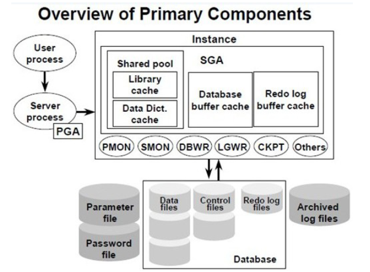

##### 用户进程
> 用户需要的内存是 UGA、PGA、CGA部分
##### 实例

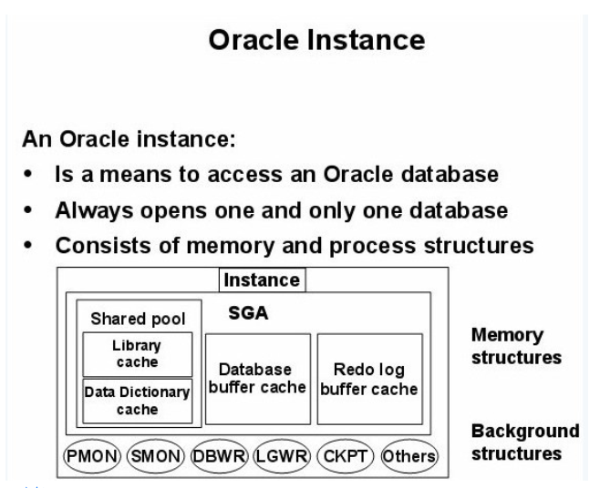

> 后台进程和共享内存组成
> windows系统，所有后台进程都在一个 Oracle进程里
> linux系统，很多Oracle后台进程
> 实例的内存是 SGA

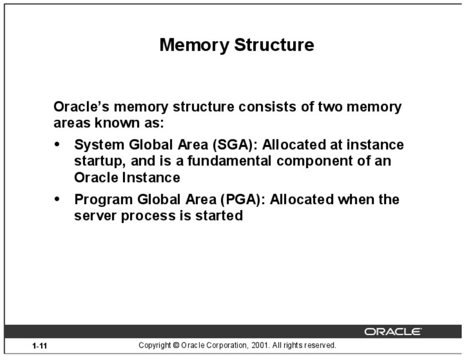

###### SGA
> 系统全局区，用于存储数据库信息的内存区，该信息为数据库所有进程共享。它包含Oracle服务器的数据和控制信息
> 动态设置 sga_target 可以生效
> 10G 叫 ASMM 

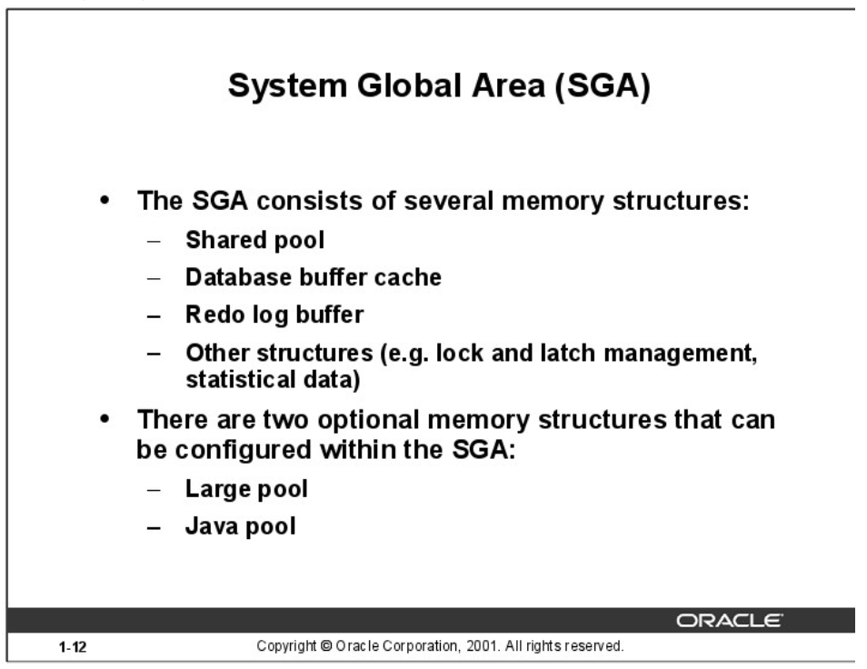

- 共享池
> 用来存放SQL解析树和字典对象定义的共享区域
> 共享池的设置可以设置参数 shared_pool_size
> 10G 设置 sga_target
> 11G 设置 memory_target


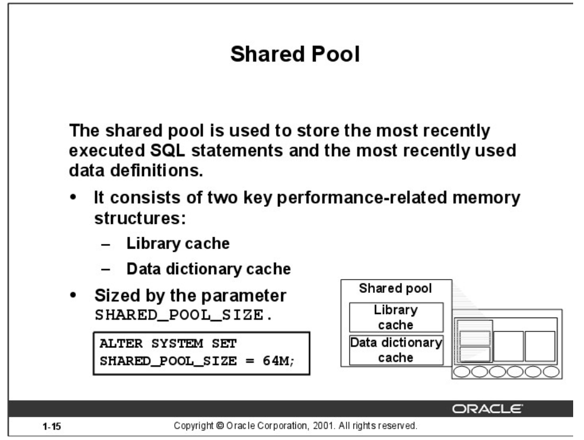

```sql
SQL> show parameter shared_pool_size;

NAME                                 TYPE        VALUE
------------------------------------ ----------- ------------------------------
shared_pool_size                     big integer 0
```

- 数据库高速缓存区
> 用来存放业务数据的共享内存区域
> 通过 db_cache_size 来生效

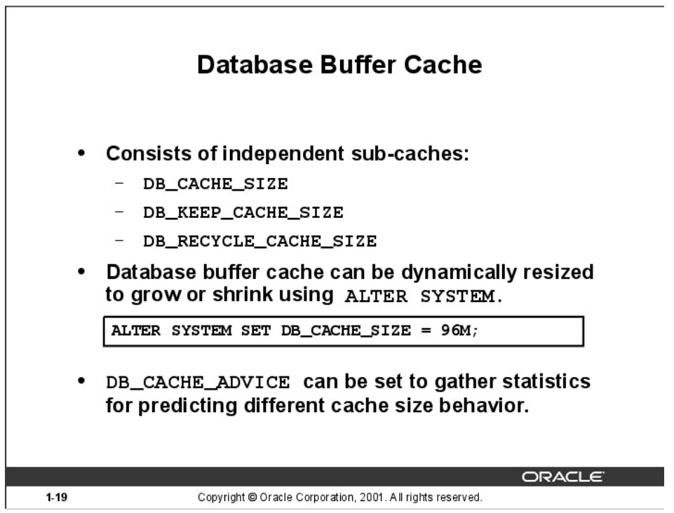

```sql
SQL> show parameter db_cache_size;

NAME                                 TYPE        VALUE
------------------------------------ ----------- ------------------------------
db_cache_size                        big integer 0
SQL> show parameter db_keep_cache_size;

NAME                                 TYPE        VALUE
------------------------------------ ----------- ------------------------------
db_keep_cache_size                   big integer 0
SQL> show parameter db_recycle_cache_size;

NAME                                 TYPE        VALUE
------------------------------------ ----------- ------------------------------
db_recycle_cache_size                big integer 0
```
```sql
SQL> show parameter sga_max_size;

NAME                                 TYPE        VALUE
------------------------------------ ----------- ------------------------------
sga_max_size                         big integer 1520M
SQL> alter system set sga_target = 1000m scope=both;

System altered.

SQL> show parameter sga_target;

NAME                                 TYPE        VALUE
------------------------------------ ----------- ------------------------------
sga_target                           big integer 1008M

SQL> show parameter pool;

NAME                                 TYPE        VALUE
------------------------------------ ----------- ------------------------------
buffer_pool_keep                     string
buffer_pool_recycle                  string
java_pool_size                       big integer 0
large_pool_size                      big integer 0
olap_page_pool_size                  big integer 0
shared_pool_reserved_size            big integer 10905190
shared_pool_size                     big integer 0
streams_pool_size                    big integer 0


SQL> show parameter sga;

NAME                                 TYPE        VALUE
------------------------------------ ----------- ------------------------------
allow_group_access_to_sga            boolean     FALSE
lock_sga                             boolean     FALSE
pre_page_sga                         boolean     TRUE
sga_max_size                         big integer 1520M
sga_min_size                         big integer 0
sga_target                           big integer 1008M
unified_audit_sga_queue_size         integer     1048576

SQL> create pfile='/tmp/init.ora' from spfile;

File created


```
```bash
[oracle@localhost tmp]$ cat init.ora
orcl.__data_transfer_cache_size=0
orcl.__db_cache_size=452984832
orcl.__inmemory_ext_roarea=0
orcl.__inmemory_ext_rwarea=0
orcl.__java_pool_size=16777216
orcl.__large_pool_size=33554432
orcl.__oracle_base='/usr/oracle'#ORACLE_BASE set from environment
orcl.__pga_aggregate_target=536870912
orcl.__sga_target=1056964608
orcl.__shared_io_pool_size=50331648
orcl.__shared_pool_size=486539264
orcl.__streams_pool_size=0
```


- REDO日志缓存区
> 用来记录数据库的每个改动想想，其中包括系统的改动和UNDO的改动(undo也是一次redo)

- 共享资源
> 其他共享资源， 如 lock、enqueue、latch、统计数据
> 前3个组件的共享资源并发冲突可以用latch来管理，那latch本身也是一种资源，还需要专门管理latch的latch的管理

- 大池
> 复杂程序分析、RMAN、UGA、异步IO等相关的数据

- java 池
> 存放 java存储过程的分析信息

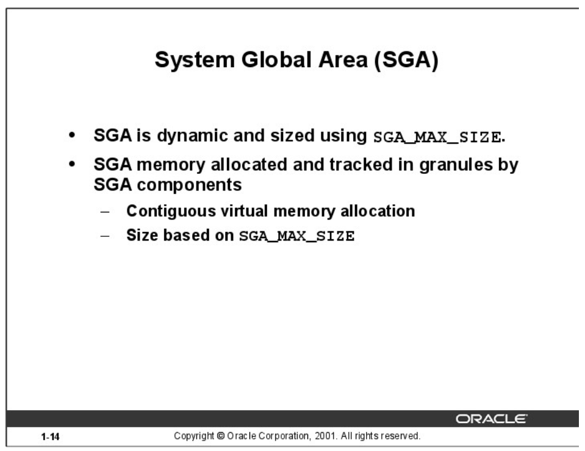

- SGA_MAX_SIZE
> Oracle需要先划分一个SGA的最大大小限额 SGA_MAX_SIZE, 用于划出最大多少的内存给 Oracle 共享内存使用。该参数只能通过文本参数修改或 spfile 的设置，并在重启后生效。 10g实现SGA的自动管理，并设置了 sga_target。sga_target也可以设置为0。sga_target我们称自动内存管理 ASMM。在11G，可以把PGA和SGA作为一个整体进行管理
> 11G memory_target memory_max_target
```sql
SQL> show parameter sga_max_size;

NAME                                 TYPE        VALUE
------------------------------------ ----------- ------------------------------
sga_max_size                         big integer 1520M
SQL> show parameter sga_target;

NAME                                 TYPE        VALUE
------------------------------------ ----------- ------------------------------
sga_target                           big integer 0
SQL> show parameter memory_target;

NAME                                 TYPE        VALUE
------------------------------------ ----------- ------------------------------
memory_target                        big integer 1520M
SQL> show parameter memory_max_target;

NAME                                 TYPE        VALUE
------------------------------------ ----------- ------------------------------
memory_max_target                    big integer 1520M
```
- 设置对应的虚拟内存

- 内存的分配需要按照颗粒大小来分配
```sql
SQL> set linesize 180
SQL> set pagesize 1000
SQL> col component for a50
SQL> select component, current_size, granule_size/1024/1024 as "granule_size(MB)"
  2  from v$sga_dynamic_components;

  COMPONENT                                          CURRENT_SIZE granule_size(MB)
  -------------------------------------------------- ------------ ----------------
  shared pool                                           402653184               16
  large pool                                             33554432               16
  java pool                                              16777216               16
  streams pool                                                  0               16
  DEFAULT buffer cache                                  469762048               16
  KEEP buffer cache                                             0               16
  RECYCLE buffer cache                                          0               16
  DEFAULT 2K buffer cache                                       0               16
  DEFAULT 4K buffer cache                                       0               16
  DEFAULT 8K buffer cache                                       0               16
  DEFAULT 16K buffer cache                                      0               16
  DEFAULT 32K buffer cache                                      0               16
  Shared IO Pool                                         50331648               16
  Data Transfer Cache                                           0               16
  In-Memory Area                                                0               16
  In Memory RW Extension Area                                   0               16
  In Memory RO Extension Area                                   0               16
  ASM Buffer Cache                                              0               16

  18 rows selected.
```


###### PGA 私有进程全局区
> 程序全局区，包含单个服务器进程或单个后台进程的数据和控制信息

> PGA 一般通过 C 语句的运行时调用 malloc() 或 memmap() 来分配，而且可以在运行时动态扩大，甚至可以收缩，使用一个专用服务器连接。在专用服务器连接下，则不需要访问会话状态，UGA几乎成了PGA的同义词。UGA就包含在专用服务器的PGA中。

- STACK SPACE
> 堆栈空间，包括一些输入输出变量。
- 工作区
   > sort_area_size 是 512KB， sort_area_retained_size 是 256KB，那么服务器进程最初处理查询时会使用 512KB 的内存对数据排序，等到排序完成时，排序区会"收缩"为 256KB，这 256KB 内存中放不下的已排序数据会写出到临时表空间中。

   - sort_area_size
      > 排序工作区，用于进程排序时存放排序数据的内存区域，属于PGA
   - sort_area_retained_size
      > sort_area_retained_size 是给用户使用的内存，如果结果不需要反馈给用户，执行的语句就不会使用到该部分
      > 排序完成后用于保存已排序数据的内存总量
      > IF sort_area_retained_size = 0 then sort_area_retained_size = sort_area_size
   -

   ```sql
   select * from tab order by 1,2,3,4;
   会使用到 sort_area_retained_size
   除非设置了 set termout off
   ```


###### UGA
> 用户全局区，包含用户进程从服务器获取到的相关信息
> UGA包含在PGA中

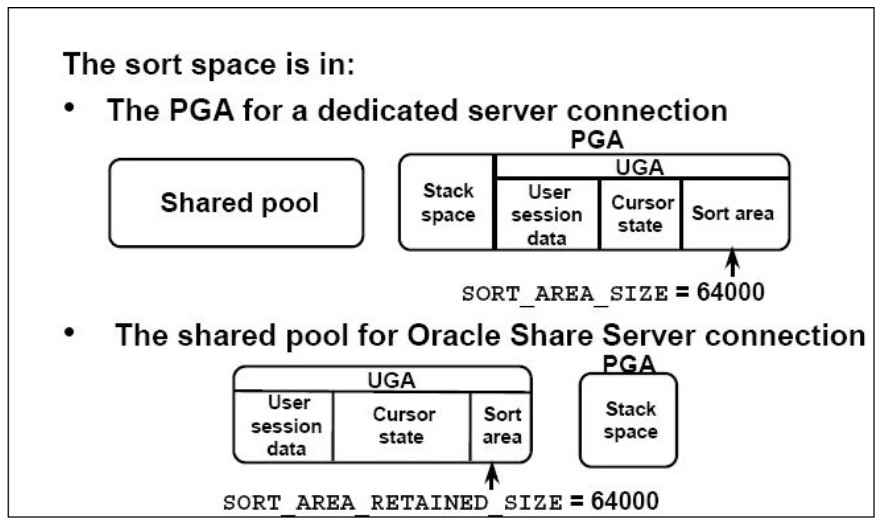

###### 专有服务器模式
> cursor 从SGA的 database buffer 获取到然后转给 PGA，再转给 UGA

###### 共享服务器模式
> oracle 就是一个服务器进程可以有多个会话(session)，一个会话信息需要让多个服务器进程共享，所以叫共享服务器进程。会话信息放在UGA中，所以UGA对于服务器进程是共享的。所以UGA是共享的，属于SGA。而每个服务器进程都会在执行完任务后反馈给客户会话信息
- 会话信息(UGA)：这次任务起始时间、结束时间、当前状态、排序反馈信息、任务的目的等
- curosr信息
> 游标在分配 CURSOR 私有SQL区后，要定义游标的内容，比如SQL，然后再指向SQL共享区。每个用户可以有很多私有SQL区，私有SQL区就是cursor, open_cursors是限制某个会话打开的cursor数
> curosr(私有SQL区)这里有两个部分
=====================================================================================
> 句柄，指向共享SQL区
> 运行时，如果每次执行完一个cursor后不马上释放这些cursor信息，那么超过open_cursors数后回抛出open cursor错误。上面这些cursor信息在共享服务模式是共享的，属于UGA，并存放在SGA中，在有大池的情况下存放在大池。
=====================================================================================
> 还有一部分内存是完全私有的，比如有些局部变量作为程序的栈空间，还有些私有工作空间，如排序区，HASH JOIN区，位图合并区等。它们是在执行的时候调用全局区的，我们称为CGA，执行完就释放


```sql
SQL> show parameter open_cursors;

NAME                                 TYPE        VALUE
------------------------------------ ----------- ------------------------------
open_cursors                         integer     300
```


##### 数据库库文件
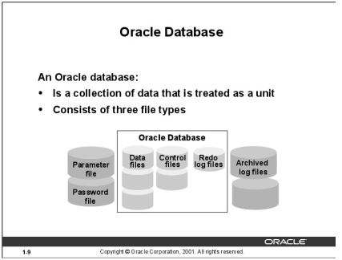
> 操作系统的文件集组成，比如控制文件、日志文件、数据文件、参数文件、口令文件
> 数据库是物理磁盘文件集组成
> 在线文件与离线文件的区别主要在一个需要数据库打开才能使用，一个不需要
###### 文本离线文件
> 参数文件、口令文件

###### 离线文件
> 归档文件

###### DB在线文件
> oracle 物理结构指的是OS直接能查看到的文件，可以是文件系统，可以是裸设备。也可以存储在ASM中。但文件里的内部逻辑数据，只有Oracle的命令才能查阅和修改。3组文件类型，他们的文件头都有一些描述信息 、状态信息、一致性信息和控制信息。这对备份和恢复及一致性事务操作至关重要。这些文件可以存储在本机磁盘，也可以存储在磁盘柜，甚至是共享存储系统，称为 concurrent 设备
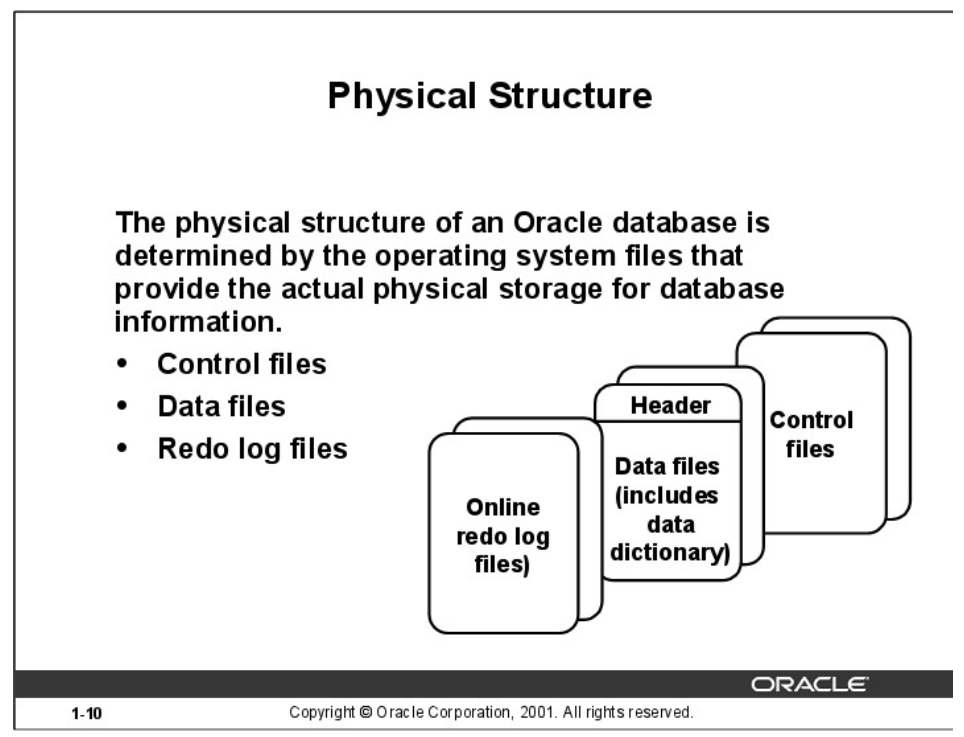

#### 描述什么是 Oracle Server
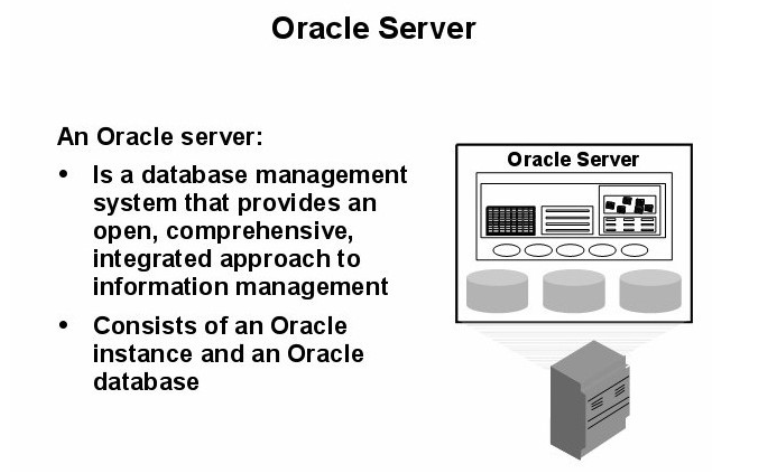
> 一个 Oracle 服务提供了开放的完整性的信息管理系统
> oracle服务由一个实例和一个数据库组成
> oracle_home + oracle_sid 唯一标识一个实例
#### 列出下列语句处理过程的各个阶段
##### 查询
##### DML语句
##### COMMIT
#### Oracle的连接方法
> listener和instance之间的关系是 n:m
