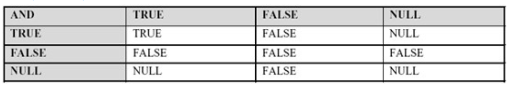

www.centrexcc.com
integrid.info
www.ixora.com.au
www.jlcomp.demon.co.uk
www.juliandyke.com
www.hotsos.com

#### NULL 操作符
> 空值是无法用等于的
> 空值的操作包含 IS NULL 和 IS NOT NULL
> 空值意味着该值不可用、未指派、未知的、无效或不适用
> 空值无法等于或者不等于任何值
##### NULL的注意事项
###### NULL在成本运算时容易算错
###### not in 空值造成误操作
```sql
not in (select a.name from test where a.name is not null)

where not exists (select 1 from test where a.name = b.name)
```
#### 逻辑表达式

