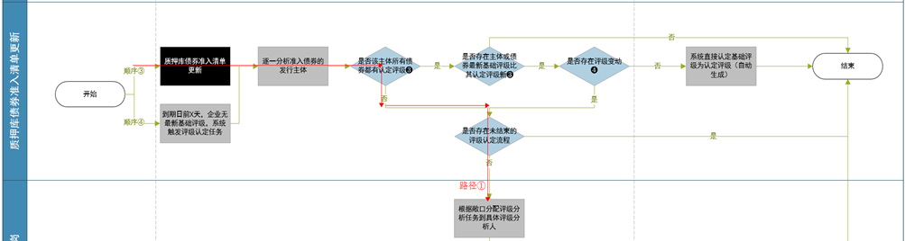
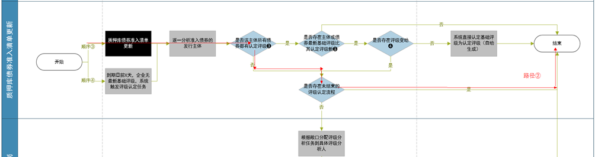
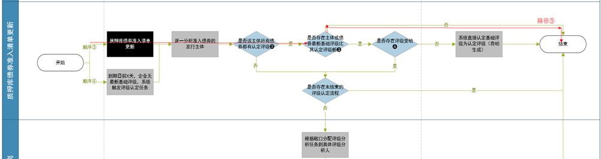
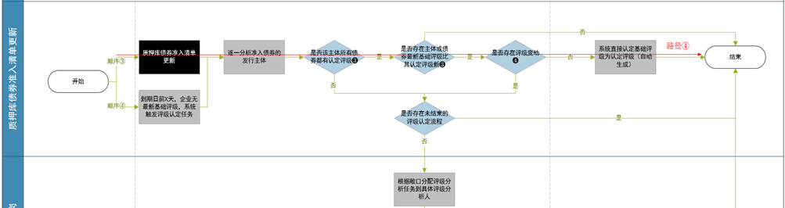
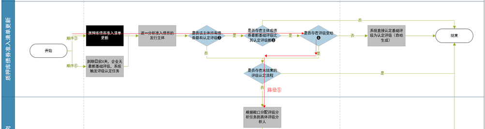

# 结算
## 评级分类(CreditMaster)
   ```
   基础评级
   指标入库发生变化，如果经营数据与财务数据对应的是同一年份的数据

   参考评级
   指标入库发生变化，如果经营数据与财务数据对应的不是同一年份的数据

   机器评级
   如果两次基础评级的级别是一样的，则会认定为机器评级

   人工评级
   需要测试在前端进行检查

   如果触发的评级与上次的评级不一致，则产生预警

   触发system的条件，尚未明确
   ```

## 入模指标(CreditMaster)
   ```sql
   SELECT coalesce(ret1.factor_value::varchar, ret2.factor_value::varchar), ret.*
     FROM (SELECT bfo.company_id,
                  bfo.company_nm,
                  ep.exposure_sid,
                  ep.exposure,
                  rms.name AS sub_model_nm,
                  rmf.ft_code,
                  f.factor_category_cd,
                  f.factor_nm,
                  fo.option_num,
                  f.formula_en
             FROM rating_model_factor rmf
             JOIN rating_model_sub_model rms
               ON (rmf.sub_model_id = rms.id)
             JOIN rating_model rm
               ON (rms.parent_rm_id = rm.id AND rm.is_active = 1 AND rm.isdel = 0)
             JOIN rating_model_exposure_xw rmxw
               ON (rm.id = rmxw.model_id)
             JOIN exposure ep
               ON (rmxw.exposure_sid = ep.exposure_sid AND ep.isdel = 0)
             JOIN compy_exposure cse
               ON (ep.exposure_sid = cse.exposure_sid)
             JOIN compy_basicinfo bfo
               ON (cse.company_id = bfo.company_id AND
                  bfo.company_nm = '广州医药集团有限公司')
             LEFT JOIN exposure_factor_xw efx
               ON (ep.exposure_sid = efx.exposure_sid AND
                  rmf.ft_code = efx.factor_cd AND efx.isdel = 0)
             LEFT JOIN factor f
               ON (rmf.ft_code = f.factor_cd AND f.isdel = 0)
             LEFT JOIN (SELECT *
                         FROM (SELECT exposure_sid,
                                      factor_cd,
                                      option_num,
                                      formula_ch,
                                      row_number() over(PARTITION BY exposure_sid, factor_cd ORDER BY option_num DESC) AS rn
                                 FROM factor_option
                                WHERE isdel = 0) as ret
                        WHERE rn = 1) fo
               ON (efx.exposure_sid = fo.exposure_sid AND
                  efx.factor_cd = fo.factor_cd)
            ORDER BY ep.exposure, rm.name, rms.name, rmf.ft_code, fo.option_num) as ret
   left join compy_factor_finance ret1
   on ret1.company_id = ret.company_id
   and ret1.rpt_dt = date'2016-12-31'
   and ret1.factor_cd = ret.ft_code
   left join compy_factor_operation ret2
    on ret2.company_id = ret.company_id
   and ret2.rpt_dt = date'2016-12-31'
   and ret2.factor_cd = ret.ft_code;
   ```

## 推数配置
   ```bash
   3.执行/usr/local/MasterDataExport-1.1.0/bin/MasterDataExport.sh -s 5 -e uat

   # 结算MDS对UAT环境  24.11
   /usr/local/MasterDataExport-1.0-SNAPSHOT/bin/MasterDataExport.sh -s 1 -e uat


   # 结算测试推数 44.11
   /usr/local/MasterDataExport-1.1.0/bin/MasterDataExport.sh -s 1 -e test

   # 标准版测试环境推数 44.11
   /usr/local/MasterDataExport-1.1.0/bin/MasterDataExport.sh -s 10 -e test

   # 长城测试推数 44.11
   /usr/local/MasterDataExport-1.0-SNAPSHOT/bin/MasterDataExport.sh -s 4 -e test
   ```

## 推数场景验证(CreditMaster)

### 准备工作-EDW(CreditMaster)
   ```sql
   -- 清理掉EDW清单
   select * from bond_position where secinner_id= ?;
   delete from bond_position where secinner_id= ?;
   -- 清理掉 财务数据abc表
   delete from compy_finance where company_id=314772 and rpt_dt >= '20161231' ;
   delete from compy_finance_last_y where company_id_last_y=314772 and rpt_dt_last_y >= '20161231';
   delete from compy_finance_bf_last_y where company_id_bf_last_y=314772 and rpt_dt_bf_last_y >= '20161231';

   -- 清理掉财务指标和经营指标
   delete from compy_factor_finance where company_id=314772 and rpt_dt='2016-12-31';
   delete from compy_factor_operation where company_id=314772 and rpt_dt='2016-12-31';

   -- 清理掉对应的任务
   delete from task where workflow_sid in (select workflow_sid from  workflow where tgt_nm='安徽省投资集团控股有限公司');
   delete from workflow where tgt_nm='安徽省投资集团控股有限公司';

   -- 清理掉主体评级记录
   delete from rating_detail where rating_record_id in (select rating_record_id from rating_record where company_id=314772 and factor_dt='2016-12-31') ;
   delete from rating_display where rating_record_id in (select rating_record_id from rating_record where company_id=314772 and factor_dt='2016-12-31') ;
   delete from rating_factor where rating_record_id in (select rating_record_id from rating_record where company_id=314772 and factor_dt='2016-12-31') ;
   delete from rating_approv where rating_record_id in (select rating_record_id from rating_record where company_id=314772 and factor_dt='2016-12-31') ;
   delete from rating_adjustment_reason where rating_record_id in (select rating_record_id from rating_record where company_id=314772 and factor_dt='2016-12-31') ;
   delete from rating_record_log where rating_record_id in (select rating_record_id from rating_record where company_id=314772 and factor_dt='2016-12-31') ;
   delete from rating_record where company_id=314772 and factor_dt='2016-12-31';

   -- 清理掉债券评级记录
   delete from bond_rating_detail where bond_rating_record_sid in (select bond_rating_record_sid from bond_rating_record where secinner_id in
         (select secinner_id from compy_security_xw where company_id=314772));
   delete from bond_rating_factor where bond_rating_record_sid in (select bond_rating_record_sid from bond_rating_record where secinner_id in
         (select secinner_id from compy_security_xw where company_id=314772));
   delete from bond_rating_xw where bond_rating_record_sid in (select bond_rating_record_sid from bond_rating_record where secinner_id in
         (select secinner_id from compy_security_xw  where company_id=314772));
   delete from bond_rating_approv where bond_rating_record_sid in (select bond_rating_record_sid from bond_rating_record where secinner_id in
         (select secinner_id from compy_security_xw where company_id=314772));
   delete from bond_rating_display where bond_rating_record_id in (select bond_rating_record_sid from bond_rating_record where secinner_id in
         (select secinner_id from compy_security_xw where company_id=314772));
   delete from bond_rating_record where secinner_id in
         (select secinner_id from compy_security_xw where company_id=314772);
   ```

### 准备工作-COMPANY(CreditMaster)
   ```sql
   -- 清理掉 财务数据abc表
   delete from compy_finance where company_id=314772 and rpt_dt >= '20161231' ;
   delete from compy_finance_last_y where company_id_last_y=314772 and rpt_dt_last_y >= '20161231';
   delete from compy_finance_bf_last_y where company_id_bf_last_y=314772 and rpt_dt_bf_last_y >= '20161231';
   -- 清理掉财务指标和经营指标
   delete from compy_factor_finance where company_id=314772 and rpt_dt='2016-12-31';
   delete from compy_factor_operation where company_id=314772 and rpt_dt='2016-12-31';
   -- 清理掉主体评级记录
   delete from rating_detail where rating_record_id in (select rating_record_id from rating_record where company_id=314772 and factor_dt='2016-12-31') ;
   delete from rating_display where rating_record_id in (select rating_record_id from rating_record where company_id=314772 and factor_dt='2016-12-31') ;
   delete from rating_factor where rating_record_id in (select rating_record_id from rating_record where company_id=314772 and factor_dt='2016-12-31') ;
   delete from rating_approv where rating_record_id in (select rating_record_id from rating_record where company_id=314772 and factor_dt='2016-12-31') ;
   delete from rating_adjustment_reason where rating_record_id in (select rating_record_id from rating_record where company_id=314772 and factor_dt='2016-12-31') ;
   delete from rating_record_log where rating_record_id in (select rating_record_id from rating_record where company_id=314772 and factor_dt='2016-12-31') ;
   delete from rating_record where company_id=314772 and factor_dt='2016-12-31';

   -- 清理掉债券评级记录
   delete from bond_rating_detail where bond_rating_record_sid in (select bond_rating_record_sid from bond_rating_record where secinner_id in
         (select secinner_id from compy_security_xw where company_id=314772));
   delete from bond_rating_factor where bond_rating_record_sid in (select bond_rating_record_sid from bond_rating_record where secinner_id in
         (select secinner_id from compy_security_xw where company_id=314772));
   delete from bond_rating_xw where bond_rating_record_sid in (select bond_rating_record_sid from bond_rating_record where secinner_id in
         (select secinner_id from compy_security_xw  where company_id=314772));
   delete from bond_rating_approv where bond_rating_record_sid in (select bond_rating_record_sid from bond_rating_record where secinner_id in
         (select secinner_id from compy_security_xw where company_id=314772));
   delete from bond_rating_display where bond_rating_record_id in (select bond_rating_record_sid from bond_rating_record where secinner_id in
         (select secinner_id from compy_security_xw where company_id=314772));
   delete from bond_rating_record where secinner_id in
         (select secinner_id from compy_security_xw where company_id=314772);
   ```

### 准备工作(MDS)
   ```sql
   -- 设置时区
   set time zone 'PRC';

   -- 查看ABC表
   select * from compy_finance_bf_last_y where company_id = 16220 and rpt_dt = date'2017-12-31';
   select * from compy_finance_last_y where company_id = 16220 and rpt_dt = date'2017-12-31';
   select * from compy_finance where company_id = 16220 and rpt_dt = date'2017-12-31';

   -- 查看财务指标
   select * from compy_factor_finance where company_id = 16220 and rpt_dt = date'2017-12-31';

   -- 查看经营数据以及经营数据所用到的财务数据
   select * from compy_factor_operation_expert where company_id = 16220 and rpt_dt = date'2017-12-31' and client_id = 1;
   select * from compy_factor_finance_expert where company_id = 16220 and rpt_dt = date'2017-12-31' and client_id = 1;
   ```

### case1：主体数据更新
#### 1.1 无参考评级变动，无预警，有新增评级记录
> 保证 企业1 有2016年12月31日的参考(基础)评级，把该企业20161231的财务数据（入模指标）当
  做2017年12月31日的财务数据， 2017年经营数据（入模指标）缺失并推送：
  中国石油化工股份有限公司  1519
- MDS
```sql
set time zone 'PRC';
delete from compy_finance where company_id=1519 and rpt_dt = date'2017-12-31';
delete from compy_finance_last_y where company_id=1519 and rpt_dt = date'2017-12-31';
delete from compy_finance_bf_last_y where company_id=1519 and rpt_dt = date'2017-12-31';
-- 企业财务指标值表
delete from compy_factor_finance where company_id=1519 and rpt_dt = date'2017-12-31';
--
-- delete from compy_factor_finance_expert where company_id=1519 and rpt_dt = date'2017-12-31';
-- 经营数据
-- delete from compy_factor_operation_expert where company_id = 1519 and rpt_dt = date'2017-12-31' and client_id = 1;
-- delete from compy_factor_finance_expert where company_id = 1519 and rpt_dt = date'2017-12-31' and client_id = 1;

insert into compy_finance
  select
    company_id,
    '2017-12-31' :: date as rpt_dt,
    fst_notice_dt,
    latest_notice_dt,
    start_dt,
    end_dt,
    rpt_timetype_cd,
    combine_type_cd,
    rpt_srctype_id,
    data_ajust_type,
    data_type,
    is_public_rpt,
    company_type,
    currency,
    monetary_fund,
    tradef_asset,
    bill_rec,
    account_rec,
    other_rec,
    advance_pay,
    dividend_rec,
    interest_rec,
    inventory,
    nonl_asset_oneyear,
    defer_expense,
    other_lasset,
    lasset_other,
    lasset_balance,
    sum_lasset,
    saleable_fasset,
    held_maturity_inv,
    estate_invest,
    lte_quity_inv,
    ltrec,
    fixed_asset,
    construction_material,
    construction_progress,
    liquidate_fixed_asset,
    product_biology_asset,
    oilgas_asset,
    intangible_asset,
    develop_exp,
    good_will,
    ltdefer_asset,
    defer_incometax_asset,
    other_nonl_asset,
    nonlasset_other,
    nonlasset_balance,
    sum_nonl_asset,
    cash_and_depositcbank,
    deposit_infi,
    fi_deposit,
    precious_metal,
    lend_fund,
    derive_fasset,
    buy_sellback_fasset,
    loan_advances,
    agency_assets,
    premium_rec,
    subrogation_rec,
    ri_rec,
    undue_rireserve_rec,
    claim_rireserve_rec,
    life_rireserve_rec,
    lthealth_rireserve_rec,
    gdeposit_pay,
    insured_pledge_loan,
    capitalg_deposit_pay,
    independent_asset,
    client_fund,
    settlement_provision,
    client_provision,
    seat_fee,
    other_asset,
    asset_other,
    asset_balance,
    sum_asset,
    st_borrow,
    trade_fliab,
    bill_pay,
    account_pay,
    advance_receive,
    salary_pay,
    tax_pay,
    interest_pay,
    dividend_pay,
    other_pay,
    accrue_expense,
    anticipate_liab,
    defer_income,
    nonl_liab_oneyear,
    other_lliab,
    lliab_other,
    lliab_balance,
    sum_lliab,
    lt_borrow,
    bond_pay,
    lt_account_pay,
    special_pay,
    defer_incometax_liab,
    other_nonl_liab,
    nonl_liab_other,
    nonl_liab_balance,
    sum_nonl_liab,
    borrow_from_cbank,
    borrow_fund,
    derive_financedebt,
    sell_buyback_fasset,
    accept_deposit,
    agency_liab,
    other_liab,
    premium_advance,
    comm_pay,
    ri_pay,
    gdeposit_rec,
    insured_deposit_inv,
    undue_reserve,
    claim_reserve,
    life_reserve,
    lt_health_reserve,
    independent_liab,
    pledge_borrow,
    agent_trade_security,
    agent_uw_security,
    liab_other,
    liab_balance,
    sum_liab,
    share_capital,
    capital_reserve,
    surplus_reserve,
    retained_earning,
    inventory_share,
    general_risk_prepare,
    diff_conversion_fc,
    minority_equity,
    sh_equity_other,
    sh_equity_balance,
    sum_parent_equity,
    sum_sh_equity,
    liabsh_equity_other,
    liabsh_equity_balance,
    sum_liabsh_equity,
    td_eposit,
    st_bond_rec,
    claim_pay,
    policy_divi_pay,
    unconfirm_inv_loss,
    ricontact_reserve_rec,
    deposit,
    contact_reserve,
    invest_rec,
    specia_lreserve,
    subsidy_rec,
    marginout_fund,
    export_rebate_rec,
    defer_income_oneyear,
    lt_salary_pay,
    fvalue_fasset,
    define_fvalue_fasset,
    internal_rec,
    clheld_sale_ass,
    fvalue_fliab,
    define_fvalue_fliab,
    internal_pay,
    clheld_sale_liab,
    anticipate_lliab,
    other_equity,
    other_cincome,
    plan_cash_divi,
    parent_equity_other,
    parent_equity_balance,
    preferred_stock,
    prefer_stoc_bond,
    cons_biolo_asset,
    stock_num_end,
    net_mas_set,
    outward_remittance,
    cdandbill_rec,
    hedge_reserve,
    suggest_assign_divi,
    marginout_security,
    cagent_trade_security,
    trade_risk_prepare,
    creditor_planinv,
    short_financing,
    receivables,
    operate_reve,
    operate_exp,
    operate_tax,
    sale_exp,
    manage_exp,
    finance_exp,
    asset_devalue_loss,
    fvalue_income,
    invest_income,
    intn_reve,
    int_reve,
    int_exp,
    commn_reve,
    comm_reve,
    comm_exp,
    exchange_income,
    premium_earned,
    premium_income,
    ripremium,
    premium_exp,
    indemnity_exp,
    amortise_indemnity_exp,
    duty_reserve,
    amortise_duty_reserve,
    rireve,
    riexp,
    surrender_premium,
    policy_divi_exp,
    amortise_riexp,
    security_uw,
    client_asset_manage,
    operate_profit_other,
    operate_profit_balance,
    operate_profit,
    nonoperate_reve,
    nonoperate_exp,
    nonlasset_net_loss,
    sum_profit_other,
    sum_profit_balance,
    sum_profit,
    income_tax,
    net_profit_other2,
    net_profit_balance1,
    net_profit_balance2,
    net_profit,
    parent_net_profit,
    minority_income,
    undistribute_profit,
    basic_eps,
    diluted_eps,
    invest_joint_income,
    total_operate_reve,
    total_operate_exp,
    other_reve,
    other_exp,
    unconfirm_invloss,
    sum_cincome,
    parent_cincome,
    minority_cincome,
    net_contact_reserve,
    rdexp,
    operate_manage_exp,
    insur_reve,
    nonlasset_reve,
    total_operatereve_other,
    net_indemnity_exp,
    total_operateexp_other,
    net_profit_other1,
    cincome_balance1,
    cincome_balance2,
    other_net_income,
    reve_other,
    reve_balance,
    operate_exp_other,
    operate_exp_balance,
    bank_intnreve,
    bank_intreve,
    ninsur_commn_reve,
    ninsur_comm_reve,
    ninsur_comm_exp,
    salegoods_service_rec,
    tax_return_rec,
    other_operate_rec,
    ni_deposit,
    niborrow_from_cbank,
    niborrow_from_fi,
    nidisp_trade_fasset,
    nidisp_saleable_fasset,
    niborrow_fund,
    nibuyback_fund,
    operate_flowin_other,
    operate_flowin_balance,
    sum_operate_flowin,
    buygoods_service_pay,
    employee_pay,
    other_operat_epay,
    niloan_advances,
    nideposit_incbankfi,
    indemnity_pay,
    intandcomm_pay,
    operate_flowout_other,
    operate_flowout_balance,
    sum_operate_flowout,
    operate_flow_other,
    operate_flow_balance,
    net_operate_cashflow,
    disposal_inv_rec,
    inv_income_rec,
    disp_filasset_rec,
    disp_subsidiary_rec,
    other_invrec,
    inv_flowin_other,
    inv_flowin_balance,
    sum_inv_flowin,
    buy_filasset_pay,
    inv_pay,
    get_subsidiary_pay,
    other_inv_pay,
    nipledge_loan,
    inv_flowout_other,
    inv_flowout_balance,
    sum_inv_flowout,
    inv_flow_other,
    inv_cashflow_balance,
    net_inv_cashflow,
    accept_inv_rec,
    loan_rec,
    other_fina_rec,
    issue_bond_rec,
    niinsured_deposit_inv,
    fina_flowin_other,
    fina_flowin_balance,
    sum_fina_flowin,
    repay_debt_pay,
    divi_profitorint_pay,
    other_fina_pay,
    fina_flowout_other,
    fina_flowout_balance,
    sum_fina_flowout,
    fina_flow_other,
    fina_flow_balance,
    net_fina_cashflow,
    effect_exchange_rate,
    nicash_equi_other,
    nicash_equi_balance,
    nicash_equi,
    cash_equi_beginning,
    cash_equi_ending,
    asset_devalue,
    fixed_asset_etcdepr,
    intangible_asset_amor,
    ltdefer_exp_amor,
    defer_exp_reduce,
    drawing_exp_add,
    disp_filasset_loss,
    fixed_asset_loss,
    fvalue_loss,
    inv_loss,
    defer_taxasset_reduce,
    defer_taxliab_add,
    inventory_reduce,
    operate_rec_reduce,
    operate_pay_add,
    inoperate_flow_other,
    inoperate_flow_balance,
    innet_operate_cashflow,
    debt_to_capital,
    cb_oneyear,
    finalease_fixed_asset,
    cash_end,
    cash_begin,
    equi_end,
    equi_begin,
    innicash_equi_other,
    innicash_equi_balance,
    innicash_equi,
    other,
    subsidiary_accept,
    subsidiary_pay,
    divi_pay,
    intandcomm_rec,
    net_rirec,
    nilend_fund,
    defer_tax,
    defer_income_amor,
    exchange_loss,
    fixandestate_depr,
    fixed_asset_depr,
    tradef_asset_reduce,
    ndloan_advances,
    reduce_pledget_deposit,
    add_pledget_deposit,
    buy_subsidiary_pay,
    cash_equiending_other,
    cash_equiending_balance,
    nd_depositinc_bankfi,
    niborrow_sell_buyback,
    ndlend_buy_sellback,
    net_cd,
    nitrade_fliab,
    ndtrade_fasset,
    disp_masset_rec,
    cancel_loan_rec,
    ndborrow_from_cbank,
    ndfide_posit,
    ndissue_cd,
    nilend_sell_buyback,
    ndborrow_sell_buyback,
    nitrade_fasset,
    ndtrade_fliab,
    buy_finaleaseasset_pay,
    niaccount_rec,
    issue_cd,
    addshare_capital_rec,
    issue_share_rec,
    bond_intpay,
    niother_finainstru,
    uwsecurity_rec,
    buysellback_fasset_rec,
    agent_uwsecurity_rec,
    nidirect_inv,
    nitrade_settlement,
    buysellback_fasset_pay,
    nddisp_trade_fasset,
    ndother_fina_instr,
    ndborrow_fund,
    nddirect_inv,
    ndtrade_settlement,
    ndbuyback_fund,
    agenttrade_security_pay,
    nddisp_saleable_fasset,
    nisell_buyback,
    ndbuy_sellback,
    nettrade_fasset_rec,
    net_ripay,
    ndlend_fund,
    nibuy_sellback,
    ndsell_buyback,
    ndinsured_deposit_inv,
    nettrade_fasset_pay,
    niinsured_pledge_loan,
    disp_subsidiary_pay,
    netsell_buyback_fassetrec,
    netsell_buyback_fassetpay,
    ebit,
    ebitda,
    bank_sub_001,
    bank_sub_002,
    bank_sub_003,
    bank_sub_004,
    bank_sub_005,
    bank_sub_006,
    bank_sub_007,
    bank_sub_008,
    bank_sub_009,
    bank_sub_010,
    bank_sub_011,
    bank_sub_012,
    bank_sub_013,
    bank_sub_014,
    bank_sub_015,
    bank_sub_016,
    bank_sub_017,
    bank_sub_018,
    bank_sub_019,
    bank_sub_020,
    bank_sub_021,
    bank_sub_022,
    bank_sub_023,
    bank_sub_024,
    bank_sub_025,
    bank_sub_026,
    bank_sub_027,
    bank_sub_028,
    bank_sub_029,
    bank_sub_030,
    bank_sub_031,
    bank_sub_032,
    bank_sub_033,
    bank_sub_034,
    bank_sub_035,
    bank_sub_036,
    bank_sub_037,
    bank_sub_038,
    bank_sub_039,
    bank_sub_040,
    bank_sub_041,
    bank_sub_042,
    bank_sub_043,
    bank_sub_044,
    bank_sub_045,
    bank_sub_046,
    bank_sub_047,
    bank_sub_048,
    bank_sub_049,
    bank_sub_050,
    bank_sub_051,
    bank_sub_052,
    bank_sub_053,
    bank_sub_054,
    bank_sub_055,
    bank_sub_056,
    bank_sub_057,
    bank_sub_058,
    bank_sub_059,
    bank_sub_060,
    bank_sub_061,
    bank_sub_062,
    bank_sub_063,
    bank_sub_064,
    bank_sub_065,
    bank_sub_066,
    bank_sub_067,
    bank_sub_068,
    bank_sub_069,
    bank_sub_070,
    bank_sub_071,
    bank_sub_072,
    bank_sub_073,
    bank_sub_074,
    bank_sub_075,
    bank_sub_076,
    bank_sub_077,
    bank_sub_078,
    bank_sub_079,
    bank_sub_080,
    bank_sub_081,
    bank_sub_082,
    bank_sub_083,
    bank_sub_084,
    bank_sub_085,
    bank_sub_086,
    bank_sub_087,
    bank_sub_088,
    bank_sub_089,
    bank_sub_090,
    bank_sub_091,
    bank_sub_092,
    bank_sub_093,
    bank_sub_094,
    bank_sub_095,
    bank_sub_096,
    bank_sub_097,
    bank_sub_098,
    bank_sub_099,
    bank_sub_100,
    bank_sub_101,
    bank_sub_102,
    bank_sub_103,
    bank_sub_104,
    bank_sub_105,
    bank_sub_106,
    bank_sub_107,
    bank_sub_108,
    bank_sub_109,
    bank_sub_110,
    bank_sub_111,
    bank_sub_112,
    bank_sub_113,
    bank_sub_114,
    bank_sub_115,
    bank_sub_116,
    bank_sub_117,
    bank_sub_118,
    bank_sub_119,
    bank_sub_120,
    bank_sub_121,
    bank_sub_122,
    bank_sub_123,
    bank_sub_124,
    bank_sub_125,
    com_expend,
    act_capit_sx,
    act_capit_cx,
    inv_asset_cx,
    udr_reserve_sx,
    min_capit_sx,
    udr_reserve_cx,
    comexpend_cx,
    earnprem_sx,
    min_capit,
    act_capit,
    inv_asset_sx,
    ostlr_cx,
    ror_cx,
    inv_asset,
    ostlr_sx,
    min_capit_cx,
    earnprem_cx,
    earnprem,
    com_expend_sx,
    com_compensate_cx,
    solven_ratio_sx,
    com_cost_cx,
    earnprem_gr_cx,
    nrorsx,
    nror,
    tror,
    solven_ratio_cx,
    earnprem_gr_sx,
    solven_ratio,
    nror_cx,
    earnprem_gr,
    sur_rate,
    ror_sx,
    secu_sub_001,
    secu_sub_002,
    secu_sub_003,
    secu_sub_004,
    secu_sub_005,
    secu_sub_006,
    secu_sub_007,
    secu_sub_008,
    secu_sub_009,
    secu_sub_010,
    secu_sub_011,
    secu_sub_012,
    secu_sub_013,
    secu_sub_014,
    secu_sub_015,
    secu_sub_016,
    secu_sub_017,
    secu_sub_018,
    top10_frbm,
    spec_ment_loan,
    sum_last3_loan,
    trust_industry_amt,
    owner_industry_amt,
    operate_reve_amt,
    owner_asset,
    new_prod_amt,
    trust_loan_amt,
    trust_quity_inv,
    comp_reserve_fund,
    collect_trust_size,
    client_id,
    updt_by,
    now()                as updt_dt
from compy_finance
where company_id = 1519 and rpt_dt = date '2016-12-31';

insert into compy_finance_last_y
select company_id
   ,'2017-12-31'::date as rpt_dt
   ,rpt_timetype_cd
   ,monetary_fund_last_y
   ,tradef_asset_last_y
   ,bill_rec_last_y
   ,account_rec_last_y
   ,other_rec_last_y
   ,advance_pay_last_y
   ,dividend_rec_last_y
   ,interest_rec_last_y
   ,inventory_last_y
   ,nonl_asset_oneyear_last_y
   ,defer_expense_last_y
   ,other_lasset_last_y
   ,lasset_other_last_y
   ,lasset_balance_last_y
   ,sum_lasset_last_y
   ,saleable_fasset_last_y
   ,held_maturity_inv_last_y
   ,estate_invest_last_y
   ,lte_quity_inv_last_y
   ,ltrec_last_y
   ,fixed_asset_last_y
   ,construction_material_last_y
   ,construction_progress_last_y
   ,liquidate_fixed_asset_last_y
   ,product_biology_asset_last_y
   ,oilgas_asset_last_y
   ,intangible_asset_last_y
   ,develop_exp_last_y
   ,good_will_last_y
   ,ltdefer_asset_last_y
   ,defer_incometax_asset_last_y
   ,other_nonl_asset_last_y
   ,nonlasset_other_last_y
   ,nonlasset_balance_last_y
   ,sum_nonl_asset_last_y
   ,cash_and_depositcbank_last_y
   ,deposit_infi_last_y
   ,fi_deposit_last_y
   ,precious_metal_last_y
   ,lend_fund_last_y
   ,derive_fasset_last_y
   ,buy_sellback_fasset_last_y
   ,loan_advances_last_y
   ,agency_assets_last_y
   ,premium_rec_last_y
   ,subrogation_rec_last_y
   ,ri_rec_last_y
   ,undue_rireserve_rec_last_y
   ,claim_rireserve_rec_last_y
   ,life_rireserve_rec_last_y
   ,lthealth_rireserve_rec_last_y
   ,gdeposit_pay_last_y
   ,insured_pledge_loan_last_y
   ,capitalg_deposit_pay_last_y
   ,independent_asset_last_y
   ,client_fund_last_y
   ,settlement_provision_last_y
   ,client_provision_last_y
   ,seat_fee_last_y
   ,other_asset_last_y
   ,asset_other_last_y
   ,asset_balance_last_y
   ,sum_asset_last_y
   ,st_borrow_last_y
   ,trade_fliab_last_y
   ,bill_pay_last_y
   ,account_pay_last_y
   ,advance_receive_last_y
   ,salary_pay_last_y
   ,tax_pay_last_y
   ,interest_pay_last_y
   ,dividend_pay_last_y
   ,other_pay_last_y
   ,accrue_expense_last_y
   ,anticipate_liab_last_y
   ,defer_income_last_y
   ,nonl_liab_oneyear_last_y
   ,other_lliab_last_y
   ,lliab_other_last_y
   ,lliab_balance_last_y
   ,sum_lliab_last_y
   ,lt_borrow_last_y
   ,bond_pay_last_y
   ,lt_account_pay_last_y
   ,special_pay_last_y
   ,defer_incometax_liab_last_y
   ,other_nonl_liab_last_y
   ,nonl_liab_other_last_y
   ,nonl_liab_balance_last_y
   ,sum_nonl_liab_last_y
   ,borrow_from_cbank_last_y
   ,borrow_fund_last_y
   ,derive_financedebt_last_y
   ,sell_buyback_fasset_last_y
   ,accept_deposit_last_y
   ,agency_liab_last_y
   ,other_liab_last_y
   ,premium_advance_last_y
   ,comm_pay_last_y
   ,ri_pay_last_y
   ,gdeposit_rec_last_y
   ,insured_deposit_inv_last_y
   ,undue_reserve_last_y
   ,claim_reserve_last_y
   ,life_reserve_last_y
   ,lt_health_reserve_last_y
   ,independent_liab_last_y
   ,pledge_borrow_last_y
   ,agent_trade_security_last_y
   ,agent_uw_security_last_y
   ,liab_other_last_y
   ,liab_balance_last_y
   ,sum_liab_last_y
   ,share_capital_last_y
   ,capital_reserve_last_y
   ,surplus_reserve_last_y
   ,retained_earning_last_y
   ,inventory_share_last_y
   ,general_risk_prepare_last_y
   ,diff_conversion_fc_last_y
   ,minority_equity_last_y
   ,sh_equity_other_last_y
   ,sh_equity_balance_last_y
   ,sum_parent_equity_last_y
   ,sum_sh_equity_last_y
   ,liabsh_equity_other_last_y
   ,liabsh_equity_balance_last_y
   ,sum_liabsh_equity_last_y
   ,td_eposit_last_y
   ,st_bond_rec_last_y
   ,claim_pay_last_y
   ,policy_divi_pay_last_y
   ,unconfirm_inv_loss_last_y
   ,ricontact_reserve_rec_last_y
   ,deposit_last_y
   ,contact_reserve_last_y
   ,invest_rec_last_y
   ,specia_lreserve_last_y
   ,subsidy_rec_last_y
   ,marginout_fund_last_y
   ,export_rebate_rec_last_y
   ,defer_income_oneyear_last_y
   ,lt_salary_pay_last_y
   ,fvalue_fasset_last_y
   ,define_fvalue_fasset_last_y
   ,internal_rec_last_y
   ,clheld_sale_ass_last_y
   ,fvalue_fliab_last_y
   ,define_fvalue_fliab_last_y
   ,internal_pay_last_y
   ,clheld_sale_liab_last_y
   ,anticipate_lliab_last_y
   ,other_equity_last_y
   ,other_cincome_last_y
   ,plan_cash_divi_last_y
   ,parent_equity_other_last_y
   ,parent_equity_balance_last_y
   ,preferred_stock_last_y
   ,prefer_stoc_bond_last_y
   ,cons_biolo_asset_last_y
   ,stock_num_end_last_y
   ,net_mas_set_last_y
   ,outward_remittance_last_y
   ,cdandbill_rec_last_y
   ,hedge_reserve_last_y
   ,suggest_assign_divi_last_y
   ,marginout_security_last_y
   ,cagent_trade_security_last_y
   ,trade_risk_prepare_last_y
   ,creditor_planinv_last_y
   ,short_financing_last_y
   ,receivables_last_y
   ,operate_reve_last_y
   ,operate_exp_last_y
   ,operate_tax_last_y
   ,sale_exp_last_y
   ,manage_exp_last_y
   ,finance_exp_last_y
   ,asset_devalue_loss_last_y
   ,fvalue_income_last_y
   ,invest_income_last_y
   ,intn_reve_last_y
   ,int_reve_last_y
   ,int_exp_last_y
   ,commn_reve_last_y
   ,comm_reve_last_y
   ,comm_exp_last_y
   ,exchange_income_last_y
   ,premium_earned_last_y
   ,premium_income_last_y
   ,ripremium_last_y
   ,premium_exp_last_y
   ,indemnity_exp_last_y
   ,amortise_indemnity_exp_last_y
   ,duty_reserve_last_y
   ,amortise_duty_reserve_last_y
   ,rireve_last_y
   ,riexp_last_y
   ,surrender_premium_last_y
   ,policy_divi_exp_last_y
   ,amortise_riexp_last_y
   ,security_uw_last_y
   ,client_asset_manage_last_y
   ,operate_profit_other_last_y
   ,operate_profit_balance_last_y
   ,operate_profit_last_y
   ,nonoperate_reve_last_y
   ,nonoperate_exp_last_y
   ,nonlasset_net_loss_last_y
   ,sum_profit_other_last_y
   ,sum_profit_balance_last_y
   ,sum_profit_last_y
   ,income_tax_last_y
   ,net_profit_other2_last_y
   ,net_profit_balance1_last_y
   ,net_profit_balance2_last_y
   ,net_profit_last_y
   ,parent_net_profit_last_y
   ,minority_income_last_y
   ,undistribute_profit_last_y
   ,basic_eps_last_y
   ,diluted_eps_last_y
   ,invest_joint_income_last_y
   ,total_operate_reve_last_y
   ,total_operate_exp_last_y
   ,other_reve_last_y
   ,other_exp_last_y
   ,unconfirm_invloss_last_y
   ,sum_cincome_last_y
   ,parent_cincome_last_y
   ,minority_cincome_last_y
   ,net_contact_reserve_last_y
   ,rdexp_last_y
   ,operate_manage_exp_last_y
   ,insur_reve_last_y
   ,nonlasset_reve_last_y
   ,total_operatereve_other_last_y
   ,net_indemnity_exp_last_y
   ,total_operateexp_other_last_y
   ,net_profit_other1_last_y
   ,cincome_balance1_last_y
   ,cincome_balance2_last_y
   ,other_net_income_last_y
   ,reve_other_last_y
   ,reve_balance_last_y
   ,operate_exp_other_last_y
   ,operate_exp_balance_last_y
   ,bank_intnreve_last_y
   ,bank_intreve_last_y
   ,ninsur_commn_reve_last_y
   ,ninsur_comm_reve_last_y
   ,ninsur_comm_exp_last_y
   ,salegoods_service_rec_last_y
   ,tax_return_rec_last_y
   ,other_operate_rec_last_y
   ,ni_deposit_last_y
   ,niborrow_from_cbank_last_y
   ,niborrow_from_fi_last_y
   ,nidisp_trade_fasset_last_y
   ,nidisp_saleable_fasset_last_y
   ,niborrow_fund_last_y
   ,nibuyback_fund_last_y
   ,operate_flowin_other_last_y
   ,operate_flowin_balance_last_y
   ,sum_operate_flowin_last_y
   ,buygoods_service_pay_last_y
   ,employee_pay_last_y
   ,other_operat_epay_last_y
   ,niloan_advances_last_y
   ,nideposit_incbankfi_last_y
   ,indemnity_pay_last_y
   ,intandcomm_pay_last_y
   ,operate_flowout_other_last_y
   ,operate_flowout_balance_last_y
   ,sum_operate_flowout_last_y
   ,operate_flow_other_last_y
   ,operate_flow_balance_last_y
   ,net_operate_cashflow_last_y
   ,disposal_inv_rec_last_y
   ,inv_income_rec_last_y
   ,disp_filasset_rec_last_y
   ,disp_subsidiary_rec_last_y
   ,other_invrec_last_y
   ,inv_flowin_other_last_y
   ,inv_flowin_balance_last_y
   ,sum_inv_flowin_last_y
   ,buy_filasset_pay_last_y
   ,inv_pay_last_y
   ,get_subsidiary_pay_last_y
   ,other_inv_pay_last_y
   ,nipledge_loan_last_y
   ,inv_flowout_other_last_y
   ,inv_flowout_balance_last_y
   ,sum_inv_flowout_last_y
   ,inv_flow_other_last_y
   ,inv_cashflow_balance_last_y
   ,net_inv_cashflow_last_y
   ,accept_inv_rec_last_y
   ,loan_rec_last_y
   ,other_fina_rec_last_y
   ,issue_bond_rec_last_y
   ,niinsured_deposit_inv_last_y
   ,fina_flowin_other_last_y
   ,fina_flowin_balance_last_y
   ,sum_fina_flowin_last_y
   ,repay_debt_pay_last_y
   ,divi_profitorint_pay_last_y
   ,other_fina_pay_last_y
   ,fina_flowout_other_last_y
   ,fina_flowout_balance_last_y
   ,sum_fina_flowout_last_y
   ,fina_flow_other_last_y
   ,fina_flow_balance_last_y
   ,net_fina_cashflow_last_y
   ,effect_exchange_rate_last_y
   ,nicash_equi_other_last_y
   ,nicash_equi_balance_last_y
   ,nicash_equi_last_y
   ,cash_equi_beginning_last_y
   ,cash_equi_ending_last_y
   ,asset_devalue_last_y
   ,fixed_asset_etcdepr_last_y
   ,intangible_asset_amor_last_y
   ,ltdefer_exp_amor_last_y
   ,defer_exp_reduce_last_y
   ,drawing_exp_add_last_y
   ,disp_filasset_loss_last_y
   ,fixed_asset_loss_last_y
   ,fvalue_loss_last_y
   ,inv_loss_last_y
   ,defer_taxasset_reduce_last_y
   ,defer_taxliab_add_last_y
   ,inventory_reduce_last_y
   ,operate_rec_reduce_last_y
   ,operate_pay_add_last_y
   ,inoperate_flow_other_last_y
   ,inoperate_flow_balance_last_y
   ,innet_operate_cashflow_last_y
   ,debt_to_capital_last_y
   ,cb_oneyear_last_y
   ,finalease_fixed_asset_last_y
   ,cash_end_last_y
   ,cash_begin_last_y
   ,equi_end_last_y
   ,equi_begin_last_y
   ,innicash_equi_other_last_y
   ,innicash_equi_balance_last_y
   ,innicash_equi_last_y
   ,other_last_y
   ,subsidiary_accept_last_y
   ,subsidiary_pay_last_y
   ,divi_pay_last_y
   ,intandcomm_rec_last_y
   ,net_rirec_last_y
   ,nilend_fund_last_y
   ,defer_tax_last_y
   ,defer_income_amor_last_y
   ,exchange_loss_last_y
   ,fixandestate_depr_last_y
   ,fixed_asset_depr_last_y
   ,tradef_asset_reduce_last_y
   ,ndloan_advances_last_y
   ,reduce_pledget_deposit_last_y
   ,add_pledget_deposit_last_y
   ,buy_subsidiary_pay_last_y
   ,cash_equiending_other_last_y
   ,cash_equiending_balance_last_y
   ,nd_depositinc_bankfi_last_y
   ,niborrow_sell_buyback_last_y
   ,ndlend_buy_sellback_last_y
   ,net_cd_last_y
   ,nitrade_fliab_last_y
   ,ndtrade_fasset_last_y
   ,disp_masset_rec_last_y
   ,cancel_loan_rec_last_y
   ,ndborrow_from_cbank_last_y
   ,ndfide_posit_last_y
   ,ndissue_cd_last_y
   ,nilend_sell_buyback_last_y
   ,ndborrow_sell_buyback_last_y
   ,nitrade_fasset_last_y
   ,ndtrade_fliab_last_y
   ,buy_finaleaseasset_pay_last_y
   ,niaccount_rec_last_y
   ,issue_cd_last_y
   ,addshare_capital_rec_last_y
   ,issue_share_rec_last_y
   ,bond_intpay_last_y
   ,niother_finainstru_last_y
   ,uwsecurity_rec_last_y
   ,buysellback_fasset_rec_last_y
   ,agent_uwsecurity_rec_last_y
   ,nidirect_inv_last_y
   ,nitrade_settlement_last_y
   ,buysellback_fasset_pay_last_y
   ,nddisp_trade_fasset_last_y
   ,ndother_fina_instr_last_y
   ,ndborrow_fund_last_y
   ,nddirect_inv_last_y
   ,ndtrade_settlement_last_y
   ,ndbuyback_fund_last_y
   ,agenttrade_security_pay_last_y
   ,nddisp_saleable_fasset_last_y
   ,nisell_buyback_last_y
   ,ndbuy_sellback_last_y
   ,nettrade_fasset_rec_last_y
   ,net_ripay_last_y
   ,ndlend_fund_last_y
   ,nibuy_sellback_last_y
   ,ndsell_buyback_last_y
   ,ndinsured_deposit_inv_last_y
   ,nettrade_fasset_pay_last_y
   ,niinsured_pledge_loan_last_y
   ,disp_subsidiary_pay_last_y
   ,netsell_bback_frec_last_y
   ,netsell_bback_fpay_last_y
   ,ebit_last_y
   ,ebitda_last_y
   ,bank_sub_001_last_y
   ,bank_sub_002_last_y
   ,bank_sub_003_last_y
   ,bank_sub_004_last_y
   ,bank_sub_005_last_y
   ,bank_sub_006_last_y
   ,bank_sub_007_last_y
   ,bank_sub_008_last_y
   ,bank_sub_009_last_y
   ,bank_sub_010_last_y
   ,bank_sub_011_last_y
   ,bank_sub_012_last_y
   ,bank_sub_013_last_y
   ,bank_sub_014_last_y
   ,bank_sub_015_last_y
   ,bank_sub_016_last_y
   ,bank_sub_017_last_y
   ,bank_sub_018_last_y
   ,bank_sub_019_last_y
   ,bank_sub_020_last_y
   ,bank_sub_021_last_y
   ,bank_sub_022_last_y
   ,bank_sub_023_last_y
   ,bank_sub_024_last_y
   ,bank_sub_025_last_y
   ,bank_sub_026_last_y
   ,bank_sub_027_last_y
   ,bank_sub_028_last_y
   ,bank_sub_029_last_y
   ,bank_sub_030_last_y
   ,bank_sub_031_last_y
   ,bank_sub_032_last_y
   ,bank_sub_033_last_y
   ,bank_sub_034_last_y
   ,bank_sub_035_last_y
   ,bank_sub_036_last_y
   ,bank_sub_037_last_y
   ,bank_sub_038_last_y
   ,bank_sub_039_last_y
   ,bank_sub_040_last_y
   ,bank_sub_041_last_y
   ,bank_sub_042_last_y
   ,bank_sub_043_last_y
   ,bank_sub_044_last_y
   ,bank_sub_045_last_y
   ,bank_sub_046_last_y
   ,bank_sub_047_last_y
   ,bank_sub_048_last_y
   ,bank_sub_049_last_y
   ,bank_sub_050_last_y
   ,bank_sub_051_last_y
   ,bank_sub_052_last_y
   ,bank_sub_053_last_y
   ,bank_sub_054_last_y
   ,bank_sub_055_last_y
   ,bank_sub_056_last_y
   ,bank_sub_057_last_y
   ,bank_sub_058_last_y
   ,bank_sub_059_last_y
   ,bank_sub_060_last_y
   ,bank_sub_061_last_y
   ,bank_sub_062_last_y
   ,bank_sub_063_last_y
   ,bank_sub_064_last_y
   ,bank_sub_065_last_y
   ,bank_sub_066_last_y
   ,bank_sub_067_last_y
   ,bank_sub_068_last_y
   ,bank_sub_069_last_y
   ,bank_sub_070_last_y
   ,bank_sub_071_last_y
   ,bank_sub_072_last_y
   ,bank_sub_073_last_y
   ,bank_sub_074_last_y
   ,bank_sub_075_last_y
   ,bank_sub_076_last_y
   ,bank_sub_077_last_y
   ,bank_sub_078_last_y
   ,bank_sub_079_last_y
   ,bank_sub_080_last_y
   ,bank_sub_081_last_y
   ,bank_sub_082_last_y
   ,bank_sub_083_last_y
   ,bank_sub_084_last_y
   ,bank_sub_085_last_y
   ,bank_sub_086_last_y
   ,bank_sub_087_last_y
   ,bank_sub_088_last_y
   ,bank_sub_089_last_y
   ,bank_sub_090_last_y
   ,bank_sub_091_last_y
   ,bank_sub_092_last_y
   ,bank_sub_093_last_y
   ,bank_sub_094_last_y
   ,bank_sub_095_last_y
   ,bank_sub_096_last_y
   ,bank_sub_097_last_y
   ,bank_sub_098_last_y
   ,bank_sub_099_last_y
   ,bank_sub_100_last_y
   ,bank_sub_101_last_y
   ,bank_sub_102_last_y
   ,bank_sub_103_last_y
   ,bank_sub_104_last_y
   ,bank_sub_105_last_y
   ,bank_sub_106_last_y
   ,bank_sub_107_last_y
   ,bank_sub_108_last_y
   ,bank_sub_109_last_y
   ,bank_sub_110_last_y
   ,bank_sub_111_last_y
   ,bank_sub_112_last_y
   ,bank_sub_113_last_y
   ,bank_sub_114_last_y
   ,bank_sub_115_last_y
   ,bank_sub_116_last_y
   ,bank_sub_117_last_y
   ,bank_sub_118_last_y
   ,bank_sub_119_last_y
   ,bank_sub_120_last_y
   ,bank_sub_121_last_y
   ,bank_sub_122_last_y
   ,bank_sub_123_last_y
   ,bank_sub_124_last_y
   ,bank_sub_125_last_y
   ,com_expend_last_y
   ,act_capit_sx_last_y
   ,act_capit_cx_last_y
   ,inv_asset_cx_last_y
   ,udr_reserve_sx_last_y
   ,min_capit_sx_last_y
   ,udr_reserve_cx_last_y
   ,comexpend_cx_last_y
   ,earnprem_sx_last_y
   ,min_capit_last_y
   ,act_capit_last_y
   ,inv_asset_sx_last_y
   ,ostlr_cx_last_y
   ,ror_cx_last_y
   ,inv_asset_last_y
   ,ostlr_sx_last_y
   ,min_capit_cx_last_y
   ,earnprem_cx_last_y
   ,earnprem_last_y
   ,com_expend_sx_last_y
   ,com_compensate_cx_last_y
   ,solven_ratio_sx_last_y
   ,com_cost_cx_last_y
   ,earnprem_gr_cx_last_y
   ,nrorsx_last_y
   ,nror_last_y
   ,tror_last_y
   ,solven_ratio_cx_last_y
   ,earnprem_gr_sx_last_y
   ,solven_ratio_last_y
   ,nror_cx_last_y
   ,earnprem_gr_last_y
   ,sur_rate_last_y
   ,ror_sx_last_y
   ,secu_sub_001_last_y
   ,secu_sub_002_last_y
   ,secu_sub_003_last_y
   ,secu_sub_004_last_y
   ,secu_sub_005_last_y
   ,secu_sub_006_last_y
   ,secu_sub_007_last_y
   ,secu_sub_008_last_y
   ,secu_sub_009_last_y
   ,secu_sub_010_last_y
   ,secu_sub_011_last_y
   ,secu_sub_012_last_y
   ,secu_sub_013_last_y
   ,secu_sub_014_last_y
   ,secu_sub_015_last_y
   ,secu_sub_016_last_y
   ,secu_sub_017_last_y
   ,secu_sub_018_last_y
   ,top10_frbm_last_y
   ,spec_ment_loan_last_y
   ,sum_last3_loan_last_y
   ,trust_industry_amt_last_y
   ,owner_industry_amt_last_y
   ,operate_reve_amt_last_y
   ,owner_asset_last_y
   ,new_prod_amt_last_y
   ,trust_loan_amt_last_y
   ,trust_quity_inv_last_y
   ,comp_reserve_fund_last_y
   ,collect_trust_size_last_y
   ,client_id
   ,updt_by
   ,now() updt_dt
from compy_finance_last_y
where company_id=1519 and rpt_dt = date'2016-12-31';

insert into compy_finance_bf_last_y
select
   company_id
   ,'2017-12-31'::date as rpt_dt
   ,rpt_timetype_cd
   ,monetary_fund_bf_last_y
   ,tradef_asset_bf_last_y
   ,bill_rec_bf_last_y
   ,account_rec_bf_last_y
   ,other_rec_bf_last_y
   ,advance_pay_bf_last_y
   ,dividend_rec_bf_last_y
   ,interest_rec_bf_last_y
   ,inventory_bf_last_y
   ,nonl_asset_oneyear_bf_last_y
   ,defer_expense_bf_last_y
   ,other_lasset_bf_last_y
   ,lasset_other_bf_last_y
   ,lasset_balance_bf_last_y
   ,sum_lasset_bf_last_y
   ,saleable_fasset_bf_last_y
   ,held_maturity_inv_bf_last_y
   ,estate_invest_bf_last_y
   ,lte_quity_inv_bf_last_y
   ,ltrec_bf_last_y
   ,fixed_asset_bf_last_y
   ,construct_material_bf_last_y
   ,construct_pro_bf_last_y
   ,liquidate_f_asset_bf_last_y
   ,prod_biology_asset_bf_last_y
   ,oilgas_asset_bf_last_y
   ,intangible_asset_bf_last_y
   ,develop_exp_bf_last_y
   ,good_will_bf_last_y
   ,ltdefer_asset_bf_last_y
   ,defer_intax_asset_bf_last_y
   ,other_nonl_asset_bf_last_y
   ,nonlasset_other_bf_last_y
   ,nonlasset_balance_bf_last_y
   ,sum_nonl_asset_bf_last_y
   ,cash_depositcbank_bf_last_y
   ,deposit_infi_bf_last_y
   ,fi_deposit_bf_last_y
   ,precious_metal_bf_last_y
   ,lend_fund_bf_last_y
   ,derive_fasset_bf_last_y
   ,buy_sellback_fasset_bf_last_y
   ,loan_advances_bf_last_y
   ,agency_assets_bf_last_y
   ,premium_rec_bf_last_y
   ,subrogation_rec_bf_last_y
   ,ri_rec_bf_last_y
   ,undue_rireserve_rec_bf_last_y
   ,claim_rireserve_rec_bf_last_y
   ,life_rireserve_rec_bf_last_y
   ,lthealth_rirese_rec_bf_last_y
   ,gdeposit_pay_bf_last_y
   ,insured_pledge_loan_bf_last_y
   ,capitalg_deposit_pay_bf_last_y
   ,independent_asset_bf_last_y
   ,client_fund_bf_last_y
   ,settlement_provision_bf_last_y
   ,client_provision_bf_last_y
   ,seat_fee_bf_last_y
   ,other_asset_bf_last_y
   ,asset_other_bf_last_y
   ,asset_balance_bf_last_y
   ,sum_asset_bf_last_y
   ,st_borrow_bf_last_y
   ,trade_fliab_bf_last_y
   ,bill_pay_bf_last_y
   ,account_pay_bf_last_y
   ,advance_receive_bf_last_y
   ,salary_pay_bf_last_y
   ,tax_pay_bf_last_y
   ,interest_pay_bf_last_y
   ,dividend_pay_bf_last_y
   ,other_pay_bf_last_y
   ,accrue_expense_bf_last_y
   ,anticipate_liab_bf_last_y
   ,defer_income_bf_last_y
   ,nonl_liab_oneyear_bf_last_y
   ,other_lliab_bf_last_y
   ,lliab_other_bf_last_y
   ,lliab_balance_bf_last_y
   ,sum_lliab_bf_last_y
   ,lt_borrow_bf_last_y
   ,bond_pay_bf_last_y
   ,lt_account_pay_bf_last_y
   ,special_pay_bf_last_y
   ,defer_incometax_liab_bf_last_y
   ,other_nonl_liab_bf_last_y
   ,nonl_liab_other_bf_last_y
   ,nonl_liab_balance_bf_last_y
   ,sum_nonl_liab_bf_last_y
   ,borrow_from_cbank_bf_last_y
   ,borrow_fund_bf_last_y
   ,derive_financedebt_bf_last_y
   ,sell_buyback_fasset_bf_last_y
   ,accept_deposit_bf_last_y
   ,agency_liab_bf_last_y
   ,other_liab_bf_last_y
   ,premium_advance_bf_last_y
   ,comm_pay_bf_last_y
   ,ri_pay_bf_last_y
   ,gdeposit_rec_bf_last_y
   ,insured_deposit_inv_bf_last_y
   ,undue_reserve_bf_last_y
   ,claim_reserve_bf_last_y
   ,life_reserve_bf_last_y
   ,lt_health_reserve_bf_last_y
   ,independent_liab_bf_last_y
   ,pledge_borrow_bf_last_y
   ,agent_trade_security_bf_last_y
   ,agent_uw_security_bf_last_y
   ,liab_other_bf_last_y
   ,liab_balance_bf_last_y
   ,sum_liab_bf_last_y
   ,share_capital_bf_last_y
   ,capital_reserve_bf_last_y
   ,surplus_reserve_bf_last_y
   ,retained_earning_bf_last_y
   ,inventory_share_bf_last_y
   ,general_risk_prepare_bf_last_y
   ,diff_conversion_fc_bf_last_y
   ,minority_equity_bf_last_y
   ,sh_equity_other_bf_last_y
   ,sh_equity_balance_bf_last_y
   ,sum_parent_equity_bf_last_y
   ,sum_sh_equity_bf_last_y
   ,liabsh_equity_other_bf_last_y
   ,liabsh_equ_balan_bf_last_y
   ,sum_liabsh_equity_bf_last_y
   ,td_eposit_bf_last_y
   ,st_bond_rec_bf_last_y
   ,claim_pay_bf_last_y
   ,policy_divi_pay_bf_last_y
   ,unconfirm_inv_loss_bf_last_y
   ,ricont_res_rec_bf_last_y
   ,deposit_bf_last_y
   ,contact_reserve_bf_last_y
   ,invest_rec_bf_last_y
   ,specia_lreserve_bf_last_y
   ,subsidy_rec_bf_last_y
   ,marginout_fund_bf_last_y
   ,export_rebate_rec_bf_last_y
   ,defer_income_oneyear_bf_last_y
   ,lt_salary_pay_bf_last_y
   ,fvalue_fasset_bf_last_y
   ,define_fvalue_fasset_bf_last_y
   ,internal_rec_bf_last_y
   ,clheld_sale_ass_bf_last_y
   ,fvalue_fliab_bf_last_y
   ,define_fvalue_fliab_bf_last_y
   ,internal_pay_bf_last_y
   ,clheld_sale_liab_bf_last_y
   ,anticipate_lliab_bf_last_y
   ,other_equity_bf_last_y
   ,other_cincome_bf_last_y
   ,plan_cash_divi_bf_last_y
   ,parent_equity_other_bf_last_y
   ,parent_equ_balan_bf_last_y
   ,preferred_stock_bf_last_y
   ,prefer_stoc_bond_bf_last_y
   ,cons_biolo_asset_bf_last_y
   ,stock_num_end_bf_last_y
   ,net_mas_set_bf_last_y
   ,outward_remittance_bf_last_y
   ,cdandbill_rec_bf_last_y
   ,hedge_reserve_bf_last_y
   ,suggest_assign_divi_bf_last_y
   ,marginout_security_bf_last_y
   ,cagent_trade_secu_bf_last_y
   ,trade_risk_prepare_bf_last_y
   ,creditor_planinv_bf_last_y
   ,short_financing_bf_last_y
   ,receivables_bf_last_y
   ,operate_reve_bf_last_y
   ,operate_exp_bf_last_y
   ,operate_tax_bf_last_y
   ,sale_exp_bf_last_y
   ,manage_exp_bf_last_y
   ,finance_exp_bf_last_y
   ,asset_devalue_loss_bf_last_y
   ,fvalue_income_bf_last_y
   ,invest_income_bf_last_y
   ,intn_reve_bf_last_y
   ,int_reve_bf_last_y
   ,int_exp_bf_last_y
   ,commn_reve_bf_last_y
   ,comm_reve_bf_last_y
   ,comm_exp_bf_last_y
   ,exchange_income_bf_last_y
   ,premium_earned_bf_last_y
   ,premium_income_bf_last_y
   ,ripremium_bf_last_y
   ,premium_exp_bf_last_y
   ,indemnity_exp_bf_last_y
   ,amortise_inde_exp_bf_last_y
   ,duty_reserve_bf_last_y
   ,amortise_duty_rese_bf_last_y
   ,rireve_bf_last_y
   ,riexp_bf_last_y
   ,surrender_premium_bf_last_y
   ,policy_divi_exp_bf_last_y
   ,amortise_riexp_bf_last_y
   ,security_uw_bf_last_y
   ,client_asset_manage_bf_last_y
   ,operate_profit_other_bf_last_y
   ,operate_profit_balan_bf_last_y
   ,operate_profit_bf_last_y
   ,nonoperate_reve_bf_last_y
   ,nonoperate_exp_bf_last_y
   ,nonlasset_net_loss_bf_last_y
   ,sum_profit_other_bf_last_y
   ,sum_profit_balance_bf_last_y
   ,sum_profit_bf_last_y
   ,income_tax_bf_last_y
   ,net_profit_other2_bf_last_y
   ,net_profit_balance1_bf_last_y
   ,net_profit_balance2_bf_last_y
   ,net_profit_bf_last_y
   ,parent_net_profit_bf_last_y
   ,minority_income_bf_last_y
   ,undistribute_profit_bf_last_y
   ,basic_eps_bf_last_y
   ,diluted_eps_bf_last_y
   ,invest_joint_income_bf_last_y
   ,total_operate_reve_bf_last_y
   ,total_operate_exp_bf_last_y
   ,other_reve_bf_last_y
   ,other_exp_bf_last_y
   ,unconfirm_invloss_bf_last_y
   ,sum_cincome_bf_last_y
   ,parent_cincome_bf_last_y
   ,minority_cincome_bf_last_y
   ,net_contact_reserve_bf_last_y
   ,rdexp_bf_last_y
   ,operate_manage_exp_bf_last_y
   ,insur_reve_bf_last_y
   ,nonlasset_reve_bf_last_y
   ,total_reve_other_bf_last_y
   ,net_indemnity_exp_bf_last_y
   ,total_exp_other_bf_last_y
   ,net_profit_other1_bf_last_y
   ,cincome_balance1_bf_last_y
   ,cincome_balance2_bf_last_y
   ,other_net_income_bf_last_y
   ,reve_other_bf_last_y
   ,reve_balance_bf_last_y
   ,operate_exp_other_bf_last_y
   ,operate_exp_balance_bf_last_y
   ,bank_intnreve_bf_last_y
   ,bank_intreve_bf_last_y
   ,ninsur_commn_reve_bf_last_y
   ,ninsur_comm_reve_bf_last_y
   ,ninsur_comm_exp_bf_last_y
   ,salegoods_serv_rec_bf_last_y
   ,tax_return_rec_bf_last_y
   ,other_operate_rec_bf_last_y
   ,ni_deposit_bf_last_y
   ,niborrow_from_cbank_bf_last_y
   ,niborrow_from_fi_bf_last_y
   ,nidisp_trade_fasset_bf_last_y
   ,nidisp_sale_fasset_bf_last_y
   ,niborrow_fund_bf_last_y
   ,nibuyback_fund_bf_last_y
   ,operate_flowin_other_bf_last_y
   ,oper_flowin_balan_bf_last_y
   ,sum_operate_flowin_bf_last_y
   ,buygoods_service_pay_bf_last_y
   ,employee_pay_bf_last_y
   ,other_operat_epay_bf_last_y
   ,niloan_advances_bf_last_y
   ,nideposit_incbankfi_bf_last_y
   ,indemnity_pay_bf_last_y
   ,intandcomm_pay_bf_last_y
   ,oper_flowout_other_bf_last_y
   ,oper_flowout_balan_bf_last_y
   ,sum_operate_flowout_bf_last_y
   ,operate_flow_other_bf_last_y
   ,operate_flow_balance_bf_last_y
   ,net_operate_cashflow_bf_last_y
   ,disposal_inv_rec_bf_last_y
   ,inv_income_rec_bf_last_y
   ,disp_filasset_rec_bf_last_y
   ,disp_subsidiary_rec_bf_last_y
   ,other_invrec_bf_last_y
   ,inv_flowin_other_bf_last_y
   ,inv_flowin_balance_bf_last_y
   ,sum_inv_flowin_bf_last_y
   ,buy_filasset_pay_bf_last_y
   ,inv_pay_bf_last_y
   ,get_subsidiary_pay_bf_last_y
   ,other_inv_pay_bf_last_y
   ,nipledge_loan_bf_last_y
   ,inv_flowout_other_bf_last_y
   ,inv_flowout_balance_bf_last_y
   ,sum_inv_flowout_bf_last_y
   ,inv_flow_other_bf_last_y
   ,inv_cashflow_balance_bf_last_y
   ,net_inv_cashflow_bf_last_y
   ,accept_inv_rec_bf_last_y
   ,loan_rec_bf_last_y
   ,other_fina_rec_bf_last_y
   ,issue_bond_rec_bf_last_y
   ,niinsur_deposit_inv_bf_last_y
   ,fina_flowin_other_bf_last_y
   ,fina_flowin_balance_bf_last_y
   ,sum_fina_flowin_bf_last_y
   ,repay_debt_pay_bf_last_y
   ,divi_profitorint_pay_bf_last_y
   ,other_fina_pay_bf_last_y
   ,fina_flowout_other_bf_last_y
   ,fina_flowout_balance_bf_last_y
   ,sum_fina_flowout_bf_last_y
   ,fina_flow_other_bf_last_y
   ,fina_flow_balance_bf_last_y
   ,net_fina_cashflow_bf_last_y
   ,effect_exchange_rate_bf_last_y
   ,nicash_equi_other_bf_last_y
   ,nicash_equi_balance_bf_last_y
   ,nicash_equi_bf_last_y
   ,cash_equi_beginning_bf_last_y
   ,cash_equi_ending_bf_last_y
   ,asset_devalue_bf_last_y
   ,fixed_asset_etcdepr_bf_last_y
   ,intang_asset_amor_bf_last_y
   ,ltdefer_exp_amor_bf_last_y
   ,defer_exp_reduce_bf_last_y
   ,drawing_exp_add_bf_last_y
   ,disp_filasset_loss_bf_last_y
   ,fixed_asset_loss_bf_last_y
   ,fvalue_loss_bf_last_y
   ,inv_loss_bf_last_y
   ,defer_taxasset_redu_bf_last_y
   ,defer_taxliab_add_bf_last_y
   ,inventory_reduce_bf_last_y
   ,operate_rec_reduce_bf_last_y
   ,operate_pay_add_bf_last_y
   ,inoperate_flow_other_bf_last_y
   ,inoperate_flow_balan_bf_last_y
   ,innet_operate_cash_bf_last_y
   ,debt_to_capital_bf_last_y
   ,cb_oneyear_bf_last_y
   ,finalease_fix_asset_bf_last_y
   ,cash_end_bf_last_y
   ,cash_begin_bf_last_y
   ,equi_end_bf_last_y
   ,equi_begin_bf_last_y
   ,innicash_equi_other_bf_last_y
   ,innicash_equi_balan_bf_last_y
   ,innicash_equi_bf_last_y
   ,other_bf_last_y
   ,subsidiary_accept_bf_last_y
   ,subsidiary_pay_bf_last_y
   ,divi_pay_bf_last_y
   ,intandcomm_rec_bf_last_y
   ,net_rirec_bf_last_y
   ,nilend_fund_bf_last_y
   ,defer_tax_bf_last_y
   ,defer_income_amor_bf_last_y
   ,exchange_loss_bf_last_y
   ,fixandestate_depr_bf_last_y
   ,fixed_asset_depr_bf_last_y
   ,tradef_asset_reduce_bf_last_y
   ,ndloan_advances_bf_last_y
   ,reduce_pled_depo_bf_last_y
   ,add_pledget_deposit_bf_last_y
   ,buy_subsidiary_pay_bf_last_y
   ,cash_equie_other_bf_last_y
   ,cash_equie_balan_bf_last_y
   ,nd_depositinc_bankfi_bf_last_y
   ,niborr_sell_buyback_bf_last_y
   ,ndlend_buy_sellback_bf_last_y
   ,net_cd_bf_last_y
   ,nitrade_fliab_bf_last_y
   ,ndtrade_fasset_bf_last_y
   ,disp_masset_rec_bf_last_y
   ,cancel_loan_rec_bf_last_y
   ,ndborrow_from_cbank_bf_last_y
   ,ndfide_posit_bf_last_y
   ,ndissue_cd_bf_last_y
   ,nilend_sell_buyback_bf_last_y
   ,ndborr_sell_buyback_bf_last_y
   ,nitrade_fasset_bf_last_y
   ,ndtrade_fliab_bf_last_y
   ,buy_finalasset_pay_bf_last_y
   ,niaccount_rec_bf_last_y
   ,issue_cd_bf_last_y
   ,addshare_capital_rec_bf_last_y
   ,issue_share_rec_bf_last_y
   ,bond_intpay_bf_last_y
   ,niother_finainstru_bf_last_y
   ,uwsecurity_rec_bf_last_y
   ,buysback_fasset_rec_bf_last_y
   ,agent_uwsecurity_rec_bf_last_y
   ,nidirect_inv_bf_last_y
   ,nitrade_settlement_bf_last_y
   ,buysback_fasset_pay_bf_last_y
   ,nddisp_trade_fasset_bf_last_y
   ,ndother_fina_instr_bf_last_y
   ,ndborrow_fund_bf_last_y
   ,nddirect_inv_bf_last_y
   ,ndtrade_settlement_bf_last_y
   ,ndbuyback_fund_bf_last_y
   ,agenttrade_secu_pay_bf_last_y
   ,nddisp_sale_fasset_bf_last_y
   ,nisell_buyback_bf_last_y
   ,ndbuy_sellback_bf_last_y
   ,nettrade_fasset_rec_bf_last_y
   ,net_ripay_bf_last_y
   ,ndlend_fund_bf_last_y
   ,nibuy_sellback_bf_last_y
   ,ndsell_buyback_bf_last_y
   ,ndinsu_dep_inv_bf_last_y
   ,nettrade_fasset_pay_bf_last_y
   ,niinsu_pled_loan_bf_last_y
   ,disp_subsidiary_pay_bf_last_y
   ,netsell_bback_frec_bf_last_y
   ,netsell_bback_fpay_bf_last_y
   ,ebit_bf_last_y
   ,ebitda_bf_last_y
   ,bank_sub_001_bf_last_y
   ,bank_sub_002_bf_last_y
   ,bank_sub_003_bf_last_y
   ,bank_sub_004_bf_last_y
   ,bank_sub_005_bf_last_y
   ,bank_sub_006_bf_last_y
   ,bank_sub_007_bf_last_y
   ,bank_sub_008_bf_last_y
   ,bank_sub_009_bf_last_y
   ,bank_sub_010_bf_last_y
   ,bank_sub_011_bf_last_y
   ,bank_sub_012_bf_last_y
   ,bank_sub_013_bf_last_y
   ,bank_sub_014_bf_last_y
   ,bank_sub_015_bf_last_y
   ,bank_sub_016_bf_last_y
   ,bank_sub_017_bf_last_y
   ,bank_sub_018_bf_last_y
   ,bank_sub_019_bf_last_y
   ,bank_sub_020_bf_last_y
   ,bank_sub_021_bf_last_y
   ,bank_sub_022_bf_last_y
   ,bank_sub_023_bf_last_y
   ,bank_sub_024_bf_last_y
   ,bank_sub_025_bf_last_y
   ,bank_sub_026_bf_last_y
   ,bank_sub_027_bf_last_y
   ,bank_sub_028_bf_last_y
   ,bank_sub_029_bf_last_y
   ,bank_sub_030_bf_last_y
   ,bank_sub_031_bf_last_y
   ,bank_sub_032_bf_last_y
   ,bank_sub_033_bf_last_y
   ,bank_sub_034_bf_last_y
   ,bank_sub_035_bf_last_y
   ,bank_sub_036_bf_last_y
   ,bank_sub_037_bf_last_y
   ,bank_sub_038_bf_last_y
   ,bank_sub_039_bf_last_y
   ,bank_sub_040_bf_last_y
   ,bank_sub_041_bf_last_y
   ,bank_sub_042_bf_last_y
   ,bank_sub_043_bf_last_y
   ,bank_sub_044_bf_last_y
   ,bank_sub_045_bf_last_y
   ,bank_sub_046_bf_last_y
   ,bank_sub_047_bf_last_y
   ,bank_sub_048_bf_last_y
   ,bank_sub_049_bf_last_y
   ,bank_sub_050_bf_last_y
   ,bank_sub_051_bf_last_y
   ,bank_sub_052_bf_last_y
   ,bank_sub_053_bf_last_y
   ,bank_sub_054_bf_last_y
   ,bank_sub_055_bf_last_y
   ,bank_sub_056_bf_last_y
   ,bank_sub_057_bf_last_y
   ,bank_sub_058_bf_last_y
   ,bank_sub_059_bf_last_y
   ,bank_sub_060_bf_last_y
   ,bank_sub_061_bf_last_y
   ,bank_sub_062_bf_last_y
   ,bank_sub_063_bf_last_y
   ,bank_sub_064_bf_last_y
   ,bank_sub_065_bf_last_y
   ,bank_sub_066_bf_last_y
   ,bank_sub_067_bf_last_y
   ,bank_sub_068_bf_last_y
   ,bank_sub_069_bf_last_y
   ,bank_sub_070_bf_last_y
   ,bank_sub_071_bf_last_y
   ,bank_sub_072_bf_last_y
   ,bank_sub_073_bf_last_y
   ,bank_sub_074_bf_last_y
   ,bank_sub_075_bf_last_y
   ,bank_sub_076_bf_last_y
   ,bank_sub_077_bf_last_y
   ,bank_sub_078_bf_last_y
   ,bank_sub_079_bf_last_y
   ,bank_sub_080_bf_last_y
   ,bank_sub_081_bf_last_y
   ,bank_sub_082_bf_last_y
   ,bank_sub_083_bf_last_y
   ,bank_sub_084_bf_last_y
   ,bank_sub_085_bf_last_y
   ,bank_sub_086_bf_last_y
   ,bank_sub_087_bf_last_y
   ,bank_sub_088_bf_last_y
   ,bank_sub_089_bf_last_y
   ,bank_sub_090_bf_last_y
   ,bank_sub_091_bf_last_y
   ,bank_sub_092_bf_last_y
   ,bank_sub_093_bf_last_y
   ,bank_sub_094_bf_last_y
   ,bank_sub_095_bf_last_y
   ,bank_sub_096_bf_last_y
   ,bank_sub_097_bf_last_y
   ,bank_sub_098_bf_last_y
   ,bank_sub_099_bf_last_y
   ,bank_sub_100_bf_last_y
   ,bank_sub_101_bf_last_y
   ,bank_sub_102_bf_last_y
   ,bank_sub_103_bf_last_y
   ,bank_sub_104_bf_last_y
   ,bank_sub_105_bf_last_y
   ,bank_sub_106_bf_last_y
   ,bank_sub_107_bf_last_y
   ,bank_sub_108_bf_last_y
   ,bank_sub_109_bf_last_y
   ,bank_sub_110_bf_last_y
   ,bank_sub_111_bf_last_y
   ,bank_sub_112_bf_last_y
   ,bank_sub_113_bf_last_y
   ,bank_sub_114_bf_last_y
   ,bank_sub_115_bf_last_y
   ,bank_sub_116_bf_last_y
   ,bank_sub_117_bf_last_y
   ,bank_sub_118_bf_last_y
   ,bank_sub_119_bf_last_y
   ,bank_sub_120_bf_last_y
   ,bank_sub_121_bf_last_y
   ,bank_sub_122_bf_last_y
   ,bank_sub_123_bf_last_y
   ,bank_sub_124_bf_last_y
   ,bank_sub_125_bf_last_y
   ,com_expend_bf_last_y
   ,act_capit_sx_bf_last_y
   ,act_capit_cx_bf_last_y
   ,inv_asset_cx_bf_last_y
   ,udr_reserve_sx_bf_last_y
   ,min_capit_sx_bf_last_y
   ,udr_reserve_cx_bf_last_y
   ,comexpend_cx_bf_last_y
   ,earnprem_sx_bf_last_y
   ,min_capit_bf_last_y
   ,act_capit_bf_last_y
   ,inv_asset_sx_bf_last_y
   ,ostlr_cx_bf_last_y
   ,ror_cx_bf_last_y
   ,inv_asset_bf_last_y
   ,ostlr_sx_bf_last_y
   ,min_capit_cx_bf_last_y
   ,earnprem_cx_bf_last_y
   ,earnprem_bf_last_y
   ,com_expend_sx_bf_last_y
   ,com_compensate_cx_bf_last_y
   ,solven_ratio_sx_bf_last_y
   ,com_cost_cx_bf_last_y
   ,earnprem_gr_cx_bf_last_y
   ,nrorsx_bf_last_y
   ,nror_bf_last_y
   ,tror_bf_last_y
   ,solven_ratio_cx_bf_last_y
   ,earnprem_gr_sx_bf_last_y
   ,solven_ratio_bf_last_y
   ,nror_cx_bf_last_y
   ,earnprem_gr_bf_last_y
   ,sur_rate_bf_last_y
   ,ror_sx_bf_last_y
   ,secu_sub_001_bf_last_y
   ,secu_sub_002_bf_last_y
   ,secu_sub_003_bf_last_y
   ,secu_sub_004_bf_last_y
   ,secu_sub_005_bf_last_y
   ,secu_sub_006_bf_last_y
   ,secu_sub_007_bf_last_y
   ,secu_sub_008_bf_last_y
   ,secu_sub_009_bf_last_y
   ,secu_sub_010_bf_last_y
   ,secu_sub_011_bf_last_y
   ,secu_sub_012_bf_last_y
   ,secu_sub_013_bf_last_y
   ,secu_sub_014_bf_last_y
   ,secu_sub_015_bf_last_y
   ,secu_sub_016_bf_last_y
   ,secu_sub_017_bf_last_y
   ,secu_sub_018_bf_last_y
   ,top10_frbm_bf_last_y
   ,spec_ment_loan_bf_last_y
   ,sum_last3_loan_bf_last_y
   ,trust_industry_amt_bf_last_y
   ,owner_industry_amt_bf_last_y
   ,operate_reve_amt_bf_last_y
   ,owner_asset_bf_last_y
   ,new_prod_amt_bf_last_y
   ,trust_loan_amt_bf_last_y
   ,trust_quity_inv_bf_last_y
   ,comp_reserve_fund_bf_last_y
   ,collect_trust_size_bf_last_y
   ,client_id
   ,updt_by
   ,now() as updt_dt
from compy_finance_bf_last_y
where company_id=1519 and rpt_dt = date'2016-12-31';

insert into compy_factor_finance
  select
    nextval('seq_compy_factor_finance' :: regclass) as compy_factor_finance_sid,
    company_id,
    exposure_sid,
    factor_cd,
    factor_value,
    selected_option,
    '2017-12-31' :: date                            as rpt_dt,
    rpt_timetype_cd,
    remark,
    isdel,
    now()                                           as updt_dt
  from compy_factor_finance
  where company_id = 1519 and rpt_dt = date '2016-12-31';

update compy_finance set updt_dt = now() where company_id=1519 and rpt_dt = date'2017-12-31';
update compy_finance_last_y set updt_dt = now() where company_id=1519 and rpt_dt = date'2017-12-31';
update compy_finance_bf_last_y set updt_dt = now() where company_id=1519 and rpt_dt = date'2017-12-31';
  -- 企业财务指标值表
update compy_factor_finance set updt_dt = now() where company_id=1519 and rpt_dt = date'2017-12-31';
```

- CreditMaster
```sql
-- 准备工作-COMPANY(CreditMaster)
-- 314772 替换成 1519
-- 2016-12-31 替换成 2017-12-31
```

#### 1.2  2017年完整的财务数据（入模指标）+ 2017年缺失的经营数据（入模指标）触发参考评级变动
> 保证 企业2有2016年12月31日的参考(基础)评级，推送该企业 2017年12月31日完整的财务数据（入模指标）
  +2017年经营数据（入模指标）缺失并推送：
  中国铁建股份有限公司 80095
- MDS
```sql
set time zone 'PRC';
select * from compy_finance_bf_last_y where company_id = 80095 and rpt_dt = date'2017-12-31';
select * from compy_finance_last_y where company_id = 80095 and rpt_dt = date'2017-12-31';
select * from compy_finance where company_id = 80095 and rpt_dt = date'2017-12-31';
select * from compy_factor_finance where company_id = 80095 and rpt_dt = date'2017-12-31';
select * from compy_factor_operation_expert where company_id = 80095 and rpt_dt = date'2017-12-31' and client_id = 1;
select * from compy_factor_finance_expert where company_id = 80095 and rpt_dt = date'2017-12-31' and client_id = 1;

update compy_finance_bf_last_y set updt_dt = now() where company_id = 80095 and rpt_dt = date'2017-12-31';
update compy_finance_last_y set updt_dt = now() where company_id = 80095 and rpt_dt = date'2017-12-31';
update compy_finance set updt_dt = now() where company_id = 80095 and rpt_dt = date'2017-12-31';
update compy_factor_finance set updt_dt = now() where company_id = 80095 and rpt_dt = date'2017-12-31';
update compy_factor_operation_expert set updt_dt = now() where company_id = 80095 and rpt_dt = date'2017-12-31' and client_id = 1;
update compy_factor_finance_expert set updt_dt = now() where company_id = 80095 and rpt_dt = date'2017-12-31' and client_id = 1;
```

- CreditMaster
```sql
-- 准备工作-COMPANY(CreditMaster)
-- 314772 替换成 80095
-- 2016-12-31 替换成 2017-12-31
```
#### 1.3  2016年财务数据包括需要特殊处理的（入模指标缺失率小于40%）+2016年完整的经营数据（入模指标）需触发基础评级自动计算
> 保证 企业3有2015年12月31日的参考评级，推送该企业 2016年12月31日缺失的财务数据（缺失率小于40%）+
  2016年完整的经营数据并入模指标）推送：
  销售获现比率 --- Operation13 --- 缺失
  有息债务/EBITDA --- Leverage18 分母小于0， 分子大于0， Case2
  经营活动产生的现金流量净额 --- Size10 --- 缺失
  广州医药集团有限公司 363605

- MDS
```sql
set time zone 'PRC';
-- 销售获现比率 --- Operation13 --- 缺失
update compy_factor_finance set factor_value = null, updt_dt = now()
where company_id = 363605 and rpt_dt = date '2016-12-31' and factor_cd = 'Operation13' and rpt_timetype_cd = 1;

update compy_finance set salegoods_service_rec =null, updt_dt = now()
where  company_id = 363605 and rpt_dt = date '2016-12-31' and rpt_timetype_cd = 1;
有息债务/EBITDA --- Leverage18 分母小于0， 分子大于0， Case2
update compy_factor_finance set  factor_value = -1.9255681708954259, updt_dt = now()
where company_id = 363605 and rpt_dt = date '2016-12-31' and factor_cd = 'Leverage18' and rpt_timetype_cd = 1;

update compy_finance set updt_dt = now(), ebitda = -2042040520.0100
where  company_id = 363605 and rpt_dt = date '2016-12-31' and rpt_timetype_cd = 1;

-- 经营活动产生的现金流量净额 --- Size10 --- 缺失
update compy_factor_finance set  factor_value = null, updt_dt = now()
where company_id = 363605 and rpt_dt = date '2016-12-31' and factor_cd = 'Size10' and rpt_timetype_cd = 1;

update compy_finance set net_operate_cashflow =null, updt_dt = now()
where  company_id = 363605 and rpt_dt = date '2016-12-31' and rpt_timetype_cd = 1;

update compy_finance_bf_last_y set updt_dt = now() where company_id = 363605 and rpt_dt = date'2016-12-31';
update compy_finance_last_y set updt_dt = now() where company_id = 363605 and rpt_dt = date'2016-12-31';
update compy_finance set updt_dt = now() where company_id = 363605 and rpt_dt = date'2016-12-31';
update compy_factor_finance set updt_dt = now() where company_id = 363605 and rpt_dt = date'2016-12-31';
```

- CreditMaster
```sql
-- 准备工作-COMPANY(CreditMaster)
-- 314772 替换成 363605
```
#### 1.4  2016年财务数据包括需要特殊处理的（入模指标缺失率小于40%）+2016年缺失的经营数据（入模指标）需触发参考评级自动计算
> 保证 企业4有2015年12月31日的参考评级，推送该企业 2016年12月31日缺失的财务数据（缺失率小于40%）+2016年缺失的经营数据（入模指标）并推送：
> 有息债务/EBITDA --- Leverage18 分子=0， 分母>0, 需正常计算
  有息债务/(有息债务+所有者权益) ---Structure2
  营业毛利率 --- Profitability6 --- 缺失
  保守速动比率 --- Leverage3 --- 缺失
  际华集团股份有限公司  378975
- MDS
```sql
set time zone 'PRC';
有息债务/EBITDA --- Leverage18 分子=0， 分母>0, 需正常计算
update compy_finance
set updt_dt            = now(),
  sum_lliab            = 0,
  account_pay = 0,
  advance_receive = 0,
  salary_pay = 0,
  tax_pay = 0,
  other_pay = 0,
  accrue_expense       = 0,
  defer_income_oneyear = 0
  , other_lliab        = 0,
  bond_pay = 0,
  lt_borrow = 0
where company_id = 378975 and rpt_dt = date '2016-12-31' and rpt_timetype_cd = 1;

-- 营业毛利率 --- Profitability6 --- 缺失
update compy_factor_finance set  factor_value = null, updt_dt = now()
where company_id = 378975 and rpt_dt = date '2016-12-31' and factor_cd = 'Leverage3' and rpt_timetype_cd = 1;

update compy_finance set inventory = null, updt_dt = now()
where company_id = 378975 and rpt_dt = date '2016-12-31' and rpt_timetype_cd = 1;

-- 保守速动比率 --- Leverage3 --- 缺失
update compy_factor_finance set  factor_value = null, updt_dt = now()
where company_id = 378975 and rpt_dt = date '2016-12-31' and factor_cd = 'Leverage3' and rpt_timetype_cd = 1;

update compy_finance set monetary_fund =null, updt_dt = now()
where  company_id = 378975 and rpt_dt = date '2016-12-31' and rpt_timetype_cd = 1;

update compy_finance_bf_last_y set updt_dt = now() where company_id = 378975 and rpt_dt = date'2016-12-31';
update compy_finance_last_y set updt_dt = now() where company_id = 378975 and rpt_dt = date'2016-12-31';
update compy_finance set updt_dt = now() where company_id = 378975 and rpt_dt = date'2016-12-31';
update compy_factor_finance set updt_dt = now() where company_id = 378975 and rpt_dt = date'2016-12-31';
```

- CreditMaster
```sql
-- 准备工作-COMPANY(CreditMaster)
-- 314772 替换成 378975
```

#### 1.5 2016年财务数据包括需要特殊处理的（入模指标缺失率等于40%）+2016年完整的经营数据（入模指标）触发基础评级自动计算
> 保证 企业5有2015年12月31日的参考评级，推送该企业 2016年12月31日的部分财务数据（入模指标缺失大于40%）+2016年完整经营数据（入模指标）并推送：
> 有息债务/EBITDA --- Leverage18， 分母小于0， 分子小于0， case5, 正常计算
  所有者权益 --- Size2  财务科目 < 0，指标值用0.0001替换
  净资产收益率 --- Profitability3 --- 缺失
  销售获现比率 --- Operation13 --- 缺失
  非财务分析：
   股权结构 --- factor_001   2016年
   融资渠道多样性 --- factor_004  2016年
   对外担保占比 --- factor_008 2016年
   服务能力 --- factor_079 2016年
  四川川投能源股份有限公司  347

- MDS
```sql
set time zone 'PRC';
-- 有息债务/EBITDA --- Leverage18， 分母小于0， 分子小于0， case5, 正常计算
update compy_factor_finance set  factor_value = 0.0000000002458752332986856104, updt_dt = now()
where company_id = 347 and rpt_dt = date '2016-12-31' and factor_cd = 'Leverage18' and rpt_timetype_cd = 1;

update compy_finance set updt_dt = now(), ebitda = -4067103410.8800
where  company_id = 347 and rpt_dt = date '2016-12-31' and rpt_timetype_cd = 1;

update compy_finance
set updt_dt = now(), lt_borrow = -3753154968.75
where company_id = 347 and rpt_dt = date '2016-12-31' and rpt_timetype_cd = 1;

-- 所有者权益 --- Size2  财务科目 < 0，指标值用0.0001替换
update compy_factor_finance set factor_value = -20907234115.7600000000000000, updt_dt = now()
where company_id = 347 and rpt_dt = date '2016-12-31' and factor_cd = 'Size2' and rpt_timetype_cd = 1;

update compy_finance set updt_dt = now(), sum_sh_equity = -20907234115.7600
where  company_id = 347 and rpt_dt = date '2016-12-31' and rpt_timetype_cd = 1;

-- 净资产收益率 --- Profitability3 --- 缺失
update compy_factor_finance set  factor_value = null, updt_dt = now()
where company_id = 347 and rpt_dt = date '2016-12-31' and factor_cd = 'Profitability3' and rpt_timetype_cd = 1;

update compy_finance set net_profit =null, updt_dt = now()
where  company_id = 347 and rpt_dt = date '2016-12-31' and rpt_timetype_cd = 1;
-- 销售获现比率 --- Operation13 --- 缺失
update compy_factor_finance set  factor_value = null, updt_dt = now()
where company_id = 347 and rpt_dt = date '2016-12-31' and factor_cd = 'Operation13' and rpt_timetype_cd = 1;

update compy_finance set salegoods_service_rec =null, updt_dt = now()
where  company_id = 347 and rpt_dt = date '2016-12-31' and rpt_timetype_cd = 1;


update compy_finance_bf_last_y set updt_dt = now() where company_id = 347 and rpt_dt = date'2016-12-31';
update compy_finance_last_y set updt_dt = now() where company_id = 347 and rpt_dt = date'2016-12-31';
update compy_finance set updt_dt = now() where company_id = 347 and rpt_dt = date'2016-12-31';
update compy_factor_finance set updt_dt = now() where company_id = 347 and rpt_dt = date'2016-12-31';
update compy_factor_operation_expert set updt_dt = now() where company_id = 347 and rpt_dt = date'2016-12-31' and client_id = 1;
update compy_factor_finance_expert set updt_dt = now() where company_id = 347 and rpt_dt = date'2016-12-31' and client_id = 1;
```

- CreditMaster
```sql
-- 准备工作-COMPANY(CreditMaster)
-- 314772 替换成 347
```
#### 1.6  2016年财务数据包括需要特殊处理的（入模指标缺失率等于40%）+2016年缺失的经营数据（入模指标）触发参考评级自动计算
> 保证 企业6有2015年12月31日的参考评级，推送该企业 2016年12月31日的部分财务数据（入模指标缺失等于40%）+2016年经营数据（入模指标）缺失并推送：
> 财务指标：
   有息债务/EBITDA --- Leverage18， 分母小于0， 分子小于0， case5, 正常计算
   所有者权益 --- Size2
   净资产收益率 --- Profitability3 --- 缺失
   短期有息债务/有息债务 --- Structure19
   销售获现比率 --- Operation13 --- 缺失

   非财务分析：
   股权结构 --- factor_001   2015年
   融资渠道多样性 --- factor_004  2016年
   对外担保占比 --- factor_008 2015年
   服务能力 --- factor_079 2014年
   四川川投能源股份有限公司  347
- MDS
```sql
set time zone 'PRC';
-- 有息债务/EBITDA --- Leverage18， 分母小于0， 分子小于0， case5, 正常计算
update compy_factor_finance set  factor_value = 0.0000000002458752332986856104, updt_dt = now()
where company_id = 347 and rpt_dt = date '2016-12-31' and factor_cd = 'Leverage18' and rpt_timetype_cd = 1;

update compy_finance set updt_dt = now(), ebitda = -4067103410.8800
where  company_id = 347 and rpt_dt = date '2016-12-31' and rpt_timetype_cd = 1;

update compy_finance
set updt_dt = now(), lt_borrow = -3753154968.75
where company_id = 347 and rpt_dt = date '2016-12-31' and rpt_timetype_cd = 1;
-- 净资产收益率 --- Profitability3 --- 缺失
update compy_factor_finance set  factor_value = null, updt_dt = now()
where company_id = 347 and rpt_dt = date '2016-12-31' and factor_cd = 'Profitability3' and rpt_timetype_cd = 1;

update compy_finance set net_profit =null, updt_dt = now()
where  company_id = 347 and rpt_dt = date '2016-12-31' and rpt_timetype_cd = 1;
-- 销售获现比率 --- Operation13 --- 缺失
update compy_factor_finance set  factor_value = null, updt_dt = now()
where company_id = 347 and rpt_dt = date '2016-12-31' and factor_cd = 'Operation13' and rpt_timetype_cd = 1;

update compy_finance set salegoods_service_rec =null, updt_dt = now()
where  company_id = 347 and rpt_dt = date '2016-12-31' and rpt_timetype_cd = 1;

update compy_finance_bf_last_y set updt_dt = now() where company_id = 347 and rpt_dt = date'2016-12-31';
update compy_finance_last_y set updt_dt = now() where company_id = 347 and rpt_dt = date'2016-12-31';
update compy_finance set updt_dt = now() where company_id = 347 and rpt_dt = date'2016-12-31';
update compy_factor_finance set updt_dt = now() where company_id = 347 and rpt_dt = date'2016-12-31';
---------------------------------------------------------------------------------------------------------
update compy_factor_operation_expert set updt_dt = now()
 where company_id = 347 and rpt_dt = date'2015-12-31' and client_id = 1 and factor_cd = 'factor_001';
update compy_factor_operation_expert set updt_dt = now()
 where company_id = 347 and rpt_dt = date'2016-12-31' and client_id = 1 and factor_cd = 'factor_004';
update compy_factor_operation_expert set updt_dt = now()
 where company_id = 347 and rpt_dt = date'2015-12-31' and client_id = 1 and factor_cd = 'factor_008';
update compy_factor_operation_expert set updt_dt = now()
 where company_id = 347 and rpt_dt = date'2014-12-31' and client_id = 1 and factor_cd = 'factor_079';

update compy_factor_finance_expert set updt_dt = now()
 where company_id = 347 and rpt_dt = date'2015-12-31' and client_id = 1 and factor_cd = 'factor_001';
update compy_factor_finance_expert set updt_dt = now()
 where company_id = 347 and rpt_dt = date'2016-12-31' and client_id = 1 and factor_cd = 'factor_004';
update compy_factor_finance_expert set updt_dt = now()
 where company_id = 347 and rpt_dt = date'2015-12-31' and client_id = 1 and factor_cd = 'factor_008';
update compy_factor_finance_expert set updt_dt = now()
 where company_id = 347 and rpt_dt = date'2014-12-31' and client_id = 1 and factor_cd = 'factor_079'
```

```sql
-- 准备工作-COMPANY(CreditMaster)
-- 314772 替换成 347
-- 清理经营数据需要判断
```
#### 1.5.1 2016年财务数据包括需要特殊处理的（入模指标缺失率大于40%）+2016年完整的经营数据（入模指标）无法触发系统自动计算
> 保证 企业7有2015年12月31日的参考评级，推送该企业 2016年12月31日的部分财务数据（入模指标缺失大于40%）+2016年完整经营数据（入模指标）并推送：
> 财务指标：
   净资产收益率 --- Profitability3 --- 缺失
   销售获现比率 --- Operation13 --- 缺失
   有息债务/EBITDA --- Leverage18，
   经营活动产生的现金流量净额 --- Size10
   所有者权益 --- Size2 --- 缺失， X用0.1替换？Y=(X-avg)/std_dev
   有息债务/(有息债务+所有者权益) --- Structure2
   非财务分析：
   股权结构 --- factor_001   2016年
   应收账款账龄 --- factor_011  2016年
   原材料供应状况 --- factor_091  2016年
   市场地位 --- factor_071  2016年
   康美药业股份有限公司  358876
- MDS
```sql
set time zone 'PRC';
-- 净资产收益率 --- Profitability3 --- 缺失
update compy_factor_finance set factor_value = null, updt_dt = now()
where company_id = 358876 and rpt_dt = date '2016-12-31' and factor_cd = 'Profitability3' and rpt_timetype_cd = 1;

update compy_finance set net_profit =null, updt_dt = now()
where company_id = 358876 and rpt_dt = date '2016-12-31' and rpt_timetype_cd = 1;
-- 销售获现比率 --- Operation13 --- 缺失
update compy_factor_finance set  factor_value = null, updt_dt = now()
where company_id = 358876 and rpt_dt = date '2016-12-31' and factor_cd = 'Operation13' and rpt_timetype_cd = 1;

update compy_finance
set salegoods_service_rec =null, updt_dt = now()
where company_id = 358876 and rpt_dt = date '2016-12-31' and rpt_timetype_cd = 1;
-- 所有者权益 --- Size2 --- 缺失
update compy_factor_finance set  factor_value = null, updt_dt = now()
where company_id = 358876 and rpt_dt = date '2016-12-31' and factor_cd = 'Size2' and rpt_timetype_cd = 1;

update compy_finance set updt_dt = now(), sum_sh_equity = null
where company_id = 358876 and rpt_dt = date '2016-12-31' and rpt_timetype_cd = 1;

update compy_finance_bf_last_y set updt_dt = now() where company_id = 358876 and rpt_dt = date'2016-12-31';
update compy_finance_last_y set updt_dt = now() where company_id = 358876 and rpt_dt = date'2016-12-31';
update compy_finance set updt_dt = now() where company_id = 358876 and rpt_dt = date'2016-12-31';
update compy_factor_finance set updt_dt = now() where company_id = 358876 and rpt_dt = date'2016-12-31';
update compy_factor_operation_expert set updt_dt = now() where company_id = 358876 and rpt_dt = date'2016-12-31' and client_id = 1;
update compy_factor_finance_expert set updt_dt = now() where company_id = 358876 and rpt_dt = date'2016-12-31' and client_id = 1;
```

```sql
-- 准备工作-COMPANY(CreditMaster)
-- 314772 替换成 358876
```
#### 1.6.1  2016年财务数据包括需要特殊处理的（入模指标缺失率大于40%）+2016年缺失的经营数据（入模指标）无法触发系统计算
> 保证 企业8有2015年12月31日的参考评级，推送该企业 2016年12月31日的部分财务数据（入模指标缺失大于40%）+2016年经营数据（入模指标）缺失并推送：
> 净资产收益率 --- Profitability3 --- 缺失
   销售获现比率 --- Operation13 --- 缺失
   有息债务/EBITDA --- Leverage18，
   经营活动产生的现金流量净额 --- Size10
   所有者权益 --- Size2 --- 缺失
   有息债务/(有息债务+所有者权益) --- Structure2
   非财务分析：
   股权结构 --- factor_001   2015年
   应收账款账龄 --- factor_011  2016年
   原材料供应状况 --- factor_091  2016年
   市场地位 --- factor_071  2013年
   康美药业股份有限公司  358876
- MDS
```sql
set time zone 'PRC';
-- 净资产收益率 --- Profitability3 --- 缺失
update compy_factor_finance set factor_value = null, updt_dt = now()
where company_id = 358876 and rpt_dt = date '2016-12-31' and factor_cd = 'Profitability3' and rpt_timetype_cd = 1;

update compy_finance set net_profit =null, updt_dt = now()
where company_id = 358876 and rpt_dt = date '2016-12-31' and rpt_timetype_cd = 1;
-- 销售获现比率 --- Operation13 --- 缺失
update compy_factor_finance set  factor_value = null, updt_dt = now()
where company_id = 358876 and rpt_dt = date '2016-12-31' and factor_cd = 'Operation13' and rpt_timetype_cd = 1;

update compy_finance
set salegoods_service_rec =null, updt_dt = now()
where company_id = 358876 and rpt_dt = date '2016-12-31' and rpt_timetype_cd = 1;
-- 所有者权益 --- Size2 --- 缺失
update compy_factor_finance set  factor_value = null, updt_dt = now()
where company_id = 358876 and rpt_dt = date '2016-12-31' and factor_cd = 'Size2' and rpt_timetype_cd = 1;

update compy_finance set updt_dt = now(), sum_sh_equity = null
where company_id = 358876 and rpt_dt = date '2016-12-31' and rpt_timetype_cd = 1;

update compy_finance_bf_last_y set updt_dt = now() where company_id = 358876 and rpt_dt = date'2016-12-31';
update compy_finance_last_y set updt_dt = now() where company_id = 358876 and rpt_dt = date'2016-12-31';
update compy_finance set updt_dt = now() where company_id = 358876 and rpt_dt = date'2016-12-31';
update compy_factor_finance set updt_dt = now() where company_id = 358876 and rpt_dt = date'2016-12-31';

update compy_factor_operation_expert set updt_dt = now()
 where company_id = 358876 and rpt_dt = date'2015-12-31' and client_id = 1 and factor_cd = 'factor_001';
update compy_factor_operation_expert set updt_dt = now()
 where company_id = 358876 and rpt_dt = date'2016-12-31' and client_id = 1 and factor_cd = 'factor_011';
update compy_factor_operation_expert set updt_dt = now()
 where company_id = 358876 and rpt_dt = date'2016-12-31' and client_id = 1 and factor_cd = 'factor_091';
update compy_factor_operation_expert set updt_dt = now()
 where company_id = 358876 and rpt_dt = date'2013-12-31' and client_id = 1 and factor_cd = 'factor_071';

update compy_factor_finance_expert set updt_dt = now()
 where company_id = 358876 and rpt_dt = date'2015-12-31' and client_id = 1 and factor_cd = 'factor_001';
update compy_factor_finance_expert set updt_dt = now()
 where company_id = 358876 and rpt_dt = date'2016-12-31' and client_id = 1 and factor_cd = 'factor_011';
update compy_factor_finance_expert set updt_dt = now()
 where company_id = 358876 and rpt_dt = date'2016-12-31' and client_id = 1 and factor_cd = 'factor_091';
update compy_factor_finance_expert set updt_dt = now()
 where company_id = 358876 and rpt_dt = date'2013-12-31' and client_id = 1 and factor_cd = 'factor_071'
```

```sql
-- 准备工作-COMPANY(CreditMaster)
-- 314772 替换成 358876
-- 需要特殊处理经营数据
```
#### 1.7 2016年财务数据（入模指标）和2016年经营数据（入模指标）为同时期的时候需触发基础评级
> 保证 企业9有2015年12月31日的参考评级，推送该企业 2016年12月31日的完整的财务数据（入模指标）和2016年经营数据入模指标）并推送：
> 上海地产(集团)有限公司  180010
- MDS
```sql
set time zone 'PRC';
update compy_finance_bf_last_y set updt_dt = now() where company_id = 180010 and rpt_dt = date'2016-12-31';
update compy_finance_last_y set updt_dt = now() where company_id = 180010 and rpt_dt = date'2016-12-31';
update compy_finance set updt_dt = now() where company_id = 180010 and rpt_dt = date'2016-12-31';
update compy_factor_finance set updt_dt = now() where company_id = 180010 and rpt_dt = date'2016-12-31';
update compy_factor_operation_expert set updt_dt = now() where company_id = 180010 and rpt_dt = date'2016-12-31' and client_id = 1;
update compy_factor_finance_expert set updt_dt = now() where company_id = 180010 and rpt_dt = date'2016-12-31' and client_id = 1;
```

```sql
-- 准备工作-COMPANY(CreditMaster)
-- 314772 替换成 180010
```
#### 1.7.1 2016年财务数据（入模指标）全部缺失和2016年完整的经营数据（入模指标）无法触发系统计算
> 保证 企业9有2015年12月31日的参考评级，推送该企业 2016年12月31日全部缺失的财务数据（入模指标）和2016年完整的经营数据（入模指标）并推送：
> 上海地产(集团)有限公司  180010
- MDS
```sql
set time zone 'PRC';
update compy_factor_operation_expert set updt_dt = now() where company_id = 180010 and rpt_dt = date'2016-12-31' and client_id = 1;
```

```sql
-- 准备工作-COMPANY(CreditMaster)
-- 314772 替换成 180010
```
### case2.债券数据更新的情况
#### 2.1 对系统已有参考评级主体，新增债券触发系统自动计算
#### 2.2 对系统没有参考评级记录的主体，新增债券主体，系统无法自动计算
#### 2.3 无债券参考评级变动
#### 2.4 抵质押品变动系统自动计算
#### 2.5 担保人有效评级>债券初评
#### 2.6 担保人有效评级<债券初评
#### 2.7 担保人无有效评级
#### 抵质押品和担保认都发生变化

### case3.CISP数据推送
#### 3.1 证券公司主体自动评级检查
- CreditMaster
```sql
select * from compy_element
```
#### 3.2 证券公司债券自动评级检查

### case4.EDW清单推数
#### 4、准备工作：
> 选择一家企业X（有效评级使用的财报日期为2015-12-31）发行的众多债券中的一只，由数据组同事清除该只债券X
> 关键点，要清理掉要测试年份（包含测试年份）之后的所有数据都不存在，主体和债券评级的记录都不存在
- MDS
```sql
update bond_basicinfo set isdel=0, updt_dt=clock_timestamp()
where secinner_id=21514088 and security_snm='16皖投02';
```

- CreditMaster
```sql
-- 清理债券
select * from bond_position;
delete from bond_position where secinner_id=21514088;

-- 清理主体
delete from task where workflow_sid in (select workflow_sid from  workflow where tgt_nm='安徽省投资集团控股有限公司');
delete from workflow where tgt_nm='安徽省投资集团控股有限公司';

-- 清理主体的财务数据
delete from compy_finance where company_id=314772 and rpt_dt >= '20161231' ;
delete from compy_finance_last_y where company_id_last_y=314772 and rpt_dt_last_y >= '20161231';
delete from compy_finance_bf_last_y where company_id_bf_last_y=314772 and rpt_dt_bf_last_y >= '20161231';

-- 清理主体的指标数据包含经营数据和财务数据
delete from compy_factor_finance where company_id=314772 and rpt_dt='2016-12-31';
delete from compy_factor_operation where company_id=314772 and rpt_dt='2016-12-31';

--清理主体的评级结果，
delete from rating_detail where rating_record_id in (select rating_record_id from rating_record where company_id=314772 and factor_dt>='2015-12-31') ;
delete from rating_display where rating_record_id in (select rating_record_id from rating_record where company_id=314772 and factor_dt>='2015-12-31') ;
delete from rating_factor where rating_record_id in (select rating_record_id from rating_record where company_id=314772 and factor_dt>='2015-12-31') ;
delete from rating_approv where rating_record_id in (select rating_record_id from rating_record where company_id=314772 and factor_dt>='2015-12-31') ;
delete from rating_adjustment_reason where rating_record_id in (select rating_record_id from rating_record where company_id=314772 and factor_dt>='2015-12-31') ;
delete from rating_record_log where rating_record_id in (select rating_record_id from rating_record where company_id=314772 and factor_dt>='2015-12-31') ;
delete from rating_record where company_id=314772 and factor_dt>='2015-12-31';

-- 清理主体对应的债券评级数据
delete from bond_rating_detail where bond_rating_record_sid in (select bond_rating_record_sid from bond_rating_record where secinner_id in
      (select secinner_id from compy_security_xw where company_id=314772));
delete from bond_rating_factor where bond_rating_record_sid in (select bond_rating_record_sid from bond_rating_record where secinner_id in
      (select secinner_id from compy_security_xw where company_id=314772));
delete from bond_rating_xw where bond_rating_record_sid in (select bond_rating_record_sid from bond_rating_record where secinner_id in
      (select secinner_id from compy_security_xw  where company_id=314772));
delete from bond_rating_approv where bond_rating_record_sid in (select bond_rating_record_sid from bond_rating_record where secinner_id in
      (select secinner_id from compy_security_xw where company_id=314772));
delete from bond_rating_display where bond_rating_record_id in (select bond_rating_record_sid from bond_rating_record where secinner_id in
      (select secinner_id from compy_security_xw where company_id=314772));
delete from bond_rating_record where secinner_id in
      (select secinner_id from compy_security_xw where company_id=314772);

--------------------------------------------------------------------------------------------------------------------
-- 手动认定“安徽省投资集团控股有限公司”企业和债券2015年财报的认定评级，生成主体2015年基础和认定评级， 债券2015年基础和认定评级
-- 数据库中只存在15年的数据
--------------------------------------------------------------------------------------------------------------------

-- 再次清理掉债券的评级信息
delete from bond_rating_detail where bond_rating_record_sid in (select bond_rating_record_sid from bond_rating_record where secinner_id=21514088);
delete from bond_rating_factor where bond_rating_record_sid in (select bond_rating_record_sid from bond_rating_record where secinner_id=21514088);
delete from bond_rating_xw where bond_rating_record_sid in (select bond_rating_record_sid from bond_rating_record where secinner_id=21514088);
delete from bond_rating_approv where bond_rating_record_sid in (select bond_rating_record_sid from bond_rating_record where secinner_id=21514088);
delete from bond_rating_display where bond_rating_record_id in (select bond_rating_record_sid from bond_rating_record where secinner_id=21514088);
delete from bond_rating_record where secinner_id=21514088;

--删除16皖投02, 跑完这个语句后债券列表查询不到这只债
update bond_basicinfo set isdel=1 where secinner_id=21514088 and security_snm='16皖投02';

--重新插回16皖投02, 跑完这个语句后债券列表可以查询这只债，并且能触发这只债产生基础评级（需要等5分钟左右）
-- 该部分可推送
update bond_basicinfo set isdel=0, updt_dt=clock_timestamp()
where secinner_id=21514088 and security_snm='16皖投02';
```
#### 4.1  新增债券，触发主体评级任务

> 将该只债券X放入EDW清单中，由数据组同事进行数据推送
> 该场景的判断标准是，加入EDW清单的债券是否有最新的认定评级，在准备工作中已经清理了认定评级，所以不存在认定评级
> 同时清理了认定流程表，所以也不存在认定流程，应该产生认定流程给具体评级分析人
- MDS
```sql

```

- CreditMaster
```sql
delete from bond_position where secinner_id=21514088;
insert into bond_position select '136639', '2875', '16皖投02', '21514088', '0', '0', '0', 'BB', 'BB', '2016-12-16', '2016-12-15', '0', 'CSDC', now();
```

#### 4.2 已有未处理的认定任务时，再次推数，需无任务生成

> 基于4.1已经存在了认定流程所以，不会再产生认定流程，所以该处只需要，操作EDW清单即可
- MDS
```sql

```

- CreditMaster
```sql
delete from bond_position where secinner_id=21514088;
insert into bond_position select '136639', '2875', '16皖投02', '21514088', '0', '0', '0', 'BB', 'BB', '2016-12-16', '2016-12-15', '0', 'CSDC', now();
```
#### 4.3 已有已处理的认定任务时，再次推数，需无任务生成

> 该案例的判断标准是，是否存在债权的认定评级，如果存在，则判断债券或主体的基础评级与债券的认定评级关系的先后，只有认定评级为最新时直接结束任务
> 所以需要 4.2 或 4.1 时必须产生认定评级，且比其他评级结果都要新，判断逻辑是年份？
- MDS
```sql

```

- CreditMaster
```sql
delete from bond_position where secinner_id=21514088;
insert into bond_position select '136639', '2875', '16皖投02', '21514088', '0', '0', '0', 'BB', 'BB', '2016-12-16', '2016-12-15', '0', 'CSDC', now();
```
#### 4.4 2016年与2015年认定评级无变化时， 需生成2016年基础评级和机器认定评级

>
- MDS
```sql

```

- CreditMaster
```sql

```
#### 4.5 2016年与2015年认定评级有变化时， 需生成认定任务

>
- MDS
```sql

```

- CreditMaster
```sql

```
#### 4.6 有未处理的认定任务时，更改敞口负责人，再次推数，需无新增认定任务

>
- MDS
```sql

```

- CreditMaster
```sql

```

### case5.到期日前5日触发EDW清单企业的评级任务
> 找一家在EDW清单中的企业，并确定它们的认定评级所使用的财报日期为xxxx年财报。
#### 5.1
> 在系统中配置到期日前 5 天触发评级认定任务
> 并设置失效日期为2015年财报评级失效日前五天
> 失效日期：5月28日
> 敞口负责人已配好
> 将该企业的一只债券X放入EDW清单中，由数据组同事进行数据推送
```sql
insert into bond_position select '104918', '2875', '14黑重建', '17362557', '0', '0', '0', 'BB', 'BB', '2015-12-16', '2015-12-15', '0', 'CSDC', now();
select * from bond_position;
```

#### 5.2
> 测试：[5]中财报日期为2015-12-31的企业，应触发评级认定任务。

## 结算需要额外注意的事项
- cs_master_stg
   > 结算本地无法连接到中证服务器，需要将数据同步至结算
   > subscribe_table
   > lkp_subscribe_table: 应该限定数据范围，不应该一下整表导入

## MDS配置视图
   > public.subscribe_table 配置分发的权限
   > public.lkp_subscribe_table 配置逻辑
   > vw_subscribe_table  查看视图
   > environment 查看各个环境的配置信息
   ```sql
   delete from public.subscribe_table where subscribe_table_sid in (97, 120);
   commit;
   INSERT INTO public.subscribe_table (subscribe_table_sid, subscribe_table_id, subscribe_id, client_id, subscribe_table, subscribe_filter, if_prior, frequency, isdel, updt_dt) VALUES (97, 152, 1, null, null, null, 1, null, 0, now());
   INSERT INTO public.subscribe_table (subscribe_table_sid, subscribe_table_id, subscribe_id, client_id, subscribe_table, subscribe_filter, if_prior, frequency, isdel, updt_dt) VALUES (120, 153, 1, null, null, null, 1, null, 0, now());

   delete from public.lkp_subscribe_table where subscribe_table_id in (152, 153);
   INSERT INTO public.lkp_subscribe_table (subscribe_table_id, subscribe_table, subscribe_desc, subscribe_level, subscribe_field_list, subscribe_filter, file_nm, stg_table, stg_field_list, tgt_table, tgt_table_type, tgt_field_list, tgt_logic_pk1, tgt_logic_pk2, tgt_physical_pk, process_type, frequency, isdel, updt_dt) VALUES (153, 'VW_BOND_WARRANTOR_01', '债券担保人(带报告期)', 0, 'bond_warrantor_sid, secinner_id, rpt_dt,notice_dt, warranty_rate, guarantee_type_id, warranty_period, warrantor_id, warrantor_nm, warrantor_type_id, start_dt, end_dt, warranty_amt, warrantor_resume, warranty_contract, warranty_benef, warranty_content, warranty_type_id, warranty_claim, warranty_strength_id, pay_step, warranty_fee, exempt_set, warranty_obj, isser_credit, src_updt_dt, NULL as mitigation_value, isdel, srcid, src_cd, 0 as updt_by, updt_dt', null, 'BOND_WARRANTOR', 'STG_BOND_WARRANTOR', 'record_sid,bond_warrantor_sid, secinner_id, rpt_dt,notice_dt, warranty_rate, guarantee_type_id, warranty_period, warrantor_id, warrantor_nm, warrantor_type_id, start_dt, end_dt, warranty_amt, warrantor_resume, warranty_contract, warranty_benef, warranty_content, warranty_type_id, warranty_claim, warranty_strength_id, pay_step, warranty_fee, exempt_set, warranty_obj, isser_credit, src_updt_dt, mitigation_value, isdel, srcid, src_cd, updt_by, updt_dt ,loadlog_sid', 'BOND_WARRANTOR', 0, 'bond_warrantor_sid, secinner_id, rpt_dt,notice_dt, warranty_rate, guarantee_type_id, warranty_period, warrantor_id, warrantor_nm, warrantor_type_id, start_dt, end_dt, warranty_amt, warrantor_resume, warranty_contract, warranty_benef, warranty_content, warranty_type_id, warranty_claim, warranty_strength_id, pay_step, warranty_fee, exempt_set, warranty_obj, isser_credit, src_updt_dt, mitigation_value, isdel, srcid, src_cd, updt_by, updt_dt ', 'secinner_id,rpt_dt,warranty_type_id,warrantor_id,guarantee_type_id', 'secinner_id,rpt_dt,warranty_type_id,warrantor_id,guarantee_type_id', 'bond_warrantor_sid', 4, 'DAILY', 0, '2018-05-11 15:08:28.998916');
   INSERT INTO public.lkp_subscribe_table (subscribe_table_id, subscribe_table, subscribe_desc, subscribe_level, subscribe_field_list, subscribe_filter, file_nm, stg_table, stg_field_list, tgt_table, tgt_table_type, tgt_field_list, tgt_logic_pk1, tgt_logic_pk2, tgt_physical_pk, process_type, frequency, isdel, updt_dt) VALUES (152, 'vw_bond_pledge_01', '债券抵质押品表(带报告期)', 0, 'bond_pledge_sid, secinner_id, rpt_dt, notice_dt, pledge_nm, pledge_type_id, pledge_desc, pledge_owner_id, pledge_owner, pledge_value, priority_value, pledge_depend_id, pledge_control_id, region, mitigation_value, isdel, srcid, src_cd, 0 as updt_by, updt_dt', null, 'BOND_PLEDGE', 'STG_BOND_PLEDGE', 'record_sid,bond_pledge_sid, secinner_id,rpt_dt, notice_dt, pledge_nm, pledge_type_id, pledge_desc, pledge_owner_id, pledge_owner, pledge_value, priority_value, pledge_depend_id, pledge_control_id, region, mitigation_value, isdel, srcid, src_cd, updt_by, updt_dt,loadlog_sid', 'BOND_PLEDGE', 0, 'bond_pledge_sid, secinner_id, rpt_dt, notice_dt, pledge_nm, pledge_type_id, pledge_desc, pledge_owner_id, pledge_owner, pledge_value, priority_value, pledge_depend_id, pledge_control_id, region, mitigation_value, isdel, srcid, src_cd, updt_by, updt_dt', 'secinner_id, rpt_dt, pledge_nm', 'secinner_id,rpt_dt,pledge_nm', 'bond_pledge_sid', 4, 'DAILY', 0, '2018-05-11 15:10:31.878182');

   grant select on viewname to client_basicinfo
   ```
