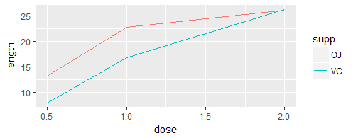
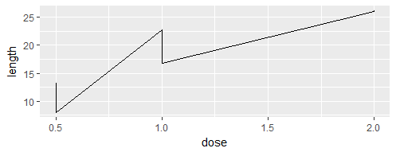

## 第四章 折线图
> 折线图通常用来对两个连续变量之间的相互依存关系进行可视化，其中，x轴对应于自变量，y轴对应于因变量。一般来说，折线图的x轴对应的是时间变量，但也可以用来表示诸如实验对象的药剂量等等连续型变量。

> 当然，跟条形图类似，折线图的用法也有例外。有时候，折线图的x轴也可以与离散型变量相对应，但此时只适用于变量为有序离散型变量的情形，而不适用于无序变量。

### 4.1 绘制简单折线图
#### 问题
> 如何绘制简单折线图

#### 方法
> ggplot()和geom_line()函数，并分别指定一个变量映射给x和y
```r
ggplot(BOD, aes(x=Time, y=demand)) + geom_line()
```


#### 讨论
> 当x对应因子型变量时，必须使用命令aes(group=1)以确保ggplot()知道这些数据点属于同一个分组，从而应该用一条折线连在一起。

```r
BOD1 <- BOD

BOD1$Time <- factor(BOD1$Time)

ggplot(BOD1,aes(x=Time, y=demand)) + geom_line()
geom_path: Each group consists of only one observation. Do you need to adjust the group aesthetic?

ggplot(BOD1,aes(x=Time, y=demand,group=1)) + geom_line()
```


> 默认情况下，ggplot2绘制的折线图的y轴范围刚好能容纳数据集中的y值。对于某些数据而言，可以将y轴的起点设置为0会更合适。
```r
ggplot(BOD, aes(x=Time, y=demand)) + geom_line() + ylim(0, max(BOD$demand))
```


```r
ggplot(BOD, aes(x=Time, y=demand)) + geom_line() + expand_limits(y=0)
```


## 4.2 向折线图添加数据标记
#### 问题
> 如何向折线图添加数据标记

#### 方法
```r
ggplot(BOD, aes(x=Time, y=demand)) + geom_line() + geom_point()
```


#### 讨论
> 当数据点的密度较低或者数据采集频率不规则时尤其有用
```r
ggplot(worldpop, aes(x=Year, y=Population)) + geom_line() + geom_point()
```


```r
ggplot(worldpop, aes(x=Year, y=Population)) + geom_line() + geom_point() + scale_y_log10()
```


### 4.3 绘制多重折线图
#### 问题
> 如何绘制多重折线图
#### 方法
> 在分别设定一个映射给x和y的基础上，再将另外一个(离散型)变量映射给颜色(colour)或者线型(linetype)即可
```r
library(gcookbook)
library(ggplot2)
library(plyr)

tg <- ddply(ToothGrowth, c("supp", "dose"), summarise, length=mean(len))
```


```r
ggplot(tg, aes(x=dose, y=length, colour=supp)) + geom_line()
```


```r
ggplot(tg, aes(x=dose, y=length, linetype=supp)) + geom_line()
```


#### 讨论
> 折线图的x轴既可以对应于连续型变量也可以对应于离散型变量。有时候，映射给x的变量虽然被存储为数值型变量，但被看作分类变量来处理

```r
ggplot(tg, aes(x=factor(dose), y=length, colour=supp, group=supp)) + geom_line()
```


**不可缺少 group=supp，否则，ggplot()会不知如何将数据组合在一起**

```r
ggplot(tg, aes(x=dose, y=length)) + geom_line()
```


**造成上述现象的原因是每个位置都有多个点**
