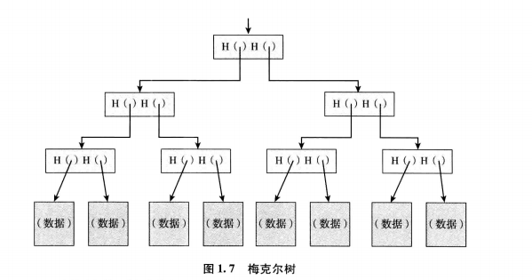

### 1.2 哈希指针及数据结构
> 哈希指针是指一个指向数据存储位置及其位置数据的哈希值的指针。一个普通的指针可以告诉你数据存储的位置，哈希指针不但可以告诉你的数据存储的位置，并且还可以给你一种方式，让你验证数据没有被篡改过。

> 哈希指针是一个不但可以指向数据存储的位置，还可以明晰某个时间戳下该数据的哈希值的指针。

**区块链**
> 通过哈希指针构建一个链表，我们将这个数据结构称为区块链(block chain)。在普通链表中有一系列区块，每个a区块既有数据也有一个指向上一个区块的指针。而在区块链中，上一个区块指针被置换成哈希指针。因此，每个区块不仅能告诉我们上一个区块的值在哪里，还包含了该值的摘要，使我们能够验证那个值没有改变。我们存储链表头部(the head of list)，即一个普通的哈希指针指向最近使用的数据区块。

**创世区块(genesis block)**
> 可以搭建一个包含很多区块的区块链网络，链表头部的哈希指针被称为创世区块

**梅克尔树**
> 使用哈希指针的二叉树也叫作梅克尔树(Merkle trees)

> 在梅克尔树的数据结构中，所有的数据区块都被两两分组，指向这些数据区块的指针被存储在上一层的父节点(parent node)中，而这些父节点再次被两两分组，并且指向父节点的指针被存储在上一层的父节点中，一直持续这个过程，直到最后我们到达树的根节点。

**隶属证明**
> 我们只记住树根节点，然后他需要展示给我们数据块信息，以及从该数据区块通向树根节点的那些区块，我们可以忽略树的其余部分。

**非隶属证明**
> 我们只需要通过展示被验证区块之前的区块路径，以及被验证区块之后的区块路径，就可以达到目的。如果之前、之后两个区块在树上是连续的，那么这说明了被验证区块与该梅克尔树之间是非隶属关系。因为被验证区块确实隶属于梅克尔树，它需要在两个条目之间，而如果两个条目是连续的话，二者之间则并没有空间。

> 我们可以在任何以指针为基础的数据结构中使用哈希指针，条件是数据结构不存在循环。如果一个非循环的数据结构中，我们可以在靠近节点的地方开始，或者在没有指针的数据区块开始，计算其哈希值，然后从后往前进行计算。但是在一个有循环结构的网络中，并没有一个根节点，可以让我们去追溯。
