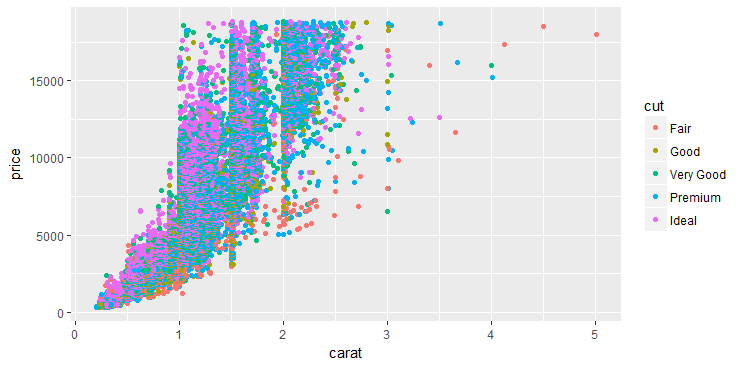

## 第 4 章 用图层构建图像
### 4.1 简介
> qplot() 的局限在于它只能使用一个数据集合一组图形属性映射，解决这个问题的办法就是使用图层。每个图层可以有自己的数据集和图形属性映射，附加的数据元素可通过图层添加到图形中

- 数据
> 必须是一个数据框(data frame)，在绘图结束后可以被修改

- 一组图形属性映射
> 用来设定数据集中的变量如何映射到该图层的图形属性，涵盖了三方面内容：通过图层设定(setting)来改变默认绘图参数的方法，在设定和映射之间的区别，以及重要的分组图形属性

- 几何对象
> 用来指定在图层中用哪种几何对象来绘图。几何对象决定了一组可用的图形属性

- 统计变换
> 对原数据做一些有用的统计变换。统计变换返回一个包含新变量的数据框，这些新变量可以通过特殊的语法映射到图形属性中

- 位置调整
> 通过调整元素位置来避免图形重合

### 4.2 创建绘图对象
> ggplot()函数，有两个主要的参数：数据和图形属性映射。这两个参数将被设为绘图的默认参数，只有在新添加的图层里设定了新参数时，默认值才会被修改。参数数据指定绘图所用的默认数据集(必须是数据框)；参数映射的设定方法只需将图形属性和变量名放到函数aes()的括号里即可

```r
p <- ggplot(diamonds, aes(carat, price, colour=cut))
```
**在加上图层之前无法显示图片**

### 4.3 图层
```r
p <- p + layer(geom = "point",stat="identity",position = "identity")
p
```


> 添加图层使用的是 **+**。该图层使用了默认的数据集和图形属性映射，并且使用了两个可选参数的默认值：统计变换和位置调整

```r
layer(geom, geom_params, stat, stat_params, data, mapping, position)
```
