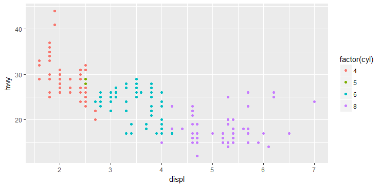
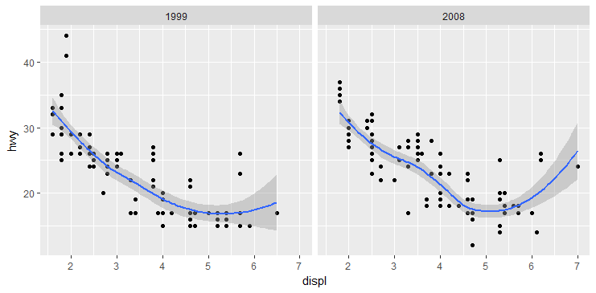

## 第 3 章 语法突破
### 3.2 耗油量数据
```r
# 发动机排量 engine displacement
# 高速公路每加仑行驶的英里数 highway mpg
# 气缸 cylinders
qplot(displ, hwy, data=mpg, colour=factor(cyl))
```



### 3.4 更复杂的图形实例
```r
qplot(displ, hwy, data=mpg, facets=.~year) + geom_smooth()
```

