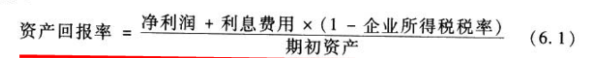
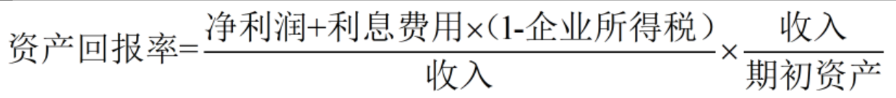
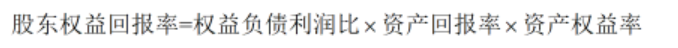

## 第六章 盈利能力分析
### 第一节 盈利能力分析基本框架概述
> 企业的盈利能力指的不是企业的盈余水平，而是盈余水平除以为了取得这样的盈利水平而使得的资源的总量，即一元钱的资源产生了多少盈余。

> 衡量企业盈利能力的主要指标有两个：
- 资产回报率(return on assets, ROA)
> 企业使用所有资产(包括所有的股东和债权人资金投入)所取得的盈余比率

- 股东权益回报率(净资产回报率, return on shareholder's equity, ROE)
> 企业为股东资产投资创造的盈余比率

### 第二节 资产回报率分析
> 资产回报率的定义是企业在应用**总资产**的基础上获取的盈余比率。因为总资产的资金来源于股东和债权人(资产等于股东权益加负债)，所以，资产回报率衡量的是企业，不论资金来源，为股东和债权人共同创建价值的能力。

> 分子是一个会计期间中企业股东的和债权人所得到的盈余的总和，分母为股东和债权人在企业中投资的总和(即总资产)。分子和分母衡量的范围是一致的，都是属于股东和债权人的。

> 损益表在计算净利润的时候已经减去了企业支付给债权人的利息费用(债权人得到的盈余)。从企业创造的盈余中，股东获得的部分是净利润，而债权人获得的部分是利息。资产回报率衡量的是股东和债权人一共从企业创造的盈余中的所得，所以在计算资产回报率的分子时要把净利润和利息加在一起。但是，不能把全部利息费用都加到净利润上去。因为利息费用实在计算应税利润之前扣除的，所以利息费用导致企业少交了一部分所得税。

> 在计算资产回报率，即在计算股东和债权人共同所得的时候，利息费用就不能用来抵税了。我们已经把股东和债权人看做一个整体，这个整体必须对其所有利润向政府交所得税。因此，资产回报率的分子在净利润基础上加入利息费用时要乘以(1-企业所得税税率)，即加入债权人的税后利息所得

> 净利润部分不做税务调整，因为它本身已经是税后项目了。

- 杜邦分析法
> 首先，资产回报率可以被分解为销售边际利益率(profit margin, PM)和资产周转率(asset turnover, ATO)两个组成部分

> 销售边际利润率，衡量的是企业在销售的基础上创造利润的能力。每1元的收入为股东和债权人共同创造了多少钱的利润。提高边际利润率的核心是企业控制成本的能力。在收入相同的情况下，成本控制得越好，边际利润率越高。

> 企业的核心竞争力是其产品或服务的稀缺性，当企业处于垄断地位的时候，企业可以控制企业的价格制定，因此成本控制不是一个决定企业成本的问题我们可以听到、看到社会大众对垄断行业的批评，其中引起公众不满的原因之一就是这些企业员工报酬很大程度上高于同类教育水平和个人素质的其他企业员工的报酬。但是，即使在高昂的人工成本的前提下，垄断企业依然是高利润企业，甚至是暴利企业。这就是因为成本控制对垄断企业来说并不是盈利的最主要的问题。但是，当竞争加剧或行业衰退时，企业失去垄断地位或面临经营困难，对产品或服务价格的控制能力减弱，这时成本控制就很快显得很重要。即时是其他企业，当面临经营困难时，首先的反应也往往是控制成本，所以，我们经常可以读到某某企业为提高竞争力，为了扭转业绩下滑的局面，采取大幅裁剪人员，降低员工奖金等控制成本的措施。

> 边际利润率反映了企业现在控制的能力。如果企业的成本控制的好，边际利润率就比较高。这样的企业在面临经济衰退、竞争加剧或其他经营困难的时候，通过降低产品价格来提供产品竞争力的余地就大，因此更容易度过风险期。所以，边际利润率越高，企业为投资者创造的财富越多，企业抵抗风险的能力越强。

> 收入/期初资产是资产周转率，资产周转率反映的是企业有效运营期所有资产的能力，即每一元的资产可以产生多少钱的收入。单位资产产生的后入越多，资产周转率越高。高效率的企业应该能调动所有的资产到收入产生的生产活动中。但是，事实上，并不是所有的企业资产都能够产生收入。呆滞资产、不良资产、低效率资产经常存在于资产负债表上。这些资产占用了企业的资金，但是产出率比较低。

> 容易被我们忽略的低效率资产是现金和金融资产。对于非金融企业来说，高效率地运营资产是应该把大部分资产都应用到生产和经营活动当中去。持有的现金和金融资产过多，说明企业的资金没有被高效地运用。当然，企业应该持有一定数额的现金以备经营需要，这些现金在短期内用不到的时候也可以投资在金融资产上。但是，超过这个合适额度的现金或金融资产则是资源的浪费，因为现金不产生回报，而非金融企业也不具有通过交易金融资产来产生更高价值的优势。所以，企业长期持有大量的现金或金融资产对股东来说是负面消息，而不是正面消息。

> 在决定资产回报率过程中到底是资产周转率作用大还是边际利润率作用大主要取决于企业所在的行业特征，一般来说，竞争激烈的行业资产周转率比较重要，而垄断程序高的行业边际利润率比较重要。

### 第三节 股东权益回报率分析
> 资产回报率衡量的是企业运用所有资产(既包括来源于股东的资产，又包括来源于债权人的资产)所创造的盈利，它反映了企业经营活动的成功。股东权益回报率，我们要评估的是股东权益的价值。股东权益的价值不仅取决于企业经营活动的成果(资产回报率)，还取决于企业利用债权人资金来为股东创造价值的能力，这个能力一般用财务杠杆(资产负债率)来衡量。

> 企业之所以要承担债务，首先是因为股东的资产是有限的，不一定能够满足企业对资金的需求；但是这不是决定性的原因。使用债权融资的决定性原因是债权融资可以增加股东权益的回报率。因为债券的风险低于股东权益的风险，所以，债权的资金成本低于股东权益的资金成本。我们把债权的资金成本称为借款成本，企业为了使用债权人的资金，需要向债权人支付借款成本。如果借款融集的资金产生的盈利回报(资产回报率)大于借款成本，多出来的盈利就归股东权益所有；如果借款融集的资金产生的盈利回报小于借款成本，不足的部分需要从股东权益的盈利部分弥补。因此，企业是否借款，即是否使用债权融资，取决于企业预期的资金回报率即资产回报率，是否大于借款成本。

> 分子为一个会计期间内企业为股东创造的盈利，其中已经减去了企业为债权人创造的盈利(利息费用),分母是期初的股东权益，是企业经营中所使用的股东的资金的数额。股东权益回报率衡量了股东每投入企业1元钱，本会计期间内得到了多少钱的盈余。

> 企业的股东权益回报率不仅取决于资产回报率，也就是企业使用所有资金所创造的盈利，还取决于企业资产权益率(财务杠杆),即企业利用债权人资金的幅度。企业使用的负债越多，资产权益率越大，财务杠杆的影响越显著。

> 权益负债利润比反映的是资产创造出来的总盈余中属于股东部分的比例，这个比率越高，说明股东取得的盈余越多，股东权益回报率越高。我们通常把资产权益率称为财务杠杆，它反映的是资产负债表的财务杠杆效应。同理，我们可以把权益负债利润比称为损益表的财务杠杆效应，它反映了资产创造的利润在股东和债权人之间的分配。当然，一般来说，利息费用相对于总利润来说额度不大，这个比率比较接近于1。
