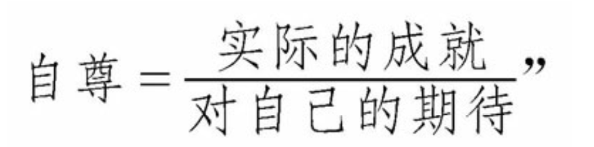

## 序言
> 份的高低决定了人情冷暖

> 历史证明，社会保障了生活的基本需求之际，就是身份的焦虑滋生之时。在现代社会里，我们总爱拿自己的成就与被我们认为是同一层面的人相比较，身份的焦虑便缘此而生了。

> 现今，身份的焦虑比以往任何时候都强烈，因为每个人获取成功的可能性似乎比以往任何时候都大。要想觉得自己不是一个“失败者”，我们必须期望更多的东西。我们每时每刻都被成功人士的故事所包围。然而回顾历史，我们可以发现，在绝大多数时代里，人们的主导思想与之完全相反：对生活抱以很低的期待不仅正常，而且明智。仅有极少数的人立志追求财富与成就。就大多数人而言，他们知道自己活在世上就是为人奴役、逆来顺受。即使是今天，我们攀上社会顶层的可能性也微乎其微。我们很难获得能与比尔·盖茨一较高下的成功，就如同一个17世纪的人想获得路易十四那样的权力是痴人说梦一样。然而不幸的是，现在的人们觉得这一切并非没有实现的可能——这种想法来自于每个人阅读的杂志。事实上，如果谁没有为了实现这一切而全力以赴，那才是世间最荒唐无稽的事情。

> 身份的焦虑是一种担忧。担忧我们处在无法与社会设定的成功典范保持一致的危险中，从而被夺去尊严和尊重，这种担忧的破坏力足以摧毁我们生活的松紧度；以及担忧我们当下所处的社会等级过于平庸，或者会堕至更低的等级。

> 如果说我们在等级之梯上的位置事关重大，这是由于我们的自我看法决定于他人对我们的看法。

> 随失败而来的是耻辱感：一种腐蚀性的意识产生了，那就是我们没能使世界信服我们自身的价值，并因而获到怨恨成功者且自惭形秽的境地

## 第一部分 焦虑起因
### 第一章 渴求身份
#### 追求显耀的身份

> 应该同时在家庭、两性和社会三种范畴中寻求爱的定义，把它视为一个人对另一个人的尊重，以及对其存在的关注。

> 被他人注意、被他人关怀，得到他人的同情、赞美和支持，这就是我们想要从一切行为中得到的价值。富有的人忘情于财富，是因为财富能够自然而然地为他吸引世界的目光。穷人则完全相反，他们以贫穷为耻。他们感觉到自己生活在世界的目光之外。一旦感到自己被世界所忽略，人类天性中最强烈的欲望将必然难以得到满足。穷人进出家门都不为人所注意，即使在闹市，他也会像独处在家一样默默无闻。而名流显贵们则不然，他们一直为世界所瞩目。所有的人都渴望能够一睹尊颜。他们的行为成为公众关心的对象。他们的片言只语、举手投足都不会被人忽略。

> 每一个成年人的生活可以说包含着两个关于爱的故事。第一个就是追求性爱的故事，这个故事已经广为人知，并且得到人们详尽的描述，构成了音乐和文学的根本主题，被社会普遍接受和赞颂。第二个就是追求来自世界之爱的故事，这一故事更为隐蔽、更加让人难为情。

#### 爱的重要性

> 给他自由，让他在社会上逍游，却又视之如无物，完全不给他丝毫的关注。

> 他人对我们的关注之所以如此重要，主要原因便在于人类对自身价值的判断有一种与生俱来的不确定性——我们对自己的认识在很大程度上取决于他人对我们的看法。我们的自我感觉和自我认同完全受制于周围的人对我们的评价。

### 第二章 势利倾向

> 势利并非是什么新生事物，平等精神才是

> 势利者最明显的特征其实并非是简单的社会歧视，而是在社会地位和人的价值之间完全画上等号。

> 势利者对他们时代的所谓杰出阶层多有奉承.势利者最关注的无非是权力，一旦权力的分配发生了改变，他们所崇拜的对象亦会自然迅速地随之改变。

> 与势利者相处，可以使我们恼怒，也可以使我们紧张和气馁，因为我们会感觉到内心深处的自我如此渺小，也就是说我们身份之外的自我如此渺小，我们根本无力改变势利者对我们的歧视。我们也许有所罗门的智慧，有奥德赛的足智多谋，然而，只要我们不具备一种社会认可的身份和地位，我们所有这些优点都形同虚有，势利者只会漠视我们的存在。

> 本质上，成人阶段的爱同幼年时期从父母那里获得的那种绝对的无条件的爱并无差别，正因为如此，势利者以身份取人的做法会让我们难于接受。

> 我们长大成人了，我们获得的爱转而取决于我们的成就，而后又须在社会上获得一定的地位和声望。这些努力也许能吸引别人的注意，但其动机和渴望其实相当平实，无非就是试图找回那种我们儿时曾有过的充分的、无条件的宠爱。

> 深藏在我们内心的害怕其实才是势利产生的惟一根源，看清了这一点，我们也就能对势利有清楚的认识。对那些对自己的地位非常有把握的人来说，他们没有心思去把成心矮化他人当作某种消遣。傲慢的背后藏着的无非就是恐惧。由于总是感觉自己不如别人，因此才要想方设法让别人觉得他不如自己。

> 这种害怕还能世代相传。同人类所有的陋习一样，势利者也是代代相承。上一辈的人定会向下一代灌输低下的社会地位就是一种悲剧的观念，使下一辈不可能在感情上轻易摆脱低下的身份就意味着平庸，高尚的身份就意味着卓越的思维定势。

> 然而，单凭个体的力量很难挣脱势利的桎梏，因为势利的病征是群体性的。年轻一代开始也许会对势利反感，但这还不足以将人类从势利的桎梏中解救出来。因为这很可能使他们渴望博得那些轻看他们的上层阶级的好感，因而也变得势利起来（我们可以不喜欢某些人，但这并不意味着我们不想讨得他们的欢心）。由此可见，杰出阶层的势利观念足以影响整个社会，使所有的人为了赢取别人的爱和认可而开始热衷于那些他们原本毫无兴趣的所谓追求。

### 第三章 过度期望
#### 物质进步

#### 平等、期望和妒嫉
> 令人奇怪的是，人类物质方面的实际拥有极大地丰富了，随之而来的竟然是一种挥之不去且愈显强烈的“一无所有”的感觉，以及对这种感觉的恐惧！

> 我们从来就不会孤立地形成我们对事物（如财富和社会尊重）的相应期待，我们的判断必然有一个参照群体——那些我们认为和自己差不多的人。只有同他们比较，我们才能确定我们合适的期待视野。我们不可能孤立地欣赏自己拥有的东西，也不可能通过与中世纪祖先进行比较来衡量我们现在的拥有。同样，我们也不可能仅仅因为自己身处一个繁荣富足的历史时期而沾沾自喜。只有当我们所拥有的同儿时的朋友、现在的同事、我们看作朋友的人，以及在公众领域与我们身份相当的人一样多，甚至还要略多一些时，我们才会觉得自己是幸运的。

> 我们每天都会经验到许多不平等的对待，但我们并不会因此而妒恨每一个比我们优越的人，这就是嫉妒的特别之处。有些人的生活胜过我们千倍万倍，但我们能心安无事；而另一些人一丁点的成功却能让我们耿耿于怀，寝食不安。我们妒嫉的只是和我们处在同一层次的人，即我们的比照群体。世上最难忍受的大概就是我们最亲近的朋友比我们成功。

> 产生这种妒忌的不是自己与他人之间的远远不成比例，反而是我们的互相接近。的确，人们也许会以为越是不成比例，则在比较之下所感到的不快必然越大。但是我们可以在另一方面考虑，远远的不成比例，就切断了关系，或者使我们根本不与我们距离很远的人物比较，或者就减弱了比较的效果。

> 18、19世纪政治和消费生产的巨大进步尽管极大程度上改善了人类的物质生活，但同时也为人类心理造成了难言苦痛，因为同社会体制和生产进步一起伴生的还有一种全新的理想——每个人都深信人生而平等，每个人都深信自己有足够的实力去实现自己的任何理想。

> 在人类历史上长期存在的主导观念却同这种新的人人平等的思想完全相左：人与人之间的不平等才是正常；随遇而安，知足常乐才算明智。绝大多数的人深知在现实生活中他们只能接受剥削，而且逆来顺受，只有极少数的人渴望财富和实现自己的抱负。

> 显然，一些人天生是自由的，而另一些人天生就适合做奴隶。对这些天生适合做奴隶的人而言，奴隶制度不只是可行，也是无可厚非的

> 尽管基督教教义也宣扬平等的观念，但基督教政治理论家几乎都回避了这样一个问题：为了使上帝的信徒能公平地享用世间的财富，我们是否可以对世间的社会等级结构做些改革和调整？是的，在上帝面前我们每个人都是平等的，但这并不表明我们在尘世就可以追求人与人之间的平等。

> 只有平等之观念开始深入人心，“势利”这一带有贬抑和歧视色彩的用语才可能出现。

> 1651年，托马斯·霍布斯在其著作《利维坦》中指出，
> 个体的存在先于社会的出现。个体是为了自己的利益才加入社会组织中，他们放弃自己的一些自由和权利，来换取社会的保护。

> 约翰·洛克 《政府论两篇》
> 洛克指出上帝并没有把地球作为私有财产给予亚当，而是把地球给予了世间所有的人，期冀所有的人都能从中获得幸福和财富的机会。他认为，统治者应该是人民的工具，人民是否应该服从他们，完全取决于这些统治者是否是为广大民众谋福利。这样，一个让人震惊的现代观念诞生了：政府的正当性在于它们能在多大程度上提高国民获得幸福和财富的机会。

> 1776年美国革命后
> 在贵族统治制度下，社会提供的提高社会地位的机遇很少，人在社会中的地位完全取决于他的家族历史和名望；而在新的社会秩序下，人的社会地位只与每一代人的自身成就相关，特别是他们在经济方面的成就。

> 失败并非任何时候都会给我们带来羞辱，只有某件事情我们不仅尽力而为了，而且在一开始就觉得此事关涉我们的自尊和成就感，结果却还是做砸了，这时我们才会觉得羞愧。

> 对于我们未曾想去尝试的事情，就不可用成败来衡量；既无失败，何来羞辱？人生在世，我们的自尊完全受制于时时督策我们的理想以及我们为理想所付诸的行动，取决于我们实际的现状同我们对自身期待之间的比率。

> 一个人若对来世的可能丧失信念，在希望受挫后他遭受的打击可能会更大。那些相信现世的一切只是永生世界的短暂序曲的人可能觉得他人在现世的成功不过是永恒世界中一现的昙花，因而不易心生妒嫉

> 一旦人们觉得来世不过是一种臆想，或者从科学的角度把来世视为一种并不存在的精神鸦片，这时，追求现世成功和实现切近人生理想的压力就会无时无处不在，这使他们躁动不已，因为他们清楚人生苦短，任何的机会都可能稍纵即逝。现世的一切不再视为永恒世界的一段序曲，相反，现世的成功就是人生的一切。

> 然而现代的社会观念使得人们充满渴望和期盼，也无情地改变了先前人们所固守的人生来就是受苦的理念。

> 诚然，现代社会前所未有地提高了我们的收入，至少使我们看起来更为富有。实际上，现代社会给人们真实的感受却是使我们愈来愈感觉到贫穷。现代社会激发了人们无限的期望，在我们想要得到的和能够得到的东西之间、在我们实际的地位和我们理想的地位之间造成了永远无法填补的鸿沟。我们可能比原始社会里的野人更觉得一无所有

> 我们所期待的远超出我们祖先们的想象，但我们付出的代价则是永远都挥之不去的焦虑——我们永远都不能安于现状，永远都有尚未企及的梦想。

### 第四章 精英崇拜
> 就物质层面看，在社会等级中位居低层，此般境遇少有快乐可言。但从精神层面看就不尽然，低层的人不一定总得无时无地苦不堪言。在很大程度上，贫困对自尊的影响取决于周围的人对贫穷的理解和看法。

> 长期以来，人的血统和家族渊源，而不是其才识，决定着他在社会上的职位

> 美国理想也许不太关注社会平等，它仅仅要求每个人在开始阶段拥有严格控制的均等机会。

> 要打破有钱人作为一个整体对国家的控制。

> 在精英崇拜制度下人们致富无可厚非，同理，人们挨穷也不是没有缘由。

### 第五章 制约因素
> 在传统社会里，要获得上层身份异常困难，但值得欣慰的是，上层身份一旦获得，就不易丧失。要想 使一个贵族不再成为贵族，其难度不亚于使一个下层民众不再成为下层民众，虽然两者地位悬殊，但情形相通。决定因素在于家庭出身，而不在于一生中通过发挥才智获得了何种成就。关键在于你是谁，而不在于你做了什么。

#### 1.受变幻无常的才能的制约
> 我们很难对成功所需的能力进行把握，因而我们在与未来相关的事务中被迫处于一种屈从和焦虑的状态中。

#### 2.受运气的制约
> 成功者自己制造运气

> 把自己的身份建立在偶然因素之上固然令人恐慌，但在一个以理性控制为主要特征的世界里，几乎不能用“坏运气”对失败提供可信的辩解，生活在其中恐怕要更加困难。

#### 3.受雇主的制约
> 因为在多数领域中，对成绩很难进行准确评估，因此升迁之路或贬谪之途具有明显的偶然性。各种机构的金字塔中，成功爬到顶端的并不一定是工作中的佼佼者，却往往是那些精通权术之人，而权术在文明生活中很难得以传授。

> 跟敌人相处，我们应该时刻想着有朝一日敌人会成为朋友；同朋友相处，我们应该时刻想着有朝一日朋友会成为敌人

> 如果你在做一些重要事情，你必须隐藏失败，而夸大成绩。这虽然有欺骗之嫌，但既然你的命运经常取决于他人的观点，而并不取决于事实，因此给别人留下一切进展顺利的印象很有必要。

#### 4.受雇主盈利原则的制约

#### 5.受全球经济发展规律的制约

## 第二部分 解决方法
### 第一章 哲学

### 第二章 艺术

### 第三章 政治
#### 最理想的人的类型
> 那些因所处社会的关于人的理想标准而狂躁不安或心怀怨恨的人，心里应该明白，身份的历史，即使是非常粗略地勾勒出的一个身份历史，都能揭示出一个根本的、振奋人心的结论：关于人的理想标准并非像石头一样一成不变。身份的理想标准长期以来都是，将来也一定会处于不断的变化当中。我们可以用一个词来形容这一个变化过程，这个词就是政治。

> 通过政治斗争，不同的群体都试图改变他们社会的尊严系统，摆脱在既有体系中利益既得者的统治，从而为自己获得尊严。

#### 从政治角度谈现代身份焦虑
> 同过去的社会不同，一切成就不再归因于“运气”、“天意”或“上帝”——反映了现代世俗社会对个人意志力的信任。除了能够赋予一个人上层社会地位，财富还被提高到能够给人带来幸福的高度，这种幸福是通过购买一系列永远都在变化的消费品实现的

> 在必需品中，不但包括那些大自然使其成为最低阶级人民所必需的物品，而且包括那些有关面子的习俗，使其成为最低阶级人民所必需的物品。

> 自从斯密之后，经济学家几乎众口一词地认为，贫困的最根本特征，贫困最令人痛苦的地方，并不是它所导致的身体上的痛苦，而是他人对贫困状态的负面反应所导致的羞耻感，是贫困状态违反了斯密所称的“既定的社会体面原则”所产生的羞耻感。

> 昂贵的物品可以赋予拥有者尊敬，这一身份象征的观念可以演绎出一个为人广泛接受而且并非没有道理的推论：要拥有最昂贵的物品，无一例外地需要具备最完美的素质。

> 除了在发家致富和身怀美德之间建立起相互关系之外，关于成功生活的现代理想同时还在赚钱和幸福之间建立了另外一种联系。

> 以前我们处于一种虽然生活简单、但能够追求自己真正需求的特权状态，而处在现在的生活状态之中，我们则艳羡那些与我们自己的个性毫无关联的生活方式。

> 生活就是用一种焦虑代替另一种焦虑，用一种欲望代替另一种欲望的过程——这样说，并非要我们永远都不要去努力克服焦虑，或不要努力去满足某种欲望，而是要求我们在努力追求的过程中要明白一个道理：我们的任何一个目标向我们提供的一劳永逸的保证，按照目标本身的意思，是不可能实现的。

> 我们同样能够很容易地误解特定职业的魅力，因为这些工作需要付出的代价往往被人剪辑掉了，而只是剩下了那些人们无法抗拒的优点。我们总是在阅读结果，而不是整个过程。

### 第四章 基督教
#### 死亡
> 一个对死亡的思考使人们获得一种更加真实、更加富有意义的生活方式

> 通过这样的途径，死亡向我们揭示出我们妄图通过身份获得的各种意图都是极为脆弱、或毫无价值的。疾病能够消
除这些世俗之爱赖以存在的各种外在条件，从而使这两者之间的差别变得快速而残酷地明显。当我们穿着医院的病服，等待死亡的来临时，我们易于对那些因为我们的社会地位而爱我们的人产生愤怒和反感，同时对他人精心策划这些缺乏感情的诱惑，以及我们虚荣地受到他们的诱惑而生气不已。即将死亡的想法能够让真实回归社会生活。

> 随着依赖外在条件的感情开始丧失对我们的吸引力，我们为了得到这样的感情而一直矢志追求的事物也开始丧失其吸引力。如果财富、尊严和权力能够为我们购买某种感情，而且只要我们的身份仍在继续，这种感情就会继续，但问题是，我们注定要在无助和落魄中结束自己的生命，我们在弥留之际肯定渴望像小孩一样被人关怀，那么我们就会有一个极为清晰的理由，把所有的精力集中在那些最能够经受住我们身份变化腐蚀的人际关系。

> 死亡的想法对我们的影响或许就是引领我们去追求任何对我们真正重要的东西，不管这些东西是在尼罗河畔饮酒，写一部书，还是发一笔财；同时还会鼓励我们漠视他人对我们的评价，因为他人的评价毕竟与我们的死亡没有丝毫的关系。对死亡的预见能够使我们追求我们内心中最渴望的生活方式。

> 虽然死亡的想法很可能会被人滥用（如使他人惊慌失措，从而干一些他们从来都不愿意干的事情），但我们依然希望它能够帮助我们改变自己的行为方式，因为我们总是在追求目前最重要的事情，而把我们真正喜欢做的事情一再延迟，好像我们总是有足够的时间来这样做，死亡的想法能够改变这一切。对死亡的思考能够赋予我们以勇气，使我们能够摆脱社会对我们的期望中的那些毫无道理的成分。在一具骷髅之前，他人观点中那些令人压抑的东西将会习惯性地丧失赖以吓人的力量。

> 虚空的虚空，凡事都是虚空。

> 除了对我们自己必死的命运进行思考之外，我们还可以通过思考他人的死亡来摆脱身份的焦虑，特别是那些取得很高的成就使我们自卑和嫉妒的人的死亡。不管我们生活在如何遭人遗弃和忽略的境况中，也不管他人多么势力强大，多么受人尊敬，一旦想到每一个人都将最终化为世界上最平等的物质——尘土，我们便会顿感释然。

> 一个诚实的基督徒的职责不是为了“让尘世的人记住自己”而奋斗，而应该为了“让上帝接纳自己”而生活。

> 我们总是牺牲自己宁静的心情而去追求那些转瞬即逝的世间的荣华富贵，而遗迹能够揭示出我们这些行为的愚蠢本质。

> 遗迹能够让我们放弃辛苦劳作，放弃我们自以为是的完美感和成就感。遗迹提醒我们，我们永远不可能抗拒时间，我们只是自然破坏力的玩物，而我们只能暂时压制自然破坏力，不能真正地克服它。我们可能会享受一时的成功，我们可能会在短短几年内赋予混乱以秩序，但任何事物都终将退回到以前原初的状态。如果这种想法能使我们心情宁静，那是因为我们的绝大部分焦虑来自于我们过高地估计了自己的目标和关注的重要性。由于我们对自己所做的事情评价过高，我们便因此受到惩罚，进而接受理想的折磨。

> 宏大的自然景观与废墟一样，能够起到相同的减缓焦虑的作用，因为宏大的自然景观是无限空间的代表，就如同废墟是无限时间的代表一样，与无限的时间相比，我们虚弱的、短暂的生命与飞蛾或蜘蛛的生命一样微不足道。

> 要想克服认为自己微不足道的自卑感，我们无须努力使自己变得更加重要，而是要认识到所有的人相对而言都是微不足道的。一旦面对那些比我们要大上千亿倍的东西时，我们对他人比我们高几毫米的关注就会随之消失，取而代之的是对这些巨大的东西的敬畏之情，我们往往称这种力量为无限、永恒——或很简单地，同时也最顶用地，称之为上帝

#### 集体
> 根据现代世俗社会的一种很有影响力的观点，认为一个人最不体面的命运莫过于变得“同每一个其他的人相像”：因为“每一个其他的人”是包括平庸无能的人、墨守成规的人、无聊乏味的人以及土里土气的人在内的一类人的总称。任何一个思维正常的人的目标就是想方设法使自己区别于周围的人群，在他们能力许可的前提下使自己“脱颖而出”。

> 基督教要求我们透过人们之间表面的差异，去关注那些被公认为是普遍的真理，建立在这些普遍真理之上的是集体感和亲情感。我们中有一些人可能很残酷，有些人可能很焦躁，有些人可能会很愚笨，还有些人可能会很无聊，但把我们拉在一起，并在我们之间建立起相互联系的纽带的是我们对自身的脆弱的共识。在我们的缺点背后，总有两个基本要素在起作用：恐惧和对爱的渴望。

> 基督徒认为，世界上并没有陌生人这回事，只可能因为没有意识到他人和我们具有相同的需求和弱点从而对他人产生一种陌生的印象。从本质上来说，从真正重要的东西来说，我们同他人实际上并无二致，认识到这点才是一个最高贵的人生和最完整的个人的基础。

> 我们想在社会上扬名立万的欲望，在很大程度上都来自于作为一个普通人对所具有的种种不利因素的恐惧心理。我们越认为普通生活令人耻辱、肤浅、低贱或丑陋，我们想要同他人区分开来的欲望就会更加强烈。集体越堕落，个人成就的诱惑力就越大。

> 公共场所往往更加腐朽和可怕，使我们产生在物质和精神上独立于它的冲动。

> 就有这样一些国家，由于住房、交通、教育和医疗等方面的公众条件过于糟糕，人们自然而然地躲避与公众打交道，而把自己关闭在厚厚的墙壁后面。如果做一个普通人就意味着过一种连一般的尊严和舒适的需求都无法满足的生活，那么对上层身份的欲望则会变得异常强烈。

> 当一个城市的公共空间和公共设施本身看起来充满了辉煌，民众想要获得个人辉煌的欲望就会有所减少

> 只要我们认识到每一个人都有其可贵的价值，而且，更为重要的是，只要我们对各种社会环境和社会行为模式做好心理准备，洞察其人为的特征，那么对普通人的观点将会去掉更加负面的含义，从而相应地，追求成功的欲望和想独自躲在坚实的墙壁后面的欲望将会减弱

> 在一个理想的基督教社会里，人们对自己不是获胜者的恐惧将会因为尊严和资源的最根本的平等而减弱，进而易于控制。成功意味着兴旺发达，而失败意味着衰退消亡的二分法，也会随之丧失其令人痛苦的清晰度。

#### 两座城市：上帝之城和世俗之城
> 基督教并没有废除等级，它的功绩是用伦理和非物质的方式重新定义等级

> 在现今世界里，世俗建筑在持续不断向我们讲述世俗权势的重要性，但即使在这样一个世界里，在大城小镇的上空耸立的大教堂一直在给我们提供一个关于精神第一的想象空间。

### 第五章 波希米亚
> 而对波希米亚人而言，压倒一切的头等大事，是能够体悟世界，能够以观察者或创作者的身份专注于感情的宝库：艺术
